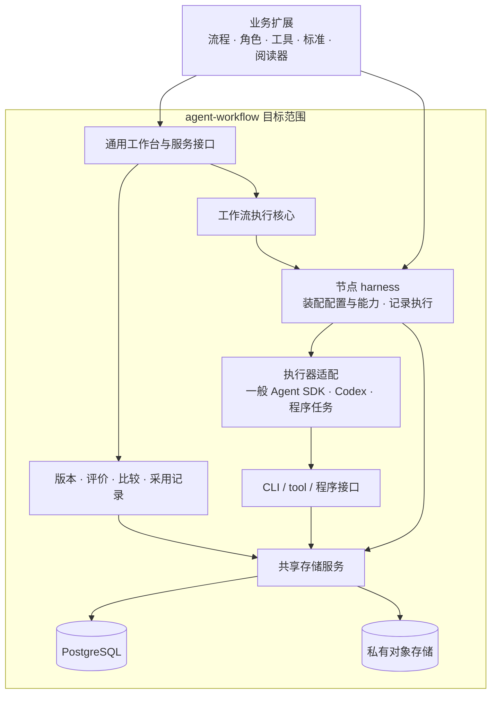

# Agent Workflow 的架构与职责

共享项目提供业务工作流的执行、资产管理、评价迭代与通用工作台。业务项目注册自己的流程、工具、资产类型、评价标准和展示扩展。本文主要描述目标模块关系；已实现的 Schema Registry、PostgreSQL Space 领域服务、节点客户端、core 桥接与只读控制台见 [Space 存储接入指南](space-storage.md)，既有 core API 见 [集成指南](integration.md)，剩余差距见 [建设路线](harness-roadmap.md)。

存储设计先读 [Workflow Space](workflow-spaces.md)：以一个业务目的为长期管理单位，保存其 workflow 版本、协作资产、会话知识与迭代关系，资产控制台按空间组织。节点使用方式、版本控制和创作资产清单在该文维护。PostgreSQL、对象存储和 SDK 的接入细节见 [基础设施方案](postgres-sdk-plan.md)；harness 包裹节点，向 CLI / tool / 程序接口注入同一空间合同。工作台也通过同一服务读取这些关系。

共享层定义固定的系统 schema（session、message、run、资产版本外壳等），workflow 定义包提供业务资产正文 schema。每个 workflow 版本再绑定节点可读输入、可写输出、字段视图与业务动作，经 Schema Registry 和空间服务校验执行。这些存储合同及通用只读视图已有确定性测试；控制台可注入按 schema 版本选择的业务阅读器。完整媒体链路和已部署的多用户工作台仍属目标。

工作台的独立设计见[通用工作台与展示契约](workbench-presentation.md)：数据 schema、节点存取合同、人的展示契约分离。首轮统一导航与业务阅读已交付，范围见[实现记录](workbench-implementation-2026-10-05.md)。实用审查又识别了[流程、执行与资产关系的通用模型缺口](workflow-process-assets.md)：方法版本提供节点、端口和允许路径，运行记录实际节点实例，资产关系连接准确输入输出及业务用途；工作台联动呈现这三层。流程和存储语义随方法／合同版本固定，排版仍单独版本化。流程合同、运行投影和资产关系查询已实现；独立方法版本入口、发布预览及自动方法图也已接入 CONTENT，验证范围见[方法图实施记录](workbench-method-implementation-2026-10-05.md)。准确已部署版本选择、PostgreSQL 持久队列与独立取消已接入，验证范围见[执行管理实施记录](workbench-execution-implementation-2026-10-06.md)。跨版本验证集合已接入，范围见[验证集合实施记录](workbench-validation-implementation-2026-10-06.md)；任意历史执行包自动加载仍待建设。以上是局部工程交付，整体产品完成状态以[产品](product.md)和[建设路线](harness-roadmap.md)为准。

## 共享项目与业务的边界

箭头表示职责协作，不表示图中全部模块已交付。当前已有 PostgreSQL RunStore、Schema Registry、Space 领域服务、节点客户端、core 运行桥接、评价与采用记录，以及可扩展阅读器的只读控制台；creation 接入仍在进行。应用自行授权的 SIWC 订阅连接已用 `gpt-6-astra` low 对合成材料完成生产与独立审阅探针：绑定读取、可观测消息/工具事件和产物/四问记录均已持久化，尚无创作质量的人类接受。它是 Responses 适配器，不是一般 Agents SDK。生产对象存储 provider、完整媒体链路、原生会话恢复和完整通用工作台仍未完成。当前接口见 [Space 存储接入指南](space-storage.md)与 [PG 存储指南](postgres-storage.md)。

| 层 | 共享项目负责 | 业务项目负责 |
| --- | --- | --- |
| 业务定义入口 | 定义、注册、版本和扩展约定 | 业务流程与阶段、角色目的、提示词、领域工具、资产 schema |
| 执行核心 | 步骤身份、分支与并行、阶段、验证、节点复用和恢复语义 | 业务分支条件、返工方式、领域停止条件 |
| 执行器 | 一般 SDK 与 Codex 适配、运行配置与事件统一、能力差异说明 | 为角色选择模型、方法、所需工具与允许范围 |
| 资产与执行 harness | 包裹节点执行，装配配置、上下文和存储 CLI / tools，记录与提交产物、会话和工具过程 | 声明输入依赖、输出类型和业务可见性 |
| 持久化 | 面向执行器的共享存储服务、PG 与对象存储适配、提交和恢复、持久记录及读取接口 | 业务数据与授权策略；提供部署配置，不自建第二套资产系统 |
| 迭代与评价 | 工作流版本、四问、比较、判者与标准版本、采用和回退记录 | 业务判据、校准案例与采用授权 |
| 通用工作台和运行服务 | 通用页面、授权接入、执行队列与 worker 集成、进度和资产读取 | 特殊阅读器与业务操作、身份来源和部署参数 |

这里的共享职责可以拆成可选包和服务。**core 仍不导入 PostgreSQL、Codex、浏览器 UI 或业务仓库。** 扩大共享产品范围，不等于让执行核心包依赖整个产品。已有消费者可以继续使用现有包，按明确迁移计划接入新能力。

## 需要分别保存的对象

以下是跨层设计概念；部分已对应 Space 类型与 `ws_*` 表，未逐项对应同名 SDK 类型或完整产品能力。准确接口见 [Space 存储接入指南](space-storage.md)。

| 对象 | 回答的问题 | 必要关联 |
| --- | --- | --- |
| 工作流及定义版本 | 这是什么业务流程，这版为什么这样设计 | 上一版、变更依据、流程与节点配置快照 |
| 案例与冻结输入 | 本次要解决什么，给了哪些资料 | 原始资产的确切版本、业务目标与约束 |
| 运行、步骤与 attempt | 执行了哪一版，在哪里成功或失败 | 定义版本、输入、执行器与实际配置 |
| 资产及版本 | 这份结果是什么，由谁用什么材料生产 | 生产步骤、输入依赖、内容摘要与可读取正文 |
| Agent 会话与 trace | 节点收到什么，发生了哪些可观测操作 | run、step、attempt、工具调用、记录完整性 |
| 评价与比较 | 谁认为哪些地方好坏，相对谁发生变化 | 精确产物、基线、标准版本、可见证据与限制 |
| 改动与采用决定 | 为什么形成下一版，最后保留了什么 | 评价、比较条件、决定者与授权范围 |

同一工作流的一次业务运行可以产生多版稿件，不必因此升级工作流定义。修改角色、提示词或流程逻辑才构成工作流变更。新的输入或流程版本应创建新运行；失败恢复不能伪装成无条件继续任意旧进程。

## PostgreSQL 资产管理 harness

PostgreSQL 是目标中的业务事实源。Workflow Space 对应一个业务目的，聚合多个 workflow 版本、运行、资产、配置、评价与迭代；稳定 `workflowId` 保持为底层执行身份。`@signal-room/workflow-postgres` 提供 run/step/attempt/event/artifact ledger；`@signal-room/workflow-space-contracts` 和 `@signal-room/workflow-spaces` 已提供 schema 登记、冻结存储合同、Space 领域表、资产版本、节点上下文、会话、评价与只读视图。Space 服务按宿主认证主体检查成员和角色，节点只接收受限客户端；`workspaceId` 本身仍只是技术分区键，数据库没有 RLS。节点上下文将宿主报告的实际指令与生效配置和已冻结的 workflow/run 配置分开保存，但动态配置没有密码学证明。16 MiB 的 PG BlobStore 可保存实际小文件；大媒体的受管私有对象 provider、部署和完整素材链路仍待建设。当前边界和恢复规则见 [Space 存储接入指南](space-storage.md)。

一次节点执行应形成完整关系：

1. 解析输入引用并校验版本、内容完整性与访问范围。
2. 按角色需要装配提示词、原始材料、上游资产与上下文；记录实际交付内容的版本。
3. 选择执行器，应用支持的工具与运行限制，并记录无法强制保证的边界。
4. 收集可获取的会话、调用、错误与用量，关联到具体 attempt；断流或缺失明确标记。
5. 校验输出并写入新资产版本、来源与事件；重试写入不能悄悄生成重复资产或覆盖旧结果。
6. 将精确结果提供给下游、工作台或独立评价者。

事务保证哪些数据一起提交、工具副作用如何避免重复，需要在实现时给出可测合同。数据库事务不能替外部发布、付款或第三方任务提供自动回滚。

运行时可以使用临时文件、工具工程目录和缓存。它们是执行材料，不承担长期唯一正本。当前方案建议大媒体使用托管私有对象存储，PG 管理其身份、版本、位置清单和来源；具体 provider 尚未开通。执行器经统一资产接口读写，需要文件时物化到本次执行目录，不把本机路径当作持久身份。两个后端的提交协议、上传对账和备份恢复见完整方案。

## 一般 SDK 与 Codex 如何共存

执行核心通过现有 `AgentRunner` 端口调用 Agent；已有 Space runtime 桥接可为节点记录输入、配置和可观测事件，Codex 继续适用于需要工程目录和代码工具的节点。可选 SIWC Responses 适配器支持宿主注入工具；一般 Agents SDK 仍是目标。确定性计算、装配和校验保留为程序任务。

不同 SDK 的会话、工具权限、恢复和流式事件能力不必相同。适配层需要声明实际支持范围，保存原生会话标识与可获取记录。不能仅因为设置了 prompt，就宣称已完成工具隔离；也不能把数据库历史重放写成能够恢复原生会话的任意内部状态。

现有 `CodexSdkRunner` 使用 Codex SDK/CLI；SIWC 方案是 Responses 协议适配器，不是 OpenAI Agents SDK 集成。合成材料的生产和独立审阅工具链已实跑，业务质量、原生会话恢复和完整部署仍待验收。

## 工作台与评价如何接入

Space 默认统一工作流、业务、资产三个工作台，评价就近发生，工作流提供方法定义、单次执行、运营观察、版本演进四个视图。工作流以完整 Archify 图为主画布，定义、实际实例、输入输出与可读资产原地展开；业务工作台贯通要求、运行协作、评价交付，资产工作台支持跨案例检索与复用，演进视图贯通复盘、改动依据、验证和采用。现行职责见[展示契约](workbench-presentation.md)，新前端的 React 分包、HTTP 读模型、图 bridge 和接入边界见[前端架构方案](space-frontend-architecture.md)，分批验收见[前端实施计划](space-frontend-implementation-plan.md)。这些新前端包与稳定 HTTP API 尚未实现；已有控制台及动作不等于整体产品已经验收。所有读取和动作都经宿主授权服务，不能直接开放数据库、任意文件或原始 trace。

共享层提供四问和比较记录；业务提供标准与特殊阅读器。生成者、评价者和采用者的身份分别记录。评价者可以是人，也可以是独立 Agent A；是否允许 Agent 自动采用，由业务授权决定。校准用于检查评价质量，不用流程状态替代质量结论。

工作流设计说明与改动理由也属于迭代记录。先支持读懂和比较，不把拖拽流程编辑器或自动改流程列为未经确认的必要条件。

## 部署与保留

当前目标可先部署在一台常驻服务器：运行共享服务、worker 和 PostgreSQL，接入业务定义。PostgreSQL 可以与服务同机，也可以独立托管；数据库不要求每个 workflow 各有一台 VM。

本阶段不建设临时 VM 调度。执行结束、停止工作进程、清理缓存和删除长期资产是不同动作。完成执行不自动释放仍需排查的工作环境，不自动删除历史；保留与清理策略需要显式配置。

## 文档各写在哪里

- [产品](product.md)保存为什么做、目标用户和已经确认的能力范围。
- 本文保存共同概念、分层关系与业务扩展边界。
- [建设路线](harness-roadmap.md)保存当前实现、缺口与下一阶段验收。
- [Space 存储接入指南](space-storage.md)、[集成指南](integration.md)、[前端指南](frontend-integration.md)及 API 文档说明当前代码能怎样使用。
- 业务仓库保存领域流程、判据、阅读器和部署实例；历史报告保存当时证据，不充当现行架构。

同一事实只有一个主要维护位置，其他页面链接过去。旧 API 的使用说明和新产品目标可以同时存在，但必须标明状态。
