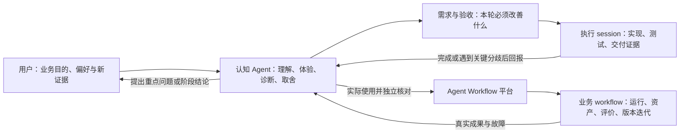

# 认知驱动的执行循环

**目标：由认知 Agent 持续代表用户的业务目的，实际使用每一轮成果，重新理解问题并提出下一轮需求；执行 session 负责把明确需求做完。** 每轮完成后，认知侧必须独立检查“是否解决了该解决的问题”，再决定继续、调整方向或结束这一阶段。

依据是用户在 2026-10-06 的明确要求：“核心是我希望通过你这个认知角色来构建 agent loop，每次完成后，你来进行多方面的完整认知后提出新需求，你来作为我”。本文将它落实为工作方式；其中具体视角、派工格式与优先级是本轮设计，不冒充此前已确认的细节。

长期产品目标仍以[产品目标](product.md)为准。本循环从[第 3 步执行管理](workbench-execution-implementation-2026-10-06.md)继续推进，第 4 步验证与比较现已通过独立认知验收，结论见第 9 节；CONTENT 内容质量仍未得到用户接受。

## 1. 两个循环，以及本认知角色的位置

外层是认知与研发循环，决定平台和业务方法下一步要改变什么。内层是业务 workflow 的生产与评价循环。独立评价者 Agent A 是内层的一种判者；编写实现的执行 session 不因测试通过就取得业务判断权。本认知角色统合两层证据，避免平台越来越完整而内容一直不好。

近期直接使用现有 session、CLI、共享服务和项目文档组织循环，不先建设另一套自动研发平台。未来可以将认知结论、问题与委派收据接入 Space；当前不能声称外层 chat 已自动进入数据库。

## 2. “代表用户”要承担什么

认知角色维护一份可追溯的用户意图：明确说过的、已被纠正的、尚属推断的分别保留。以用户要完成的任务为起点，而不是以新功能列表为起点。能凭现有目标做出的常规设计与可逆取舍直接推进；真正改变业务目的、核心偏好或授权范围的决定，整理成具体选择再交还用户。

每轮交付后，从以下视角形成整体判断。需要的验证深度随改动变化；未检查的部分明确留为未知，不把清单勾满当作完整认知。

| 视角 | 必须追问的问题 | 主要依据 |
| --- | --- | --- |
| 业务使用者 | 这轮有没有让我更接近满意的作品或业务结果？下一步我要判断什么？ | 实际产物、目标、用户四问与真实使用 |
| 初次进入的用户 | 我是否知道在哪、正在看哪个方法或结果、接下来能做什么？ | 从入口实际操作；空状态、失败状态、窄屏 |
| Workflow 构建者 | 能否表达流程、资产关系与评价方式，而无需为每个业务另造控制台？ | 定义、schema、节点合同及第二种代表性结构 |
| 执行中的节点 | 是否拿到正确版本的必要材料，输出和会话是否准确保存？ | context、输入输出收据、实际工具与配置 |
| 评价与迭代者 | 能否比较、解释原因、定位共性问题，并知道哪些结论还没有证据？ | 固定输入、评价标准、判者、trace、失败与缺跑 |
| 维护与 FDE 交付者 | 重启后是否可恢复理解，能力是否可复用，人工投入是否下降？ | 持久记录、故障处理、部署边界、操作成本 |

判断分别回答：业务方法问题、输入／材料问题、评价标准问题、交互理解问题、执行或存储问题。根因未知时给出证据和下一次验证方法，不能因为改 prompt 容易就把问题都归到 prompt。

认知工作还包括反问现有方案：有没有更简单的办法？新问题是普遍缺口还是这次操作造成？新增功能的维护成本值不值得？反复修补三次仍无稳定改善时，重新审视方法与边界，不继续堆补丁。

## 3. 每轮如何运行

1. **恢复目标和现场。** 同时恢复业务目的、完整产品目标、认知与执行分工，以及本轮要作的具体决定；区分先前已知要求与刚提出的新要求。阅读上一轮认知记录、当前交付与未解问题，声明此次实际覆盖范围。
2. **独立使用。** 从人的实际任务走完整路径，读资产正文并尝试据此作判断，查结果、版本、失败与边界；必要时下钻代码和原始证据。执行者自述只作为检查线索。仅检查入口和页面组件不算完成内容认知。
3. **写认知结论。** 记录观察、有效做法、原因假设、替代解释、反例及未查明点，说明它们怎样影响本轮决定。明确此前假设得到支持、被推翻或仍未知；内部 evaluator 的结论也是待判断的证据。
4. **形成需求并排序。** 每条需求包含问题、证据、预期改善、成功与失败条件；通常只派出一个连贯批次，其他进入待办。
5. **派发执行。** 新批次可以使用新的执行 session；同批修复继续原 session，避免为每次反馈重开。带齐上下文、文件责任、验证与回报要求。
6. **接收后再认知。** 完成消息触发本认知 session 续做：核对实现、真实操作、提出新发现。若有关键产品分歧，执行侧带证据提前回报。
7. **决定后续。** 在既有目标内继续下一批，或给出这一阶段可用的结论。每轮都允许判断“已足够，进入真实业务验证”，不要求为了保持循环而制造新需求。

每轮保留一份简短记录：业务目标 → 本轮问题 → 证据 → 原因假设 → 派发需求 → 交付证据 → 认知侧验收 → 新发现／阶段结束。它是持续更新的工作记录，不再生成彼此冲突的产品报告。

## 4. 需求质量与结束条件

需求必须能说清用户任务受到了什么阻碍。优先级建议：先修错误或证据不可信，再打通完成任务的阻塞，随后改善理解和操作成本，最后做扩展与美化。直接影响理解的界面问题也可能是阻塞，不能一律当低优先级。

一条需求验收通过至少意味着：对应用户任务可以完成；行为和持久证据一致；相关失败路径明确；实际入口可用；实现局限被如实记录。工程测试、业务产物质量和评价者质量分别报告。

阶段结束条件是本轮目标已可用且没有阻塞性遗漏。随后可进入真实 CONTENT 验证，不必先完成 VM、多 workflow、所有 SDK 或完整部署平台。采用哪一个业务版本仍要依据实际产物和评价；发布不等于采用。

## 5. 当前认知结论与第一批执行范围

上一轮实际浏览器验收证明准确版本、多选题、排队和取消可工作。与此同时，观察到：版本页的可读名称都显示 `content-v2`，主要靠长 ID 区分配置；任务卡结束后直接罗列十条 Agent／资产提交会话链接；已有 run 列表还不能回答“这次验证计划是否完成、哪一版在哪些选题上进步”。因此下一批要围绕人的比较与决策任务组织。

| 优先级 | 需求 | 本批处理 |
| --- | --- | --- |
| P0 | 固定验证集合，准确绑定方法、案例、输入、重复次数和评价条件 | 实现共享模型、服务、CLI 与入口 |
| P0 | 看见所有计划项的完成、失败、取消、缺跑与未评价，准确成对比较 | 实现共同读模型与比较页 |
| P0 | 四问、问题观察、修改假设与采用理由相连 | 复用现有 review／comparison／iteration／adoption，补缺失关联与校验 |
| P1 | 版本差异和下一步操作应能用人话辨认 | 验证页用变更理由、模型摘要和短 ID；保留准确身份 |
| P1 | 会话证据过多影响阅读 | 新验证界面以结果与判断为主，细节按需展开；全站导航重做后置 |

### 第一批的业务路径

操作者在一个 Space 中创建验证计划，明确问题与假设，选择两个已发布方法版本、固定案例及其输入。计划冻结后，分别显式派发两版运行。待完成或失败后，对准确结果写四问，查看逐案例的改善、退步与仍未知，记录共性问题、下一轮改动或采用理由。其他历史 run 仍可读，但不自动混入这次计划。

### 必须保持的语义

- 验证计划是运行前的实验设计。现有 `IterationDraft` 要求已有 run／review 且只承载一个版本，不能冒充跨版本计划；任务队列也不表示尚未提交的计划项。
- 计划冻结方法／入口、案例、准确 input manifest、重复次数、评价标准、判者配置、允许改变的条件和排除规则。两版使用同一准确冻结输入；需要业务反序列化时由 CONTENT 适配器提供，共享层不理解内容稿件结构。
- 计划冻结后不静默增删案例或改变标准。修改生成新计划版本或明确追加修订；重试保留原 attempt 和失败，不能只展示最好一次。运行状态从持久任务与 run 读取，不另造第二套执行引擎。
- 旧运行只能显式关联，并验证 case、version、入口、manifest、实际条件和评价规则；不匹配可作为背景证据，不能算成满足计划的同条件运行。事后组织的集合标明其性质。
- 比较保留所有计划项。技术失败、未启动、取消、排除、产出待评价、已评价分别呈现；不能从分母消失，也不能将同一案例重复三次算作三个案例。
- 现有四问与成对 comparison 继续作为准确评价依据。计划层检查配对条件，显示输入、配置、联网和判者差异；不同标准或不可匹配输入不宣称公平质量结论。声明过的预期方法变化与额外混杂条件分开说明。
- 人与 Agent A 的判断保留各自身份和材料来源，不平均成一个伪共识。复用已有可信 Agent 评价入口并关联计划项；本批不增加自动 Agent A 调度。网页不能靠选择“Agent”标签伪造独立判者。
- 共性问题有明确证据、受影响案例／run、可选节点与问题类别，标明观察还是原因假设。只有结构化记录存在时才统计频率；自由文本四问不能直接冒充已校准的分数或已解决状态。
- 采用是有权限人的明确动作，必须显示证据、理由和未解决项；采用依据需与目标版本对应。发布／运行成功／平均分不能自动移动采用指针。回退保留之前采用历史。
- 修改假设及验证结论能从 UI 和 CLI 读回。外层认知 session 的全文自动入库不在本批范围，避免把研发循环工具化扩张成另一项平台工程。

### 验收场景

在隔离 Space 中冻结两个准确版本和至少三个案例。确定性执行器制造：一个完整且有成对评价的案例、一个失败或取消的案例、一个未跑或待评价的案例；另有同案例重复运行。界面能准确显示覆盖范围、两版结果、已知差异及未解问题，不能声称全部验证完成。缺失执行器、输入错配、评价标准变化、重复派发、跨 Space 引用和 Agent 身份伪造必须被拒绝或明确呈现。

再保存有证据的共性问题、修改假设与采用／继续试验理由，重启后通过 CLI 和 UI 读回。沿用共享持久队列，不新建重复 run。浏览器实际走创建、冻结、派发、四问、比较路径；确定性验收不替用户对真实 MiMo 评分或采用。

## 6. 执行约定与完成回报

共享能力属于 `vendor/agent-workflow`，CONTENT 只提供业务适配与展示；研究和分析不迁移。执行 session 维护自己的实施记录，不改写本文的认知结论或产品目标；确有冲突先带证据回报。多人共享工作区，保留所有已有未提交改动。

运行 Node 24，使用项目现有测试与文档构建。隔离数据验证，记录实际运行的测试和可用页面。本批不运行真实模型、不发布／采用真实 Space 的方法、不改写历史业务资产、不安装全局 skill、不引入 VM 或 B3。私有运行数据、凭证、媒体不提交。

完成回报必须包含：实际完成的用户路径、变更文件、测试与浏览器证据、失败和局限、可访问入口、仍需认知侧判断的问题。将回报交给认知 session `01a10096-c56f-7c63-b914-0015f776ed34`；用户已在该 session 明确要求完成后告知认知侧，执行者应读取原始用户消息确认这一跨 session 授权后再发送。此回报触发下一轮认知，不是产品验收通过的声明。

## 7. 完成回报如何可靠到达

采用主动回报与接收方检查两条路径，不能仅依赖 prompt 记忆。

1. 执行 session 先把交接记录落盘，再尝试向认知 session 发完成消息，并留下发送成功或失败的结果；最终回复也保留同一摘要。
2. 认知 session 设置线程级定时检查，只查本轮明确登记的执行 session。执行中且状态无变化时不打扰用户；完成、失败、需判断或通知失败才进入处理。
3. 收到完成消息或检查发现结束，先读取状态和交接证据，登记本轮进入认知验收；同一轮的通知和定时检查共用一条协调记录，避免重复派工。验收完记下结果及下一批身份。
4. 未完成的 session 停止或缺交接时，认知侧主动读取末轮信息，在用户已授权范围内要求补齐；不能把一段“完成了”的文字直接标为产品验收通过。

当前协调状态临时保存在项目 `.local/cognition-loop/`，属于本轮研发调度记录，不是业务资产正本，也不代表它已进入 Workflow Space。每轮交接与检查结果记录准确 session ID、轮次、状态和已处理标记。以后接入 Space 时保留这些身份关系。

这一机制减少漏通知和重复执行，但不是永久在线保证。桌面调度器或连接不可用时检查可能延迟；恢复后可从持久状态重新核对。不要声称执行 session 一定记得回报，或未核验的通知一定到达。

## 8. 当前轮次登记

- 认知 session：`01a10096-c56f-7c63-b914-0015f776ed34`。
- 第一批执行 session：`01a10d21-f66b-7e20-bbe3-c037048ab0f1`，标题“实现验证集合与版本比较”，已完成。
- 完成通知于 2026-10-06 实际送达本认知 session。执行侧先落盘交接，再发送，保留成功回执；认知侧登记收到并完成独立体验。没有将“打算通知”当成通知已到达。
- 本轮启用了每 5 分钟状态检查作为兜底；无变化保持安静。同一交付按执行身份与完成时间去重，阶段结束后不重复派工。准确状态以 `.local/cognition-loop/state.json` 为准。
- 当前判断：本轮最小工具路径可用，进入真实业务验证准备；不为了维持循环继续增加平台功能。

## 9. 第 4 轮独立认知结论

**结论：在可信本机宿主与已部署准确版本的范围内，CONTENT 最小方法迭代路径可用。** 这说明现在可以有依据地组织下一次内容实验，不说明 CONTENT 已成熟或能够推广到所有 FDE 业务。

### 认知侧实际做了什么

除核对执行交接外，认知侧在隔离 Space 另建计划，亲自通过浏览器创建与冻结条件、分别排队及派发两版，打开准确结果与完整方法图，填写两份工程夹具四问，保存成对比较及关联两边证据的观察和下一轮假设。停止并重启隔离宿主后，CLI 读回的完整计划摘要与重启前一致：一个案例、两次运行、两份评价、一份比较和一条问题记录。窄屏 390px 未横向溢出；方法图在窄屏保留横向滚动与等价文字路径。

另一组由执行侧产生的三案例夹具保留了重复、失败、取消、缺跑与待评价；局部已比较的结果没有让整个集合显示成全部完成。两次显式采用及修改假设在重启后仍可读。两组都是工程夹具，所有人工表单内容明确标注测试身份，未替真实用户评价或采用。

认知中发现并推动修复了十处缺口：允许变化的配置键说明、采用指针身份、前瞻计划关联可信评价、部分重复被排除的统计、取消请求／中断计数、多判者正向覆盖、执行状态被评价覆盖、两版配对布局与结果入口、Agent 判者实际指令／工具证据，以及 CLI 把整个 Space 输出的问题。其中判者配置通过实际 SDK 请求与可信事件校验，CLI 现按计划读取，具体资产与 session 按 ID 获取。

共享最终测试 228 项通过；CONTENT 最终 162 项通过，含隔离数据库专项。认知侧另执行 SDK 的 8 项测试并只读核对真实历史：18 张业务表的数量和内容 hash 与此前一致。实现与详细检查见[第 4 步交付](workbench-validation-implementation-2026-10-06.md)，私有操作、截图和准确 ID 留在 `.local/cognition-loop/round-04/independent-acceptance.md` 及相邻证据文件。

### 从内容本身得到的判断

MiMo 的三稿属于同一次 workflow 运行中的三次作品修订。历史事实检查问题数为 1 → 2 → 0，模拟冷读者的 30 秒继续观看判断为否 → 是 → 是；这说明部分方面有改善，不能把最后未通过概括成“每一轮都没有用”。这些不是实际观众数据，事实检查也只在已提供材料范围内成立。

同时，C1、C2、C5、C7 仍有不足，最终主编仍要求修改，学习中的反馈如何改变后续行为没有充分讲清。输入没有固定时长上限，不能事后把七分钟稿件认定为违反九十秒要求。由这些观察得到的假设是：下一次先把“读者究竟应理解到哪一步”变成可检查的例子与复述要求，再验证解释结构，而不是只增加自动改稿次数。这个假设尚未经过真实新版本实验。

下一次建议固定 MiMo 材料与联网条件、读者目标、必答因果问题、基线及候选准确版本。候选只改变一处解释组织方式，例如用一个具体尝试、反馈、参数调整、再次尝试的过程组织正文。事实正确、因果复述和观看动机分别评价；人和 Agent A 保留各自判断。若只验证 MiMo，结论仅适用于这个案例，不能据此宣布跨案例改善。

### 尚未解决但不阻塞本轮的事项

- 方法版本的可读命名、结果页返回验证计划的导航仍能改善；已评价条目下的原生 `needs_review` 状态也需要更清楚地区分“作品接受”与“验证评价”。
- CLI 已移除整 Space 数据，但完整计划摘要仍包含较大的配置快照；大样本时应补概览投影和分页，不能把当前小集合的可用性推及任意规模。
- 浏览器控制工具在部分提交后的观测发生过超时。先重新载入核对已提交事实，没有盲目重提；原因未证实，不把它归为存储损坏或已彻底解决的故障。
- Agent A 的自动调度、判者业务校准、真实模型质量、第二业务复用、生产认证和对象存储仍未验收。外层认知 chat 也没有自动进入 Space；当前业务结论／假设可入库，研发通知另有持久协调记录。

因此本轮认知循环在这里结束工程扩展，保留明确的下一次业务实验，不将未验证的质量判断包装成已经实现的效果。

## 10. 第 5 轮：真实 MiMo 方法对照

2026-10-06 用户确认开始下一步。本轮已冻结计划并实际派发两版，均在首个研究节点遇到订阅共享额度错误，未生成稿件。**内容对照尚未完成，不能判断候选是否改善。** 正式工作台已恢复；数据库与订阅登录可用，但登录可用不等于模型推理有可用额度。

沿用原 MiMo 案例及准确冻结输入：11 份材料、关闭新增联网研究、最多两次自动改稿、原始学习目标及必答问题，不新增硬时长上限。旧三稿用于定位问题；基线和候选都在当前准确部署上重新运行，不将旧运行混入前瞻对照。

认知侧重新阅读最终稿及主编原始意见后，发现“具体例子”已经做过。故本轮唯一方法变化是作者指令：展开评分目标、参数与输出概率的可计算关系、调整方向及下一次生成之间的桥梁。其他角色、模型、输入与返工预算相同。两版各运行一次，全部尝试、失败和结果保留。

独立 Agent A 使用相同冻结标准与实际配置，评价事实、因果复述、原目标覆盖和表达，并保存四问及成对比较。它不看候选改动假设或内部主编结论；比较时可读取准确基线，明确这一条件，不宣称双盲。理解深度要求能够复述中间关系，不要求推导公式或记住算法名称。Agent 意见不冒充真人评价，任何结果都不自动被接受或采用。

执行 session“执行 MiMo 真实方法对照实验”负责最小接入与实跑。认知侧已独立核对两版仅作者指令不同、完整原指令被保留、相同输入与模型、实际执行与声明同源，以及可信判者配置；随后通过真实浏览器核对冻结计划并发出执行指令。准确进度和私有证据保存在本项目 `.local/cognition-loop/round-05/`。一次配对即使成功，也只能提供个案探索证据。

### 实际结果与不能得出的结论

| 检查对象 | 已观察到 | 结论边界 |
| --- | --- | --- |
| 最小领域适配 | 作者配置可分别冻结；按准确方法版本预览、发布及绑定展示；离线154项通过 | 证明配置接线，不证明提示词有效 |
| 数据库验证 | 隔离PG首次11/12通过；并发创建清单的一项单独重跑通过，保留原失败；本次复用已有清单 | 并发问题未修复，不能将重跑通过写成稳定性已解决 |
| 独立判者接入 | 模拟提供者通过真实SDK路径，完成绑定资产读取、Agent会话、配置验证、评价及配对落库 | 尚未取得真实Agent A的业务判断 |
| 真实模型调用 | A/B各一次，在researcher收到`subscription_sharing_usage_limit_exceeded`；各有真实请求和错误记录，无成功response或稿件 | 是执行额度阻断，不能记成方法内容差或候选无效 |
| 比较与采用 | 没有新评价、质量比较、作品接受或采用 | 质量未知；旧稿仍只作问题来源 |

没有自动重试、切换模型或计费方式，也没有由宿主补写作品。失败保留为计划的实际尝试，不从分母移除，不把“均失败”写成两版质量相同。错误说明及恢复方式核对了[官方SIWC恢复文档](https://developers.openai.com/siwc/token-sharing-open-source/errors-and-recovery)：应检查ChatGPT用量设置；这个错误可能是计划总额度或应用上限，不能仅由错误码推断恢复时间。

### 本轮新增的认知

1. **运行准备要区分身份、授权与推理可用性。** 当前登录状态只证明前两者。额度类错误需要可理解的原因及用量入口；不能自动更换身份或模型“跑通”。若增加付费探测，也需计入实际调用，不能把它当无成本检查。
2. **故障要落在具体层级。** 本轮没有进入作者节点，作者策略效果仍未知；此时继续改prompt没有业务证据。下一步是恢复原执行条件，保留失败后继续准确方法的对照。
3. **可读的实验记录也是交付的一部分。** 实际页面可辨认两版与失败，但本轮写入的长英文问题、假设和方法说明增加了阅读负担。后续记录应使用简短中文业务名称，并保留准确ID；不靠新增一套控制台解决记录本身的表达问题。

恢复时须保留本次失败：若同一部署仍可验证，显式新增重试并继续原计划；若源码、模型或判者条件已经变化，应创建新计划并链接这次技术阻断，不能静默复用旧版本名。真实内容评价和用户体验判断仍待完成，不将本轮额度排障标为业务目标达成。

### 用户指定 Luna high 后的恢复

用户随后明确要求使用Luna，并指定high。认知侧最初将其写为`gpt-6-luna`，实际订阅接口核对后发现该账户可用列表中的Luna为`gpt-5.6-luna`，明确支持high，未列出`gpt-6-luna`。已向用户披露命名纠正，采用可用的`gpt-5.6-luna / high`继续准备，两版CONTENT全部角色与独立Agent A保持一致。

模型及推理档改变，因此建立新的准确方法、判者版本和前瞻计划；此前Astra/low的两个失败保留为历史，不混入新计划的质量比较。原业务假设、作者追加指令、冻结材料、目标、审阅标准和改稿预算不变。新实验准备与证据位于`.local/cognition-loop/round-05/luna-01/`；可发现模型仍不证明有可用推理额度，结果须以实际调用为准。

**Luna high实跑结果：仍被订阅共享额度拒绝。** 两版各派发一次，在researcher实际请求中核对到`gpt-5.6-luna / high`，随后均收到`subscription_sharing_usage_limit_exceeded`。没有成功response、稿件或作者调用，独立评价与比较未执行；不能声称作者策略已经在Luna上得到效果验证。当前宿主默认配置已保留为Luna high，旧Astra工厂和失败历史保留。新工作台以中文显示方法与实验问题，准确显示两次失败和质量未知。

因此，已完成用户指定的模型配置变更与真实调用验证，但完整内容对照仍待额度恢复。本次证据不支持继续靠更换型号解决限制；需要检查订阅共享的应用额度或积分权限。没有调整计费或自动追加重试。包括此前失败在内的旧行hash保持不变，未产生新作品资产、评价、比较或采用。

### 用户报告额度恢复后的再次实跑

2026-10-06 17:56（台北时间），按用户提供的新情况恢复一次。期间执行器声明及其校验发生变化，原部署指纹已不匹配，因此在相同最新源码上新建 A/B 版本和前瞻计划，保留旧失败。认知侧独立核对原输入、标准、Luna/high、判者与作者追加策略均未改变，两版仍仅有作者指令这一业务差异。

本次先运行基线；首个研究节点仍收到 `subscription_sharing_usage_limit_exceeded`，无成功 response 或新资产。**候选未启动，独立评价和比较未执行。** 这次尝试与此前两版均失败的计划分别记录，不能说候选也在本次被拒绝。证据位于 `.local/cognition-loop/round-05/luna-recovery-02/`。额度恢复尚未得到实际接口证实，停止追加重试，内容质量判断仍未完成。

认知侧同时核对了代码与工作台：当前 CONTENT 的研究、作者、冷读、事实核查、主编五个节点全部使用自建 SIWC Responses 适配器；独立 Agent A 也走该路径。界面的 `agent-sdk` 是执行器分类，**不表示已接入官方 OpenAI Agents SDK**。路由、校验、资产保存由程序执行，终审由人完成。旧阶段 CLI 的 CONTENT/B3 使用 Codex 执行器，属于另一入口，不能与当前 Space 工作流混称。

本次还暴露出一个可读性问题：执行器声明和共享校验变化会产生新方法 ID，业务策略却可能不变。后续应在比较页分别表达业务定义、执行环境与展示变化；当前先保留完整指纹，不绕过版本校验，也不为此扩展本轮实现。

## 11. 整体前端实用审查与产品定义纠正

2026-10-06 用户明确表示整体前端离预期很远，并指出认知侧没有定义好产品。认知侧重新实际访问 Space 首页、版本列表、准确方法页、MiMo 新失败与历史运行、三稿过程、资产库、研究资产详情和方法迭代页。本次只读体验，没有启动模型、填写评价或采用结果。

**责任与结论：此前将存储、图、阅读器、比较等局部工程路径分别验收，却没有按完整用户任务检查整个 Space。** 用户早已要求方法全貌、版本、Case、运行、资产与迭代；不能将今天的整体反馈解释为用户临时追加需求。此前过度以结果阅读为中心的设计，也没有对应“开发和持续改进 workflow”这一产品定位。整体产品未验收通过，工程证据继续保留在各日期记录中。

| 实际使用路径 | 观察到的问题 | 对产品的影响 |
| --- | --- | --- |
| Space → 版本列表 | 七个 CONTENT 版本都以 content-v2 和 hash 为主要标识，缺改动与运行摘要 | 无法直接分辨业务方法、实验候选和技术恢复 |
| 准确方法 → 验证 | 版本已经属于冻结验证计划，详情仍提示“尚无验证计划记录” | 页面关系投影与业务事实不一致 |
| 方法 → Case/run | 运行切换只有第 1～6 次，方法摘要仍只有 content-v2 | 用户要自己对照 ID 才知道哪个版本产出了什么 |
| 最近额度失败 | 没有产物，页面仍提示“已生成过程稿仍可阅读” | 对当前 run 作出错误承诺；失败、空态和历史作品混淆 |
| Space 最近结果 | 最新失败使概览显示暂无最终候选，已有历史稿件未在该入口显现 | 新一次失败遮蔽了旧运行可阅读的成果 |
| 历史 run → 过程 | 过程页仍是节点卡、长稿件与关系列表；本次桌面视口下整页超过一万像素，无图画布 | 方法图与实际阅读没有形成同一注意力中心 |
| 资产库 → 比较 | 下拉选项为“资产 1…资产 15”，三稿和各轮意见大量同名 | 无法可靠选择要比较的对象 |
| 研究资产 → 上下游 | 正文和准确使用关系已有，但关系在长文后，离开后需要再定位流程 | 有数据不等于能在阅读时理解协作关系 |
| 方法迭代 | 独立 iteration 表为空就显示空页，已有版本前驱及验证计划没有入口 | 无法从 Space 恢复已经发生的方法演进和实验 |
| 日常业务发起 | 已有建 Case 与启动表单，但启动藏在结果页，使用“首次结果基线／希望验证什么”等实验用语；材料只能粘贴正文，缺当前入口中的已存资产选择 | 并非缺所有创建能力，而是用户难以沿日常任务准备输入和复用资料 |
| 完整业务目标 | MiMo 页展开“完整业务目标”后仍显示省略号截断文本 | 连当前业务要求都不能在该入口完整恢复 |

已有节点图、业务阅读器、准确上下游与状态数据可保留；根本整改是统一产品外壳、图中心主工作区、对象选择状态和面向页面的读模型。一个 Case 对多个方法版本和多个 run 已有后端支持，不应为前端重建一套存储。版本图只按明确 predecessor 建边，不能把时间排序当迭代因果。

用户随后明确：**使用 Archify 的完整流程图作为注意力中心，点击资产再展开详情。** 已据此重写[产品定位](product.md)与[工作台产品／交互定义](workbench-presentation.md)。方法定义和运行过程在同一主工作区切换；资产在侧区阅读并可扩大，返回保留上下文；版本迭代是另一个语义视图。具体对象、默认选择、状态边界和十项任务式验收均在该产品页维护，本记录不另建竞争方案。

用户又指出，仅谈工作流构建仍不完整；需要工作流工作台、资产工作台等来完成真实业务。独立需求覆盖复核确认此前首批路径都从已有 Case/run 出发，遗漏了发起、运行协作、交付反馈和资产全生命周期。现行产品定义据此补齐四个工作视角：工作流、业务、资产、评价与迭代，共用一个 Space。工作流信息从画布点击展开，跨案例管理由相应工作台承担；会话、配置、长期知识也有明确归属。完整产品验收增加业务发起、运行中断、材料版本与复用、评价交付、反馈改进任务，防止再次把只读路径通过当作整个产品完成。

文档也要改变组织方式：产品负责目的与边界；工作台产品页负责交互；架构及其前端方案负责技术；建设状态是唯一进度来源；日期化实施记录和本认知记录是证据。已修正流程设计中第 4 步“仍待实施”的过期状态，保留旧链接和历史范围。不能要求用户拼读多轮“下一步”才能理解当前产品。

分工：认知侧负责产品定义、文档入口和独立任务验收；执行 session 负责前端技术栈、共享包边界、HTTP／增量通信方案及可点击草图，再依统一定义实施。当前重写文档不等于前端已经重建；草图、接入实现、整体产品通过与业务效果分别报告。

## 12. 多 Agent 生命周期复核与认知方法纠正

用户进一步补充从首版设计、案例运行、阶段评价，到稳定使用一周和版本演进的场景，并要求多个 Agent 独立思考产品。认知侧分别组织了三项只读复核：产品生命周期；评价、演进与认知 Agent；现有实现及产品需求覆盖。三方提出具体遗漏和相互校正，认知侧负责取舍和实际浏览器检查，没有把多个 Agent 的同意当作用户验收。

| 独立复核 | 对原方案的实质纠正 | 已融入的位置 |
| --- | --- | --- |
| 产品生命周期 | 首版也需要设计理由；日常采用版本与候选研发并行；加入稳定观察窗口、接手和停用 | [产品定义](product.md#工作流的完整生命周期) |
| 评价与方法演进 | 分开评价阶段资产、节点过程、整次运行、方法的多案例表现与真实业务效果；认知判断要留下验证结果 | [评价原则](evaluating-workflows.md)、[Skill 与 CLI](tuning-loop.md#skill-与-cli-怎样支持认知-agent) |
| 现有实现与需求覆盖 | 四个菜单不能代替生命周期；工作流内部应含方法、单次执行、运营观察和版本演进；关键节点需要跨 Case 的资产集合 | [工作台产品定义](workbench-presentation.md) |

因此，第 11 节当时的“四个顶层工作视角”按最新产品定义收敛为：工作流、业务、资产三个主要入口；评价在对象旁进行，版本演进留在工作流内。需要跨案例审阅时可设独立队列。当前私有草图的第四入口作为过渡保留，不要求在规划阶段反复重排菜单。

### 为什么此前没有从这些场景出发

从此前推进与验收记录看，认知侧犯了四个具体错误：

1. 以新增工程对象驱动需求，把数据库、版本、图、比较各自完成当作产品进步；没有先回答用户在一个阶段要作什么决定、需要什么证据和动作。
2. 反复围绕一条 MiMo 历史路径验证，过度关注失败恢复和已有稿件可读，没有覆盖首版建立、多案例日常使用、周期复盘和新人接手。
3. 局部测试和点击路径通过后，对整体产品使用作了过宽判断；人能完成一项业务任务需要入口、选择、理解、行动与返回连续成立。
4. 日期化“下一步”不断增加，旧调优指南还保留强制阶段行布局和不展示 Prompt／session 的限制，与当前图中心工作台发生冲突。认知侧没有及时维护唯一产品定义和文档边界。

这些遗漏本来应由认知侧主动发现，不能解释成用户刚刚才提出需求。已修正文档中的冲突；更多文字本身不证明认知质量提高，后续仍以实际任务检验。

### 后续认知循环如何改变

每轮先标明所在生命周期阶段、用户要作的决定和期望结果，再判断这轮是作品修订、方法改进、执行故障还是工具缺口。交付前由认知侧独立完成相应用户任务，记录入口、所选对象、证据、结论和未覆盖范围。定期用首版、多案例、失败与历史成果并存、周期复盘、接手等场景检查完整产品；不要求每轮把所有场景重新跑一遍。

方法演进的可读单位是“问题与证据 → 原因假设 → 修改及影响范围 → 验证改善、退化与未知 → 采用和后续反馈”。版本之间的一条连线不足以解释这条判断链。周期复盘也可以得出继续使用、暂不改动的结论，不能为了让循环继续而制造需求。

本轮技术复核另外发现并已写入实施合同：准备中的业务要求需要可修订的领域记录；列表分页必须说明排序与并发一致性；切换登录主体要清理客户端内容缓存。这些是实施约束，当前只补设计和验收要求，不冒称相应生产功能已经实现。

### 当前草图验证的边界

认知侧实际使用了真实 MiMo 快照草图：从第二轮稿件查看其依赖和下游准确轮次，扩大阅读，再返回同一 run、作者节点和第二轮实例。重复内层详情已移除，正文／画面／关系／记录已分开。第二次检查发现详情覆盖画布右侧节点，交回同一执行 session 修正后再次实点：桌面详情独占一列，用户评价与停止节点完整可见，准确运行和第二轮选择在刷新后保留；展开业务目标可读取快照中保存的完整 207 字原文。当前阅读缺陷已修正，不能据此推断更早未留存的历史内容；未保存节点定义仍如实提示。

这些结果只证明部分交互可以成立。草图未投产，完整生命周期未实现，真实 CONTENT 内容质量实验仍没有成功产物。当前实施范围和缺口继续由[建设路线](harness-roadmap.md)维护。

最终回执的快照摘要已核对一致，数据范围为 MiMo 案例及关联记录。认知侧另在 390×844 视口关闭详情：页面宽度为 390，图恢复显示且没有横向溢出；细字需缩放，因此只确认该布局问题，没有宣称完整手机体验通过。本轮以“产品定义、技术方案和只读原型交付并复核”结束，已关闭本阶段的自动回报检查。生产接入、日常业务与运营复盘按后续批次推进，不由草图完成自动触发；此前额度实验仍保持停止。

## 13. 额度设置改变后的实用认知与下一阶段目标

用户当晚告知已开启应用使用额度，要求再次实际使用工作台并定义下一阶段完整目标。本次用浏览器走了私有图中心原型和现有真实工作台；没有提交业务评价、接受作品、采用方法或发起模型调用。产品生命周期、业务资产判断、既有服务复用三项分别交由 Agent 复核，认知侧结合实际使用作最终取舍。

### 这次要作的决定与实际覆盖

长期目的仍是通过真实业务逐步形成可靠的 workflow，并降低用户亲自翻会话、找资产和纠正每轮方向的负担。产品需要支持构建、使用、评价和持续改进；本次决定是下一阶段应做到什么程度，而不是再完整建设一次平台。合作分工仍是认知侧维护目标和判断，执行侧实现，交付后回到同一业务任务复核。

| 实际任务 | 观察 | 对下一步的影响 |
| --- | --- | --- |
| 进入新方法，理解为何这样设计 | 原型默认最新候选且无运行。点击研究节点先见空产物；输入合同同时罗列首次材料和返工输入，配置页能读准确模型与工具 | 方法视图应先解释职责／合同及输入时机；运行视图再以本轮状态和产物为主。未采用时保留已有 Case 与可执行版本入口 |
| 沿第三稿理解来源与意见 | 图能精确定位第三次作者实例，找到前稿、复用研究和下游审阅；阅读器却不能在稿件旁直接并看前稿与对应意见 | 保留准确关系能力，将读稿、比较、评价接成连续任务；无需重建资产存储 |
| 在现有真实工作台比较第二稿与第三稿 | 现有比较选择器能辨认稿件轮次，GET 比较页已有完整正文、差异与来源，结果页已有四问表单。比较仍散在很长页面中，独立评价为空 | 不能再说“没有比较或四问”；缺口是组织方式和新画布中的接入。原作者的修改说明不等于独立效果评价 |
| 从最新失败回到旧成果、准备再跑 | 失败页同时称“尚无最终候选”和“已有过程稿可读”；Case 创建与发起表单存在，但普通发起仍用首次基线／验证问题措辞，材料选择不连贯 | 明确当前失败无产物与历史稿件仍可读；日常业务发起应先表达本次要求、材料和所用方法 |
| 查看版本为什么改变 | 原型演进图能读到技术恢复理由、前驱、计划与失败；没有成功内容对照 | 这种可追溯性值得保留，但版本增加不表示业务改善。当前技术恢复版本不能展示成质量进步 |

覆盖仅限 MiMo 及相关历史。没有验证新案例完整写入、实际新运行、跨案例运营或第二业务；快照能力与现有生产页面分别记录，不拼成一条已实现的新产品路径。

### 从稿件中真正学到了什么

第二稿与第三稿并非毫无变化。第三稿在给定材料范围内不再被事实核查报告问题，并补充了对整段工具尝试评分、多个选择共同影响结果及错误归因的风险。同一份冻结研究被三稿复用，准确的前稿与主编意见被带入下一轮；这是现有方法和存储已经做对的部分，应保留。

但从正文阅读，关键过渡仍有跳跃：第二稿的“计算这些数字往哪边改”到了第三稿变成“计算怎样改动参数”，没有充分解释评分目标怎样通过可计算关系影响后续输出概率。第三轮冷读和主编也指向这个问题；这些内部意见支持继续调查，却不能替代独立理解检验。

至少有两种解释需要区分：作者没有完成必要的因果说明；或判者对普通读者应理解的深度要求过高，继续加细节反而损伤表达。下一次沿用原有五项目标与材料边界，让独立 Agent A 在不知道改动假设和内部结论的条件下复述因果关系，同时检查事实、目标覆盖和表达退化；不要求公式推导。Agent 的复述仍不能证明真实观众理解。此处形成的是待验证假设，没有把内部审阅直接转成已确认的产品缺陷或通用质量分数。

### 下一阶段：真实业务使用，加一次有证据的方法验证

完整目标和分批验收已合并到[前端实施计划](space-frontend-implementation-plan.md#下一阶段的完整目标真实使用与一次有证据的改进)：同一个 Space 中看懂方法、准确准备与运行一件业务、就近读稿比较评价；认知 Agent 通过既有 Skill／CLI 取证、提出并验证一项改法；最后能够从工作台恢复结论和下一步，不必重新翻完整聊天。

首个工程批次仍是新前端真实只读接入，随后接单案例动作与已有评价／验证能力。已有 `review`、`comparison`、问题与计划服务继续使用；仅准备假设时不伪造完成的 iteration。最少一条新模型运行应由新界面显式发起并跟进；可复用本次配对计划的一条运行，避免为两种验收重复消耗。

用户开启额度是新的条件，实际推理尚未复验。恢复前先核对准确部署与冻结条件，再跑基线；若仍被拒绝则停，不启动候选。获得两版真实结果后，候选无改善或退步也能形成有效结论；没有任何可评价产物则是仍待解决的阻断。作品接受、版本采用和外发不因阶段验收自动发生。

本次还吸收了独立审计会话的交接：认知不应只找缺陷并列需求，要读内容、保留有效模式、寻找替代解释、判断哪些问题无需新增功能。历史责任按当时已知要求判断；后来明确的运营窗口或评分细节不能倒推成早期已经明确交代过。已经明确的流程全貌、版本／资产关系与完整使用体验，则确实应由认知侧更早整合。后续每次执行交付都回到同一个用户任务重走，而非用页面存在和测试通过替代产品判断。

### 独立审计复核与实施授权

用户随后要求把上述结论交给刚才的审计会话征求意见，无阻断则设置目标并实施。“分析产品思考与请求动机”完成聚焦复核，确认可以开始，并要求澄清两点：旧的“不启动模型”仅描述此前规划阶段；方法对照即使胜出，也不证明普通观众需要冻结标准规定的理解深度。两点已纳入实施计划。既有独立判者要求不能靠常识补全稿件，仍需保留标准适切性未知，不能将 Agent 评价包装为真人理解验证。

本阶段从真实数据的图工作台接入开始，后续仍须完成单案例运行／审阅及一项方法对照。认知侧继续独立体验、说明新证据改变了哪些判断，再决定推进、修正或停止；工程交付与内容实验分别登记。当前派工与回报状态以 `.local/cognition-loop/state.json` 为准。

### 真实接入后的首次独立使用

批次 A 的真实只读宿主接入 PostgreSQL 后，认知侧亲自从 MiMo 原运行进入作者第二轮，阅读第二稿及对应冷读、主编、事实核查，再返回准确原轮次。该路径已经能利用已有资产关系，未发现需要另建一套资产库；历史方法未保存的节点定义也没有用现行配置冒充回填。

使用暴露出三项当前体验缺口：并发端点反复读取完整概览，连续读稿可等待十几秒；正文混入画面与证据，妨碍连续阅读；“没有评价”没有区分独立四问和已有内部审阅。执行侧据此减少重复读取、让领域阅读器显式分组，并在稿件旁显示两类评价入口。认知侧重载后复验了正文分组、准确意见与原轮次返回；首次深链接约 5 秒，一次事实核查切换约 3.7 秒，仍有等待，不能只采用执行侧较快的一组数字宣布全部交互达标。工程批次的正式验收另记，以上不是新内容质量实验。

准备下一批时还发现，既有无参队列派发会继续领取其他待办。单次业务按钮及有界实验必须能限定准确 run，数据库领取与后续调度都不能扩散到旧任务或候选。重复点击防重和额度失败后不重试是两项不同保证；真实运行前还须核对部署和冻结条件。此发现进入最小动作接入合同，不扩大本批只读范围。

### 修复后的真实执行与配对（2026-10-07）

最小业务动作接入后，认知侧在新界面发起真实基线。首次运行生成研究和初稿，却因冷读节点误用未绑定的工具输入槽而停止；完整错误、会话和阶段资产保留，候选没有启动。修复输入槽声明、实时图状态和就近错误后，重新冻结准确方法版本与替代计划，再进行有界验证，没有把失败改写成成功。

修复后基线实际完成三稿，达到两次改稿预算，停为 `needs_review / not-converged`。认知侧读完终稿、对应冷读／核查／主编，在图中跟进真实状态，在稿旁并读上一稿并返回原位置。独立 Agent A 使用冻结的 Luna/high 配置，读取准确目标、材料和最终稿，四问及可信判者证据已经落库并由界面读回。基线内容覆盖原五问，但“反馈如何通过参数改变下次输出”仍缺中间解释；未收敛是可评的弱结果，不是技术调用失败，也不需要以接受作品换取流程完成。

新的认知发现是审阅也可能引入问题：首轮意见提出负／正奖励措辞，第2稿照做，下轮又要求改回冻结材料中的0／1。第3稿已纠正，但这一来回没有因最终修正而被删除；认知观察已作为本计划的问题记录保存。这提示后续要校验修改意见的具体来源和新增错误，不能只统计作者是否照意见修改。

同条件候选也由界面启动，并在三稿后未收敛停止。认知侧读完三稿及逐轮内审，在独立 Agent A 开始前保存判断；Agent A 随后读取准确候选终稿、原目标和材料、准确基线稿及基线四问。两侧实际角色和判者的 Luna/high 配置、SIWC 响应回执与资产绑定均已核对。没有第四稿或扩大样本。

本次对照支持的是局部收益：候选把相对反馈、生成概率、参数的计算关系、小幅更新和下一次生成连了起来，任务内改步与训练更新也更清楚。代价是估计时长由300秒增加到470秒，连续术语和限定语仍重，发布后修复例子的部分具体信息减少。独立 Agent A 认为机制达到其门槛，内部冷读仍跟丢；这个分歧原样保留。时长没有硬上限，变长本身不是违规，也没有真人留存证据。一个案例、各一次运行且上游研究输出不同，不能据此宣布稳定因果或普遍有效。

评价者也需要核对：Agent A 提出 KL、teacher-prefix OPD 等不足，但准确基线也没有这些内容，不能算候选相对删减，更不能升格为未约定的新标准。根侧先前担心主编抹掉机制桥梁，实际第二、三稿仍保留桥梁，该担忧未获支持。另一项有实证的问题则在候选再次出现：第2轮主编要求断言完整优化细节未公开，第3稿照做，末轮核查又要求收回为“给定材料未说明”。后续可验证修改建议的来源与跨轮一致性，而不是只继续给作者加要求。

真实 comparison、三条认知问题和 iteration 已写入同一计划，状态为已比较；处理决定是保留局部收益和问题证据、暂不采用，作品仍待修改。iteration 只说明作者策略被运行和评价，不代表改法成功。准确ID和冻结条件见 creation 的[调优记录](https://github.com/cyl19970726/creator-lab/blob/main/workbenches/creation/docs/05-tuning.md#mimo-修复后前瞻对照2026-10-07)，私有产物在 `.local/cognition-loop/space-production-b-20261007/repair-01/`。

真实运行曾暴露默认图过小、空详情挤占空间、终态措辞及评价身份不清、读取偏慢和跨运行双稿缺入口。模型与评价终态后，同一执行 session 完成限定修复，真实派发入口关闭。认知侧独立重走 Space → 方法／完整节点指令 → Case 原目标与11份材料 → 准确运行及第三轮稿件 → 自身意见 → 版本 iteration → 计划比较 → 双稿 → 返回原版本，刷新仍保持准确比较对象。390×844 的阅读层无页面横向溢出，两侧评价按各自稿件分卡展示；没有用桌面截图代替手机检查。

复验特别核对了“被评价”与“作为评价证据”的区别：候选 Agent A 引用基线稿作对照，不能因此出现在基线自己的评价列表。修复后基线只显示自己的四问，候选显示自己的四问及明确关联基线；每侧流程内意见也属于自身第三轮。版本入口能读出真实 iteration 的假设、候选运行与两份评价，再进入同一计划的比较及下一假设。

这使本次单案例使用与验证闭环有了可接手的界面，仍不代表整个产品生命周期完成。旧235,382行及最初86,933行的逐行哈希保留；修复批次仅增加已授权 iteration 及其3条关联。旧方法版本因部署指纹变化目前不可再次执行，历史阅读不受影响；下一次运行前须登记匹配的新不可变版本。计划列表部分首读仍约3.4秒，启动耗时未靠额外模型调用复测。作品未接受、方法未采用，完整多案例运营、交付和真人理解仍未验证。

认知侧也记录一次自身误报：浏览器观察工具对长文本的摘要裁剪，被一度误当成页面正文裁剪；实际截图与 DOM 全文排除后立即撤回，没有要求执行侧为误报改代码。审阅必须核对实际对象，不能把观察工具的摘要当作产品事实。这和不直接照收 Agent A 判断，是同一个证据要求。

## 14. 普通新业务：从实验路径回到日常使用

前一阶段结束后，独立审计建议把下一步放在普通业务，而不是自动追加另一轮 MiMo 对照。用户已授权推进，并在认知会话确认沿用 Kimi/GLM 历史材料新委托一稿。原有协调记录仍残留上一轮未完成项，认知侧已按最终验收证据修正并归档，设置新的有界目标；工程、运行和内容判断继续分开。

认知侧再次进入业务页，实际只能选择已有案例，展开的启动入口仍绑定验证计划。针对服务层的独立核对则确认：创建 Case、导入资产、冻结输入及准确运行队列已经存在。因此本批只需将普通业务协议和表单接到已有服务，不应复制资产库，也不应要求用户为正常委托发明实验假设。

另一项判断涉及评价身份。本会话的认知 Agent 可以阅读稿件并给处理建议，但它的外部聊天不是 Space 内已核验的独立节点会话。为完成普通业务，没必要额外强制运行一个判者，也不能借网页表单冒充用户。最小方案是有 schema、有准确依赖的处理建议资产：保留声明作者、实际导入者、准确稿件、所引内审、判断与下一步，从 Case 和稿件可靠读回；明确它不表示用户接受或下一步已经执行。可信节点评价规则继续保留。

两份 Kimi/GLM 一手笔记已从历史输入原样提取并核对哈希，核验日期为 2026-09-28；旧 B1/B2/B3 输出没有混入新输入。全文阅读也暴露认知侧原建议题目的问题：材料讲同基座后训练、长任务状态与反馈数据流，并不直接支持“弱老师训练强学生”。认知侧将工作题目校正为同基座后训练：用户已确认材料选择，原题是认知侧自己误荐，修正自己的输入不应转化为新审批。该题目仍可被用户纠正，且不冒称用户已经认可；不能让作者靠常识补出原题所需证据。此次是同材料下的新业务记录，不能包装为全新选题或最新事实。新增联网关闭，真实运行最多一次、两次改稿，全部 CONTENT 角色继续 Luna/high。工程稳定后才登记准确新版本并由认知侧在界面启动；这是本轮开始时的约定，实际结果见下。

用户还在执行会话确认了旧数据归档与旧兼容清理。执行侧先完成清理并独立交接，再实现本批；认知侧保留产品文档、业务输入和验收责任，不并行修改执行侧文件。完整目标、终止条件和边界见[当前阶段计划](space-frontend-implementation-plan.md#当前阶段普通-content-新业务闭环)。

清理已先行交接。认知侧比较了在线清理前与独立恢复库的54张表摘要及资产文件摘要，并重算备份哈希；结果一致。实际重开工作台，默认两版方法、一个 MiMo Case、两次 CONTENT 运行可见，沿候选作者第三轮仍可读准确终稿。完整判者意见及计划关联的检查在清理回执中保留；旧原型/测试历史转为离线归档，不承诺旧页面继续在线。此前记录的旧行保留事实属于当时验收，不能继续当作当前在线范围。清理后的旧成果可读尚不是普通新业务完成；下一批仍须产生新 Case、新产物和持久处理建议。

### 普通案例的真实运行与失败后处理（2026-10-07）

认知侧从工作台填写新委托、预览两份历史材料与标准、保存并冻结输入，随后对 PostgreSQL 中的准确材料和 manifest 作12项核对。新版本沿用前次候选的八个节点定义，逐字段一致；重新登记对应部署不表示方法质量改善。界面只启动一次运行，五种实际 Agent 配置都是 `gpt-5.6-luna/high`，SIWC 保存七条响应（含正常工具往返），没有新增重试或扩大样本。

研究、初稿、冷读与事实核查四项产物已保存。主编响应完整保存，但结构化文本中一个多余字符使 JSON 解析失败，未形成有效主编意见。运行和任务都为 failed，已有稿件是过程稿，不能称为流程终稿。认知侧实际从图上打开主编失败原因，读取四项产物及输入关系；运行入口已关闭本轮后续派发，不修补历史响应来伪造成功。

本稿有效处是区分共同基座与最终模型、任务尝试与参数更新、生成/反馈/缓冲/训练侧职责，同时保留公开材料的边界。未解决的是普通读者的术语负担、Kimi例子与GLM主线的衔接，以及fork/snapshot等具体主张的支持范围。冷读提出理解负担，核查提出表述问题；两者自身也需要判断，模拟读者不是实际观众。这是该案例首稿，没有同案基线，不能声称相比MiMo有所提升。

失败后实用发现：原实现只允许终稿保存外部处理建议，会把已有过程稿的后续判断挡住。最小修复开放失败运行中有准确作者产出绑定的最新过程稿，仍拒绝其他资产、较早稿及跨run意见；保留失败和非终稿身份。第一次工程验证通过后，认知侧实际勾选本稿冷读与核查提交，仍被同轮绑定校验拒绝：真实并行审阅使用派生的执行记录，模拟用例却只覆盖直接观察的记录。执行侧据此校正 Agent 消费、程序发布及资产之间的准确链条，继续拒绝错误节点、来源、轮次及分支；没有通过去掉引用降低要求。首次被拒提交及当时空列表保留，后来的成功不覆盖它。

修复后，认知侧从 UI 成功保存“建议修改”的四问及下一步，准确关联这份过程稿和两份意见。服务端逐项读回、独立 PostgreSQL 16项核对通过：外部 Agent 来源为声明身份，导入者由服务记录；原运行仍失败、只有一次运行、四份节点产物，未新增接受或采用。相关定向回归与类型检查通过。认知侧实际完成桌面刷新、从干净业务入口重新选择案例/运行/作者/稿件、390像素窄屏刷新，建议及下一步均可恢复，引用可打开准确意见；页面保留失败、过程稿和未接受说明。该限定阶段因此完成：有真实产物及可恢复判断，不等于内容成功或整个产品合格。后续主编结构化输出可靠性与案例呈现改造仍待推进，没有追加真实模型尝试。

用户同期指出成熟方法使用需要以真实选题和产物为入口。当前关系数据可以读到，却藏在节点和详情页中；这支持调整信息优先级，不支持宣布新案例画布已经交付。现行目标定义已区分案例与产物、工作流开发、资产库，具体导航和呈现仍待实施。
