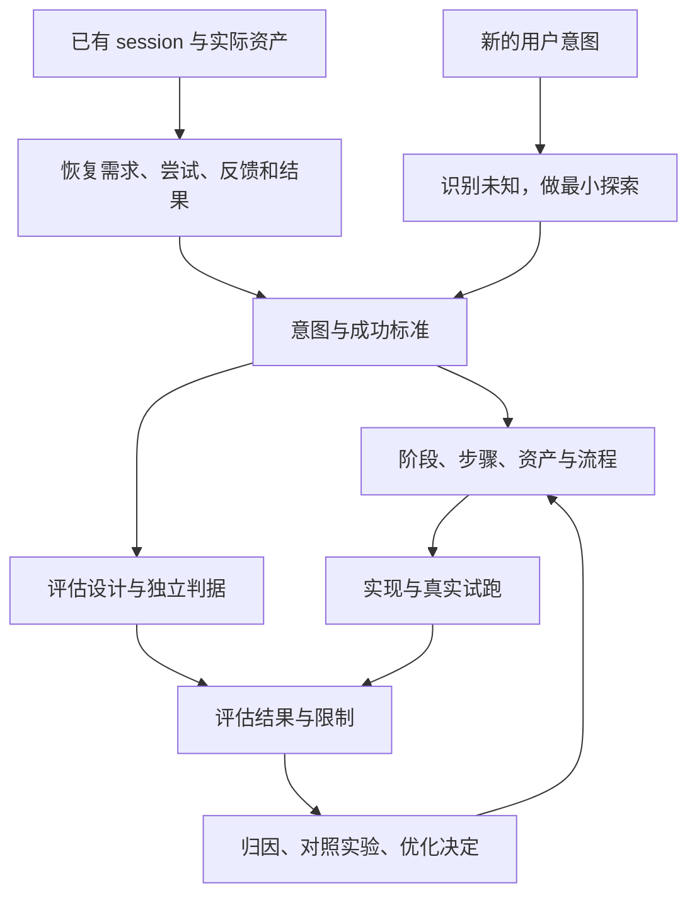

# 设计 Workflow：从意图或历史出发

方法阅读顺序：**设计 → [评估](./evaluating-workflows.md) → [优化](./optimizing-workflows.md) → 下一版设计**。写具体 TypeScript 时查 [编写工作流与 API](./writing-workflows.md)。这三份是开发指南，不是三个必须自动运行的 Agent，也不是新的核心 API。

设计回答：为谁完成什么，哪些资产能证明完成，怎样组织生成、审阅与返工。工作结构采用 **阶段 → 步骤 → 资产和流程**：阶段表达目标，步骤是可交付或可单独返工的工作单元，资产是输入、中间结果和输出，流程说明资产如何变化。Agent、工具和 skill 放在步骤内部；一次工具调用不必成为一个步骤。

## 两种入口，共同对齐意图

两种入口可以结合：复用历史中已证实的部分，对新的目标或未知单独探索。需求后来发生变化时更新意图版本，标明旧设计和旧评估哪些仍适用；不要把新需求造成的差异全部归为旧方法错误。

先用一段话说明长期目的、当前阶段目标、本轮交付及结束点。保留用户请求或确认的出处，区分当前要求、历史决定和 Agent 假设。用户不需要预先提供完整流程；Agent 负责沿用已确认答案，只集中澄清会实质改变路线的未知。

在设计 workflow 前，为主要要求建立以下对应关系。它可作为项目现有主报告的一节，无需每格新建文件。

| 意图/约束及出处 | 成功时用户能做什么 | 负责的步骤与资产 | 独立检查及判定者 |
| --- | --- | --- | --- |
| 理解材料中的关键内容 | 能回答主要问题，区分来源主张与推断 | 读取来源 → 带出处的报告 | 对照来源检查必答项、错误、合理未知 |
| 方便阅读和回到工作 | 能找到当前稿、证据及自己的意见 | 报告阅读器与决定记录 | 实际阅读和跨轮次反馈任务 |
| 有限资源内完成 | 在约定预算内得到约定范围的交付 | 调度、检查与有界返工 | 完成率、耗时、用户指导及重做投入 |

这是虚构研究任务的设计示例，不是这些要求已经在某个产品验收通过的记录。每条重要意图都要找到责任资产及检查方法；每个新增步骤也要能解释服务哪个目标。暂时无法测量的要求标为未知，不从验收中静默删除。

## 入口一：从 session 历史恢复并重建

这条路径采用 `session-to-workflow` 的恢复与重建设计，历史质证采用 `session-forensics` 的证据原则。两者是方法来源，不是本仓库安装依赖；本节给出可移植的操作合同。有这些 skill 的环境可调用原方法，无需复制工具或安装全局副本。

### 恢复案例，而非照抄操作顺序

选择共同业务目标下的相关会话、产物和反馈，固定要恢复的需求时点及范围。核对当时配置、实际工具结果、产物版本，以及 Reviewer 和子 Agent 的反证。作者说“完成了”只是一项待查宣称。

| 当时需求与输入 | 关键尝试 | 中间及最终资产 | 反馈及提供者 | 修改 | 实际结果与缺口 |
| --- | --- | --- | --- | --- | --- |
| 原请求、后续澄清分别定位 | 包含必要探索和失败 | 指向实际版本 | 区分用户意见、作者自评与独立检查 | 修改原因及版本 | 哪个范围被检查，哪些仍未知 |

重要事实保存会话/事件定位和对应资产版本。成功与失败都保留，不能只提取最后一版成功答案。先用有界索引和指标定位，再按具体问题读取原始事件；摘要只能导航，不能替代物证。缺少当时配置时不能断言“当时没有某能力”，缺少旧初稿时不能比较初稿质量。

### 带着全貌重新取舍

将必要探索、可复用方法和可避免返工分开；依据当时可知信息评判选择。后来的答案不能被当作当时本应知道的事实。每个关键调整说明：

| 历史做法及证据 | 调整理由 | 下一次的步骤 | 如何验证价值 |
| --- | --- | --- | --- |
| 几个动作没有独立交付或返工边界 | 合并减少重复交接 | 一步完成，仍保留关键中间资产 | 质量及问题发现不退化，交接负担下降 |
| 一个大步骤失败就全部重做 | 可分离的资产需要独立恢复 | 按资产或返工边界拆开 | 修复局部时复用有效部分 |
| 后来反复补同类证据 | 先确认是否是可复发缺口 | 将必要检查前置，或保留条件分支 | 同题重做检查旧失败是否改善 |

这些是取舍方法，不是规定必须合并、拆分或新增检查。新流程可以改变历史顺序和 Agent 数量；只把旧报告套进新模板，不算按新流程重做。

历史入口的交接物是：可追溯的案例证据、步骤调整理由、候选设计、未验证假设。影响设计的事实仍有争议时定向补查；无法恢复则缩小结论，不无边界翻完整历史库。

## 入口二：从新意图开始设计

没有可用历史时，从交付倒推最低必要能力，并把未知显式留在设计里。

1. 明确用户要获得或完成什么、使用情境、约束、现有资产及本轮交付点。任务描述不充分时，由 Agent 检查上下文并提出关键问题。
2. 列出最可能改变路线的未知，做低成本探索：来源能否取得、输出能否表达需求、必要工具能否工作。研究后才能决定的细节不强行变成启动前提。
3. 写一条最小但完整的资产路径，允许某一步由人工或现有方法执行。对不确定做法标注假设，避免根据理想结果臆造“最佳流程”。
4. 同时设计 evaluator、失败样本和结束条件。先验证高风险交接或一份关键资产，再决定是否扩大到完整流程。
5. 用真实新产物检查方法；原型的执行、反馈和返工成为第一批历史，之后可以接入入口一。

没有基线时可评价是否达到预先标准，但不能宣称“比旧版更好”。也可以明确选用当前人工方法或现有可用流程作为基线，同时记录人工指导和条件差异。

## 将两个入口汇成一份可执行设计

每步用“拿什么 → 怎么做 → 交出什么”描述，并补上影响协作和返工的边界：

| 项目 | 要写清楚的内容 |
| --- | --- |
| 输入与依赖 | 来源、版本、必要上下文，缺失时补取/阻塞/缩小范围的条件 |
| 中间结果与输出 | 可读候选、检查意见、接受记录；哪份是事实正本 |
| 执行与审阅 | 谁生成、谁检查、谁修订；独立审阅能看到哪些来源 |
| 分支与返工 | 有意见如何处置、技术失败如何恢复、最大投入及停止条件 |
| 版本与复用 | 改动后哪些下游需重算或复核，有效资产如何保留 |
| 完成与接受 | 检查哪一版、哪个维度；用户/授权代理/技术检查的范围 |

阶段和步骤按独立交付、判断及返工边界取舍；审阅、策略、工具和 Agent 数量不要求一一对应。流程内修订解决本次产物，跨运行优化解决可复发的方法问题，两者都要保留版本关系。

首次重建或重大结构变化，分别从历史与意图、方法与协作两个角度独立审阅同一候选。使用多 Agent 时提供相同目标、版本和资产入口；按证据处理分歧，由设计负责人修改并让相关侧复验。普通局部修改只复验相关意见，不把双审复制到每一步。记录审阅实际多发现了什么及其投入，不能从“两人都同意”推导方法成熟。

## 同时设计持续协作的入口

工作台是用户和 Agent 的共享上下文。用户回来后应能说明：为何做这件事、走到哪里、成果在哪里、最近改了什么、之前意见如何处理、下一步是什么。当前阶段突出显示，前面成果和决定仍可追溯。

关键意见绑定具体资产版本；修改后说明检查结果及受影响的下游。事实正文、执行记录、审阅结论分别呈现。工作台可用、作品合格、方法有效分别验收：按钮能点不代表用户理解，流程结束也不代表产物质量通过。实现入口见 [前端读模型集成](./frontend-integration.md)。

这些持续协作记录的正本由宿主项目的主报告或工作台维护；共享库提供执行账本、资产引用和安全读模型，不会自动维护用户意图、意见处理或优化决定。集成时分别标明现有能力和待实现部分。

## 交给评估阶段什么

保留一份主设计报告作为当前入口，包含意图与范围、阶段步骤、资产依赖、关键取舍、评估计划及当前未知；大体量证据按需引用，不另抄私有日志。方法、实现、实际接受三种状态分别记录。

当关键输入输出和返工条件可执行、重要意图有验收依据、必要工具已验证可用时，进入 [评估指南](./evaluating-workflows.md)。不能验证的部分留作候选；代码编写参考 [API 指南](./writing-workflows.md)，业务方法可放消费项目本地 skill。若评估发现方法问题，再按 [优化指南](./optimizing-workflows.md) 返回对应设计决定。
