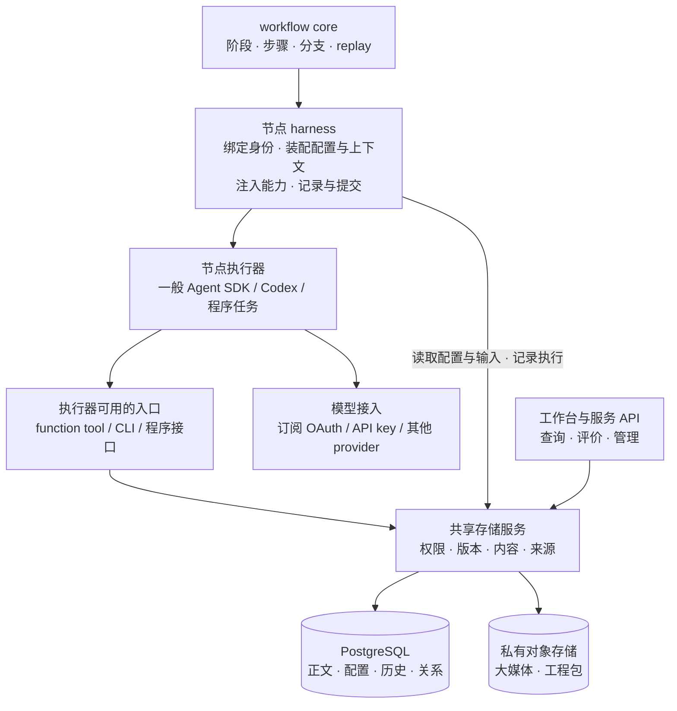

# Agent 存储层、PostgreSQL 与 SDK 执行闭环

**状态：完整目标仍是实施方案；PG 执行账本和可选 Space 基础层已实现。** 代码核对日期：2026-10-04。当前包与接口边界见[PG 存储指南](postgres-storage.md)及[Space 存储指南](space-storage.md)；本文继续描述尚未交付的完整媒体 harness、一般 Agents SDK 和生产闭环，不把方案中的模块、接口或表名写成已有 API。当前共有 core、Codex、SQLite、PostgreSQL、space-contracts、spaces、read-model、agent-sdk 八个包。

**领域模型状态：Workflow Space 已有可选 PG 领域服务、Schema Registry、节点合同与 runtime bridge，并能持久关联 workflow 版本、runs、资产、配置、会话、评价和迭代。** 只读控制台以 Space 聚合；稳定 `workflowId` 是底层执行身份。独立 PG ledger adapter 的 `workspaceId` 仍只是可信技术分区键，不能单靠它获得 Space 语义或数据库授权。完整媒体、一般 Agents SDK 与生产部署仍待建设。具体语义见[Workflow Space 领域模型](workflow-spaces.md)；本文的其余目标矩阵仍是完整产品验收要求。

我们要交付的是：**一项业务从第一版起就由 workflow 真正执行；每轮的输入、产物、过程和评价都有稳定身份，下一轮能根据证据改进。** 共享底座首先服务节点执行器：为一般 Agent SDK、Codex 和程序节点提供配置、资产、会话与历史能力。harness 负责装配与记录，CLI、tool 和程序接口按执行器需要注入；工作台也通过同一服务查看与管理数据。

**推荐存储组合：PostgreSQL 管理配置、运行、正文、关系和迭代；私有对象存储保存大媒体与工程包。** 节点面向统一的资产身份和操作，不需要理解底层文件放在哪里。两种后端的提交、恢复和保留协议见第 3.3 节。

设计原则是：**统一身份、权限、版本和来源；按数据性质采用不同读写规则；将存储与调用入口分开。** 同一层支持多种对象，不表示把所有内容塞进一个任意读写的 JSON 表，或把数据库管理权限交给 Agent。

推荐先做一个小而完整的实例：材料入库 → 写作者读取材料并成稿 → 独立 Agent A 审阅 → 人填写或修订四问 → 修改 workflow → 同题重跑比较。第一轮不要求生成视频，不要求自动优化 workflow，也不建设临时 VM 调度。

## 1. 订阅账号可以用在哪里

**可以用于部分路线，但“正在用 Codex 的订阅账号”不等于已经给我们的应用配置好通用模型凭据。** 截至本次查阅，官方有以下三种相关接入方式。

| 接入方式 | 订阅与费用关系 | 对本项目的意义 |
| --- | --- | --- |
| Codex SDK / CLI 的 ChatGPT 登录 | Codex 支持用符合条件的 ChatGPT 账号登录并使用计划额度；实际可用模型受账号与环境影响 | 保留现有 Codex runner；它适合工程工具节点，不能替代一般 SDK runner 的需求 |
| OpenAI API key | 常规 API 使用走 OpenAI Platform 计费，不能假设从订阅额度扣除 | 一般 SDK 的常规接入路线；只在明确选择此计费方式后配置 |
| 官方 Sign in with ChatGPT 的 plan usage（下文简称 SIWC） | 符合条件的应用可经用户 OAuth 授权，用其计划额度调用受支持的 Responses 请求 | 已有 SIWC Responses 适配与本应用官方登录、流式调用和独立评价存储探针；所需完整模型／工具覆盖与一般 Agents SDK 仍需分别验收 |

前两项见 [Codex 认证说明](https://learn.chatgpt.com/docs/auth)。SIWC 官方指南覆盖开源与本地托管应用；付费或远程托管应用需要按官方入口申请。个人自托管部署有单独说明，不能据此推定未来面向客户的云端 FDE 服务自动获得同样资格。[SIWC 概览](https://developers.openai.com/siwc/token-sharing-open-source)、[自托管说明](https://developers.openai.com/siwc/token-sharing-open-source/self-hosted-vms)

SIWC 应走应用自己的正式注册、授权和刷新流程，向公开的 Responses API 发请求。它不是读取现有 Codex 登录文件里的 token 后任意复用，也不需要接入非公开的 ChatGPT 后端。[模型与推理](https://developers.openai.com/siwc/token-sharing-open-source/models-and-inference)

**它目前有接口限制。** 文档要求流式调用、关闭服务端存储，HTTP 请求自行携带历史；部分参数、消息形态和托管工具不支持。因此，不能只把 OAuth token 填进 SDK 就声称全部能力可用。本方案建议增加 provider 适配，验证文本、函数工具、结构化结果和历史恢复；这是工程建议，不是官方已提供即插即用 Agents SDK 集成的承诺。[预览限制](https://developers.openai.com/siwc/token-sharing-open-source/preview-limitations)

本阶段推荐：**优先验证官方订阅接入是否满足我们的小闭环，同时让存储、harness 和 SDK runner 不依赖某一种认证方式。** 若不满足，保留明确失败原因，再选择 API 计费或其他兼容 provider；不静默切换到收费路线，不把 Codex 节点跑通算作一般 SDK 验收通过。方案设计、数据库实现和离线恢复测试都不需要先创建 API key。

### 登录时用户做什么、应用做什么

Codex 路线先用 `codex login status` 检查。已显示 ChatGPT 登录时无需为了本项目重新登录；使用同一运行身份的 Codex runner 可通过官方客户端管理登录态。新服务器或独立运行身份需要在目标环境完成官方登录，不能认为桌面 app 已登录就意味着所有服务器也已登录。实际模型可用性仍需单独验证。

一般 SDK 的 SIWC 路线需要本应用自己的授权入口，交互顺序是：

1. 应用启动本机回调监听并生成本次授权校验信息，打开 OpenAI 官方授权页。
2. 用户在官方页登录 ChatGPT，选择适用的账号 / workspace，并确认该应用使用计划额度的授权；密码和二次验证由用户完成。
3. 官方回调把授权码交给本应用。应用验证身份与权限、交换并保护凭据，页面只显示连接状态，不显示 token。
4. 执行器通过凭据引用使用该连接；应用管理续期与失效状态。随后另行验证所需模型、工具与输出能力，登录成功本身不算 SDK 闭环通过。

该直接授权流程不需要用户先创建普通 Platform API key；应用注册、回调、身份校验和凭据保存必须实现完整。不要让用户复制浏览器里的 code、token 或 Codex 登录文件到聊天中。[官方注册与登录流程](https://developers.openai.com/siwc/token-sharing-open-source/sign-in)

**本仓库已有 SIWC 登录入口和 Responses 适配，并完成一次本应用官方授权与存储探针。** 这不等于一般 Agents SDK、所有模型／工具能力或长期生产认证已验收。凭据由运行环境持有，业务资产和原始 trace 不保存它；普通 API key 不是方案和存储工作的前提。

## 2. 围绕节点执行器组织能力

这张图表示能力的调用关系。core 派发节点，harness 包裹该次执行；执行器运行期间经注入的入口读取材料、保存检查点或提交候选结果，harness 同时采集其可观测事件并完成正式提交。不能只给工作台提供一套资产 API，却让执行器继续凭本机路径找材料、自己保存唯一历史。

数据库、执行器和认证是三个独立选择。VM 解决的是进程与操作系统隔离，不替代版本、资产关系或 SDK 工具控制。本阶段可用一台常驻服务器部署服务、worker 和 PostgreSQL，配一个托管私有 bucket；也可先本机验证同一套服务，再搬到服务器。

| 模块（拟新增或扩展） | 具体职责 | 明确边界 |
| --- | --- | --- |
| core | 保留现有编排与 replay；增加可选的原子完成能力接缝 | 不导入数据库、SDK、UI 或 creation |
| PostgreSQL adapter | 实现 RunStore，并持久化资产正文、来源、会话、事件与迭代对象 | 不能只是给本机 JSON 文件建索引 |
| 共享存储服务 | 优先满足执行器的配置、资产、会话与历史读写，统一权限、版本、检索及持久内容访问 | 同一逻辑服务可先在进程内调用，不要求额外部署一个服务 |
| asset / execution harness | 包裹节点执行，绑定身份、校验资产引用、冻结上下文、注入 CLI / tool / 程序接口、采集事件并提交结果 | harness 是执行器的能力与生命周期适配层，不能当成只有人会使用的第三个薄入口 |
| 内容后端 / BlobStore | 文本与结构化正文入 PG，大文件进入私有对象存储；统一上传、校验、读取和清理协议 | 实际存储位置不泄露为公共资产身份，不把临时签名 URL 当作持久引用 |
| 一般 SDK runner | 推荐 TypeScript OpenAI Agents SDK；执行角色内部的模型和工具循环 | 具体 SDK 仍是方案建议；订阅适配必须另行实测 |
| provider / auth adapter | 解析凭据引用、授权续期、能力检查、请求适配、用量归属 | 不把 secret 写进工作流版本、产物或 trace |
| 共享服务与 read-model | 运行命令、worker、分页事件、资产读取、评价比较的安全投影 | 业务无需再造一套通用服务或直接连接数据库 |
| creation 扩展 | 内容与 B3 流程、方法、工具、schema、判据、作品阅读器 | 不复制 agent-workflow 源码或另建资产事实源 |

包名、HTTP 路径和 SQL 表名在实现时落定；上述职责先固定。Node 24、TypeScript 和现有 workspace 延续使用，首版无需新增 Redis、Kubernetes 或独立微服务集群。

## 3. 灵活存储层怎样组织

### 3.1 各类数据的存储方式

**资产、执行历史和 Agent 配置都适合由 PostgreSQL 持久管理。** 灵活性主要来自共享合同和数据模型，不是首版就同时实现很多数据库。

选择 PG 的依据是我们的数据具有明确关系和一致性要求：一次生产提交要关联配置、输入、attempt、产物与事件，且不能只成功其中一半；不同角色配置又需要可扩展字段。因此核心身份与关系采用关系表，扩展配置及结构化正文采用有 schema 版本的 JSONB。这是针对本业务的架构判断；PG 的[事务能力](https://www.postgresql.org/docs/current/tutorial-transactions.html)和 [JSON / JSONB 支持](https://www.postgresql.org/docs/current/datatype-json.html)提供实现基础。大视频进入数据库虽然技术上可行，却会把媒体传输和容量增长带入数据库备份、恢复与运维，建议分离。

| 数据 | 建议持久化方式 | 更新与读取规则 |
| --- | --- | --- |
| 成果资产、输入资料 | PG 元数据、正文、schema、hash、来源；大媒体见后文 | 资产版本不可变；读取准确版本或显式解析最新版本 |
| Agent 定义与配置 | PG 中的配置 revision；保留代码、方法或 Git 来源及摘要 | prompt、模型、工具、限制可配置；每次运行保存实际生效的完整快照 |
| Agent 执行历史 | run / step / attempt 状态表，加只追加的事件与工具记录 | 状态表服务查询，事件保留过程；Agent 不能覆写客观执行收据 |
| 会话与恢复检查点 | PG 消息、顺序、父会话、SDK 状态及格式版本 | 会话由授权执行器顺序写入；分叉形成新身份，不覆盖旧消息 |
| 长期笔记与可复用上下文 | PG 保存有作用域的条目、版本、来源、有效状态 | 每次写入带预期版本，防止多 Agent 覆盖；摘要与推断不能冒充原始证据 |
| 四问、比较、改动与采用 | PG 结构化记录，引用准确产物和标准版本 | 修订保留历史；判者与采用者分别记录 |
| 临时文件、缓存与进程状态 | 执行目录或进程内存 | 可清理、可重建；有保留价值的检查点先持久化再清理 |
| secret 与登录态 | 独立凭据存储；业务记录仅存引用 | 不作为可搜索资产或通用 tool 的读取对象 |

这里的 Agent 配置已经由用户明确为 prompt、模型、工具及其他运行配置。还应包含方法 / skills 的内容版本、输入输出 schema、上下文策略、可复用笔记范围、轮数 / 时限、重试策略及凭据引用。浏览器 / 桌面会话保存不属于本次补充需求。

配置可以由共享默认值、workflow / 节点配置和获准的单次覆盖合成，但必须有固定优先级、字段校验和权限边界。工具白名单是业务声明与宿主授权范围的交集，单次覆盖不能自行扩大权限。执行前保存合并后的实际配置及每项来源；涉及实验变量的覆盖在比较时显式显示。

长期笔记首版只需显式读写和来源记录，不建设自动记忆抽取系统。后续的全文或向量索引是可重建的查询加速层，索引结果必须指回原始记录和权限；不另造一份无法核验的事实源。

### 3.2 身份关系

一个 Workflow Space 对应一个业务目的，归属受授权的宿主分区；该业务的 workflow 各版本、案例、运行、会话知识、资产和评价都从 `spaceId` 组织。workflow 版本固定可执行入口及其代码和配置；现有 core 的 `workflowId` 是入口身份，不替代空间身份。逻辑空间不要求对应一台 VM、一份数据库或一个本地目录。领域归属、实际资产清单、版本交接和 Agent 使用规则以 [Workflow Space 存储设计](workflow-spaces.md)为准，本节只概述后端所需记录。

| 记录族（概念名称） | 保存内容 | 关键关系与约束 |
| --- | --- | --- |
| Workflow / DefinitionRevision | 业务目的、版本关系、变更理由、节点配置及方法快照 | 已用于运行的版本不可覆盖；代码构建标识与配置摘要可追溯 |
| AgentDefinition / ConfigRevision | 角色配置、工具声明、会话策略、方法内容及来源 | 同一角色可被多个 workflow 引用；运行绑定准确 revision，覆盖项校验后冻结 |
| Case / InputSnapshot | 同题比较的业务目标、约束和精确输入清单 | 输入冻结后不跟随资产的“最新版”漂移 |
| Run / Step / Attempt | 使用哪版流程、进度、失败、重试与实际执行配置 | attempt 属于唯一 step；换流程版本创建新 run |
| Asset / AssetVersion / Payload | 稳定资产身份、不可变版本、正文、类型、schema、内容 hash | 引用绑定版本与 hash；人工导入有独立来源，不能伪造 Agent 生产记录 |
| Dependency / Production | 使用了哪些上游版本、由哪个 attempt 的哪个输出产生 | 同一生产提交幂等；通过外键及 workspace 约束防止串线 |
| Session / TraceEvent / ToolCall | 实际提示与上下文、消息、工具输入输出、模型/SDK 版本、用量、结束状态 | session 归属 space，可跨 attempt 继续；消息和事件关联实际 run、step、attempt；原生 ID 与本地 ID 分别保存 |
| ContextEntry / Checkpoint | 可复用笔记、摘要依据、有效期；可恢复执行状态 | 绑定 workspace / workflow / case / session 等明确作用域；不把一段会话自动提升为全局记忆 |
| Evaluation / Comparison | 好、不好、相对基线提升、仍不满意；可选分数、证据、标准版本 | 评价绑定精确产物和基线；人和 Agent A 分别记录身份 |
| Change / Adoption | 下一版改什么、依据哪条评价；采用、拒绝或回退及决定者 | 评价建议与采用决定分开；采用不覆盖原始结果 |

运行状态、结构校验和质量评价分开存。一个节点可以成功返回却输出格式错误，也可以结构正确但创作者仍不满意。不能用一个绿色的“完成”把这些状态合并。

不可变的是已提交的版本、实际执行快照与历史事件；可变的是草稿配置、当前采用指针、会话头和运行进度。更新可变状态使用预期版本校验，并记录变化。一次运行读取的长期笔记也要冻结版本，不能在重试时悄悄换成被其他 Agent 更新后的内容。业务可修改草稿，但不能回写历史快照让旧运行看起来用了新配置。

同一个角色可以有多次会话和并发 attempt。Agent 定义 ID 回答“用的是谁的配置”，session ID 回答“哪段对话”，attempt ID 回答“本次到底执行了什么”；三者不能混为一个可覆盖的 Agent 文件夹。跨 workflow 共享材料通过显式授权和引用完成，不因为同在一台服务器就互相可见。

### 3.3 PostgreSQL 与对象存储的分工

文本、结构化结果、提示词、方法快照、可获取会话和工具记录的正文进入 PostgreSQL。JSON 的完整性需要固定序列化规则；保存原文时对原始字节计算 hash。现有 replay fingerprint 用来判断是否复用，不能充当内容完整性证明。

本轮按用户要求将大文件纳入设计，**建议采用 PostgreSQL＋托管对象存储**，具体云服务尚未开通。分工如下：

| 后端 | 保存内容 | 节点看到什么 |
| --- | --- | --- |
| PostgreSQL | 配置、运行、评价、会话、活动 trace、文本 / JSON 正文；所有资产的身份、版本、来源和内容位置清单 | 同一套配置、历史和资产操作 |
| 私有对象存储 | 视频、音频、大图片、PDF 原件、工程包；后续按策略归档的大体积 trace 正文 | 资产引用；需要文件工具时可物化为本次执行目录中的文件 |
| 本地工作目录 | 工具正在加工的文件、下载缓存、尚未提交的临时结果 | 本次执行可用的路径；不作为其他节点的持久依赖 |

文件原件与提取文本可保存成关联资产：例如 PDF 原件放对象存储，提取正文放 PG，下游明确选择使用哪一个。若未来归档 trace，PG 保留索引、范围、hash 与完整性状态，通过统一读取接口仍可取回正文；不得悄悄删掉唯一历史。

内容位置清单包括后端、bucket、不可变 object key、提供方版本标识（若支持）、字节数、MIME、独立 SHA-256 和可用状态。引用不依赖下载域名，临时签名 URL 按需生成且不作为资产 ID，不进入模型长期上下文或普通 trace。multipart ETag 不能充当整文件 SHA-256。

#### 选择服务

先实现一个 S3 兼容 adapter，最低合同限定为上传 / 分片上传、查询、读取、删除及受控传输；每个提供方仍需跑兼容性测试，不能假设所有 S3 特性均可用。

| 服务 | 适用考虑 | 需要规划的差异 |
| --- | --- | --- |
| Cloudflare R2，首个候选 | 托管服务，提供 S3 兼容接口、签名访问与大文件上传，适合先接入一个私有 bucket | 不依赖其提供 S3 bucket versioning；由应用使用不可变 object key，并另配备份策略。[S3 兼容范围](https://developers.cloudflare.com/r2/api/s3/api/)、[上传](https://developers.cloudflare.com/r2/objects/upload-objects/) |
| AWS S3 | 希望使用原生版本管理及更完整的数据保留机制，或已在 AWS 部署 | 可配置 Versioning / Object Lock；仍要设计生命周期与备份，开启版本不等于所有误删都自动可恢复。[版本管理](https://docs.aws.amazon.com/AmazonS3/latest/userguide/Versioning.html)、[Object Lock](https://docs.aws.amazon.com/AmazonS3/latest/userguide/object-lock.html) |
| Supabase Storage | 同时决定采用其托管 PG、身份与存储平台时，可减少平台拼装 | 会带入自己的元数据和授权层；不把它的元数据当成我们的业务版本账本，也不假设支持 S3 版本管理。[兼容范围](https://supabase.com/docs/guides/storage/s3/compatibility) |

当前推荐常驻服务 / worker＋PG＋一个托管私有 bucket。PG 可先同机，正式持续使用时配置异机备份；对象存储先用托管服务，避免把大文件可靠性也交给同一台服务器。具体 provider 按已有云账号、区域连通性、容量与恢复要求选择；本方案不默认购买服务或创建 bucket。

#### 上传、发布和读回

PG 与对象存储之间没有一笔共同事务，需要明确的提交协议：

1. 存储服务在 PG 创建 upload intent，绑定节点身份、候选资产、预期内容信息与幂等键，分配唯一 staging key。
2. 节点通过受控的工具 / CLI 流式上传；大文件支持分片及中断续传。首版由服务端或可信执行适配器完成存储调用，Agent 不获得 bucket 的管理凭据。
3. 完成上传后，服务端核对大小和内容 hash。使用提供方实际支持的校验能力，必要时读回校验；不只相信客户端填入的 hash 或普通 HEAD 元数据。
4. 服务端将内容写入每个候选版本独有的 final key，核验该最终对象的实际大小与 hash 后，再在 PG 事务中将版本标记为 READY，并提交输出依赖、step / attempt 状态和事件。复制时绑定已检查的源对象代次 / 条件；若提供方不能保证该条件，就在最终对象上重新校验，源文件变化时拒绝提交。final 写入使用提供方支持的禁止覆盖条件；不支持时通过专用写入服务、最小权限、唯一 key 和 PG 锁串行化发布，普通执行器无 final 写权限。已存在的 key 只核对、不覆盖，内容不同即冲突。读取及对账继续核验内容，不能只靠命名约定宣称不可变。只有 READY 的准确版本能供下游使用。
5. 如果对象已写入而 PG 尚未提交就崩溃，用原 intent 和 key 对账并继续提交；不会另造第二份权威版本。孤立对象稍后按保留策略清理。

签名 PUT 在有效期内可能被再次使用并覆盖同一 key，因此若后续开放执行器直传，只授予 staging key；已提交的 final key 不交给可重复使用的写链接。单独签名的 GET / PUT 与整个 bucket 的权限分开。[R2 签名访问](https://developers.cloudflare.com/r2/api/s3/presigned-urls/)、[S3 签名访问](https://docs.aws.amazon.com/AmazonS3/latest/userguide/using-presigned-url.html)

执行器通常先查看 metadata，再读取所需正文或片段。需要 FFmpeg、绘图或其他文件工具时，由 harness 将指定版本下载并核验到工作目录；产物完成后经同一入口上传和提交。下一个节点收到资产版本引用，由自己的执行环境解析，不继承上一台机器的绝对路径。程序工具适配器可以处理短时传输地址，模型不必看到这些地址。

#### 保留、删除与恢复

未完成上传、可再生缓存与已采用产物采用不同保留策略。只有确认没有运行、基线、采用记录或保留中的备份引用时，才可回收 final 对象；未完成 multipart 单独回收。删除先在 PG 事务中检查引用并将对象转入待删状态，禁止新增引用；过宽限期后再检查保留条件并删除对象，保存回执。正在读文件的执行器有读取租约，物理删除等待它结束；已被输入快照或基线固定的版本保持可读，直到引用被显式释放。删除失败或结果未知时继续对账，不把对象重新暴露为 READY，防止引用检查与物理删除之间发生竞态。

数据库备份和媒体备份共同组成恢复集合：PG 备份清单能定位对应的不可变对象，媒体保留窗口覆盖数据库可恢复时间窗口。定期核验缺失 / 孤立对象，演练“恢复数据库＋读回指定版本＋校验 hash”。R2 的应用版本键不能抵御 bucket 整体误删，需要独立备份或复制；S3 的版本和锁定也必须按具体恢复要求配置。自动清理不应删除已提交资产，执行结束不触发资产删除。

首个存储交付即验收一份代表性媒体文件的上传、读回、断点处理和重启后校验；首个真实内容 workflow 仍可只产文本。B3 阶段增加完整媒体生产工具及业务验收，不再把存储协议推迟到那时才设计。

工作目录和下载缓存可以继续存在。清除缓存后，系统仍须从持久存储读取已验收的输入、产物与历史；本机绝对路径不进入公共资产身份。

### 3.4 记录可观测过程，而非声称拥有所有内部推理

保存宿主实际提交、实际收到及 SDK 暴露的消息、可见推理摘要、工具调用、错误、用量和最终结果；不承诺拿到模型隐藏的内部思考或不可观测的内部注入。每个 attempt 同时记录“执行是否结束”和“trace 是否完整”，缺段、脱敏或不支持的记录类型明确标记。审计 trace 能解释已观察到的执行，不代表具备可继续运行的 SDK 检查点。

客户端可看到的业务数据与受限审计数据分开投影。凭据放在独立 secret 管理路径，数据库业务记录只保存凭据引用、认证模式和费用归属。官方云端 tracing 即便启用也只是额外出口，不作为唯一历史来源；缺少该出口的认证或权限不能导致本地链路丢失。

### 3.5 节点执行器怎样使用这些能力

harness 包裹节点的生命周期，并为该节点装配所需存储能力。CLI 和 tool 是提供给执行器的调用形态，程序节点也可直接使用类型化接口。它们使用相同的授权、版本、校验和幂等规则，不各自直连表后重复实现业务逻辑。

| 执行器 | harness 提供什么 | 运行期间怎样用存储 |
| --- | --- | --- |
| 一般 Agent SDK | 生效配置、冻结输入、会话状态、受限 function tools、事件 hooks | 通过 tool 查资产、读取内容、保存候选产物 / 笔记；消息与调用由 hooks 自动记录 |
| Codex | 生效配置、执行目录、已物化输入、节点作用域的 CLI，或实际支持的 MCP tools | 在其工具环境内调用 CLI / tool；大文件经服务物化与提交；可获取的会话和事件由 adapter 回收 |
| 程序任务 | 同样的节点身份、输入引用及类型化存储 client | 程序直接读写，不必绕一次模型 tool 调用 |

表中是完整执行器合同的目标；现有 Space 节点客户端与 core runtime bridge 已提供受限资产读写和冻结上下文，但当前 Codex runner 尚未拥有这套存储 CLI。完整验收仍须证明同一精确资产可由至少两种执行器读取，且配置、权限、来源、结果提交保持一致；不能仅以工作台能展示数据作为“支持 Agent”的证据。

| 操作族（示意，尚非发布 API） | 例子 | 允许的责任 |
| --- | --- | --- |
| 资产 | 查找材料、读取指定版本、提交候选产物 | Agent 可在被授予范围内使用；校验和正式生产提交由 harness 完成 |
| 历史 | 查询某次运行、分页读取可见事件、获取可恢复会话 | Agent 按权限读取；运行完成、工具回执等权威事件由执行器记录 |
| 配置 | 读取本次生效配置、提出下一版 prompt / 工具配置 | 运行中不悄悄切换；扩大权限不能通过写配置自行生效 |
| 上下文 | 读取有来源笔记、按预期版本更新、标记过时 | 命名空间和共享范围由授权上下文决定 |
| 评价 | 提交四问、引用证据、比较指定版本 | 评价与采用权限分别校验，不允许评价接口顺便改产物 |

调用身份由宿主绑定，不能只相信模型传来的 workspaceId 或 agentId。公共输入可选择资源 ID，但服务端重新核验访问范围；CLI 和 tool 不提供任意 SQL、任意文件路径或凭据读取入口。

读操作返回资源身份、版本、来源与分页游标；写操作携带请求幂等键，需要覆盖可变状态时再带预期版本。超大内容通过分段读取或受控内容传输，实际交给模型的片段也记录，不能让“引用了整份文件”伪装成模型真的读过全文。

存储层的灵活合同先拆成资产、配置、执行、会话、上下文和评价这些能力端口。它们首版可以共享同一个 PostgreSQL 实现和事务协调器；需要一起提交的记录不能因为拆端口而丢失事务。未来换大文件后端或增加检索能力，调用者仍使用相同身份与权限语义。

查询先支持按 workspace、workflow、Agent 定义、run、时间、类型与来源关系过滤，并分页返回。schema 与索引按查询建立，扩展字段用有版本的结构化内容承载。事件增长先通过批量写入、分页和保留策略管理，量级需要时再做分区；不预设必须增加另一套日志数据库。导出、归档和删除同样走共享接口，受权限和引用检查约束；采用版本与比较基线需要的证据不能被缓存清理顺带删掉。

这也支持尚未编成 workflow 的单个 Agent：用真实的独立执行身份登记会话、配置和资产，不伪造 workflow 节点；以后接入 workflow 时显式建立来源关系。首个验收仍聚焦已选定的 workflow 案例，避免为通用性同时扩展全部产品界面。

## 4. 一次节点执行如何闭合

下列是拟实现的执行协议，编号可以直接转成验收用例。

1. **接收运行请求。** 服务端校验调用者和 workspace，以客户端请求 ID 去重，保存 workflow revision、案例与 run。排队成功只表示已受理，不表示模型已执行。
2. **解析并冻结输入。** harness 将角色声明的逻辑输入解析为准确的 asset version 和 hash，检查 schema、可读性与权限。别名如“当前稿件”必须在此刻变成固定版本。缺材料时停止在调用模型之前。
3. **领取步骤并保存执行清单。** worker 用短事务领取任务，创建 attempt，保存模型、SDK、prompt、方法、工具列表、限制及输入版本。租约续期和 fencing token 防止过期 worker 继续提交；首版限制并发，也保留可恢复的领取记录。
4. **装配上下文与执行。** 通过现有 AgentRunner 接缝调用一般 SDK 或 Codex。模型网络请求期间不持有数据库长事务。角色只拿到声明过的材料与工具，数据库连接和原始凭据不进入模型上下文。
5. **持续落过程记录。** 模型事件、实际交付的上下文、工具请求与回执关联 attempt，按可恢复游标增量写入。事件有来源去重键；run 内序号由数据库原子分配，不能用未经并发保护的最大值加一。序号不承诺无空洞。
6. **保存候选输出并校验。** 流结束且确认完成后，持久化响应收据与候选正文，再进行 schema 和业务硬约束校验。暂停审批、断流或额度耗尽都不当作最终结果。无效产物留作诊断，但不进入可复用成功结果。
7. **原子完成生产提交。** PG 正文直接参与提交；对象内容先按第 3.3 节完成写入、核验和不可变保存，再在一个 PG 事务中保存资产版本及依赖、输出绑定、attempt / step 完成状态和完成事件。相同提交键与相同内容返回同一结果；相同键却不同内容报冲突。过期 worker 的提交被拒绝。该原子性只覆盖 PG 中的权威发布，不表示两个存储系统能共同回滚。
8. **下游与评价读取。** 下一个节点通过已提交的准确资产版本读取；工作台展示主产物和状态，再提供展开过程的入口。Agent A 的评价形成独立记录，不修改写作者的产物或冒充用户采用。

业务工具通过 harness 调用包装器执行。只读工具按资产权限取内容；有外部副作用的工具先持久化操作意图和幂等键，执行后保存回执。不能把“模型又发了一次同样的工具调用”自动理解为获准再做一次外部操作。

### 4.1 需要补的接口，不重造现有引擎

| 接缝 | 当前代码事实 | 方案中的变化 |
| --- | --- | --- |
| RunStore | 已有异步 run / step / attempt / event / artifact 操作；PG 包提供对应实现 | 保留旧 SQLite 消费者；新增业务资产对象走明确扩展端口 |
| 资产正文读取 | PG store 持久化 JSON payload，读取时校验内容 hash；SQLite 也提供自身实现 | 扩展到受控的资产版本解析、授权读取与输入装配 |
| AgentRunner | 已传入 runId、stepRunId、attemptId、input、signal、emit | 增加 SDK adapter；harness 传递冻结上下文、工具 manifest 和会话恢复引用 |
| 步骤完成 | core 已有可选 `commitStepResult` 端口；PG store 可在一个事务中提交 artifact、step/attempt 状态、完成事件与幂等收据 | 完整 harness 需强制使用该能力；旧消费者继续保留原路径及原保证 |
| attempt 恢复 | core 对原子提交结果未知的 running attempt 要求先对账，Space runtime bridge 保留已记录的节点上下文 | 继续完善跨执行器的已完成、确定失败、等待输入与结果未知判定，再决定复用、续接或重试 |

对应代码见 [存储与执行端口](../packages/core/src/ports.ts)、[核心运行时](../packages/core/src/runtime.ts)、[SQLite 适配](../packages/sqlite/sqlite-run-store.ts)、[PostgreSQL 存储指南](postgres-storage.md)、[Space 存储指南](space-storage.md)和[Codex runner](../packages/codex/src/runner.ts)。单有 PostgreSQL RunStore 或 Space 确定性测试不能证明完整生产执行闭环成立。

### 4.2 中断、重试与重复请求

| 中断位置 | 恢复行为 |
| --- | --- |
| 请求已入库，worker 尚未开始 | 重新领取同一任务；不新建重复业务 run |
| SDK 请求尚未发出 | 新 attempt 或原未开始任务继续；保存旧记录 |
| 请求已发出，但没有最终回执 | 标记结果未知，依据 provider 能力对账；不能假设取消或断网意味着远端没有执行 |
| 候选响应已持久化，尚未完成提交 | 从候选记录重新校验和幂等提交，无需再次调用模型 |
| PG 提交完成，客户端没收到成功 | 读回同一提交结果；不重复生成资产 |
| 第三方工具已执行，回执丢失 | 按业务操作键查询或人工核对；无法确认时暂停相关分支，不能盲目重试 |
| 旧 worker 丢租约后恢复 | 允许补充带来源的诊断记录，禁止以旧 fencing token 提交权威结果 |

SDK 的 HTTP 自动重试、worker 重试和业务工具重试需要统一预算和分类，不能三层相乘。会话继续不等于步骤 replay：前者依赖可用历史或可序列化状态，后者依赖已提交、校验有效的结果。

结果未知时保留一个可见的待核对项：记录已知证据、最后观察时间、可查询的外部 ID 和允许的处置。系统或操作者补入回执、确认放弃，或显式决定承担重复风险后创建新尝试；所有决定留下记录。租约到期只说明 worker 不再持有任务，不证明远端没执行，不能直接跨过待核对状态重跑。

## 5. SDK 如何做到更可控

工作流负责阶段、步骤和跨节点返工；SDK 负责一个角色内部的多轮模型与工具调用。可解释的业务交接应建成 workflow 步骤；确需节点内部 handoff 时，保留子调用身份和过程，而不是只留一个“Agent 已完成”。[Agents SDK 执行说明](https://developers.openai.com/api/docs/guides/agents/running-agents)

每个节点显式配置：角色目的、指令与方法版本、模型、输入 schema、工具白名单、输出 schema、轮数及运行时限、会话策略。资产工具由 harness 按当前 workspace 和输入范围校验，不能靠 prompt 中一句“不要读其他文件”实现权限。

一般内容节点首版仅提供受控的资产读取和必要业务工具，不自动继承本机仓库说明、用户级 skills、shell 或浏览器。Codex 节点保留工程环境能力，单独记录 cwd、实际注入材料和可用工具；无 VM 时不能宣称实现了操作系统级隔离。需要执行不可信代码的节点以后再单独加强执行环境。

可观察并持久化的会话历史由 PG 保存，SDK 使用一种明确的历史策略读取它；不要同时回放全量消息又请求服务端自动续接，导致上下文重复。暂停审批时保存 SDK 支持的可恢复状态，并记录格式及 SDK 版本兼容性；不可序列化的闭包和活进程不算已恢复。不能保证任意版本下都能反序列化旧状态。[结果与状态](https://developers.openai.com/api/docs/guides/agents/results)

认证配置与节点定义分开：节点选择 provider 和认证配置引用，执行时获取凭据。SIWC adapter 负责官方 OAuth 的 token 刷新、账号范围、支持能力与错误映射；API adapter 负责普通 API 凭据。任何额度用尽、授权失效和工具不支持都形成明确事件，不切换账号、模型或计费方式掩盖失败。

**订阅适配的最小实测门槛：** 本应用正式授权成功；选定模型完成流式回答；调用一次自定义资产工具；产出并通过结构校验；历史入 PG 后重启继续；授权和额度错误可辨认。列出模型名称或成功登录 Codex，只能证明部分条件，不能替代这些验收。

### 5.1 Codex 接入的默认行为

**共享服务中的每个受管节点，从创建 attempt 起就必须进入统一存储与记录协议。** 这包括 Codex、一般 SDK 和程序节点，不依赖业务作者逐个补日志，也不依赖 Agent 记得调用一个“保存历史”工具。CLI / tool 负责节点主动使用资产，执行历史由 harness / adapter 自动采集。

这里要改变的是我们对 Codex 的默认接入方式。先复用官方执行能力，在其外围接管配置装配、事件采集、资产提交和恢复记录。官方 SDK 支持线程运行与恢复；需要更丰富的会话、审批和事件交互时，可评估 app-server。当前项目使用 TypeScript SDK，尚未因此迁移到 app-server，也没有证据表明官方客户端可直接改为用我们的 PG 保存全部原生状态。[Codex SDK](https://learn.chatgpt.com/docs/codex-sdk)、[app-server](https://learn.chatgpt.com/docs/app-server)

2026-10-04 的代码核对表明：现有 runner 把详细原生事件写入本机文件，向 RunStore 发出的 `agent.event` 主要是精简投影；会话查询与摘要仍依赖本机目录；输出文件收据只证明观察到文件及其 hash。它们不足以证明共享存储已经拥有可用于调优的完整证据。

| 必须接管的默认行为 | 目标合同 |
| --- | --- |
| 运行身份与开始记录 | 先持久化 workspace、workflow revision、run、step、attempt，再启动 Codex；准备配置 / 方法失败也有记录；thread ID 一旦可见立即关联 |
| 配置与上下文 | 保存本次实际提交的 prompt、输入版本、方法内容、工具声明、CLI / SDK 版本及环境配置；区分明确配置、可观测注入与无法确认的原生默认值 |
| 事件与工具历史 | 详细的可观测事件进入受限审计存储，工作台摘要由其派生；不只保存公开投影，不以 Agent 自述代替工具回执 |
| 资产读取与交付 | 输入从准确资产版本物化；候选结果提交正文 / 文件内容并核验；执行目录和 receipt 路径不是长期正本 |
| 会话与嵌套调用 | 绑定原生 thread / turn / item ID 及可获取的父子关系；只收集属于本次受管执行的记录，不扫描导入同机无关会话 |
| 完成、失败和取消 | 区分业务执行状态、记录同步状态、trace 覆盖情况与质量判决；失败、超时、重试、取消和未知结果都保留，不能只保存成功样本 |
| replay、resume 与修订 | replay 指向原始产出 attempt；新尝试保留旧记录；resume 保存前驱关系；换 workflow / 配置版本的新运行保留比较基线 |

详细记录需要统一脱敏和访问权限；“原生事件入库”指经受控处理后的可观察证据，凭据不随事件一并保存。脱敏范围与缺失字段明确标注，不承诺获取隐藏内部推理。

**存储故障必须显性影响完成状态。** 开始记录无法持久化时不发起模型调用；运行中同步失败时采用有上限的私有本地缓冲，在可控制边界停止新增工作并报告同步失败。缓冲只用于重传，收到存储确认前不能清理。若进程或机器丢失导致无法恢复，记录缺口而非声称完整；模型可能已在远端执行，不能因采集失败就盲目再调用一次。候选结果、生产关系及必需的执行记录完成提交后，才允许发布权威结果。

原生会话与调优历史分别验收：共享池能读到全部已采集历史，不等于 Codex 能在任意机器原地 resume。需要原生恢复时，单独验证所需会话文件、运行版本、配置与工作目录条件；不满足时明确提示无法恢复，不能伪装成恢复成功。原生会话归档按 thread 身份和来源游标采集，并保留 hash / 完整性标记；不得靠“最近修改的文件”猜测归属。

内置子 Agent、外部工具或脚本中的嵌套模型调用也要声明覆盖范围。可取得的子调用保存父子关系和证据，未暴露的内容标为不可观察。要求独立评价、重试或成本归因的子任务应建成显式 workflow 节点；没有采集能力的隐式分支不能显示为历史完整。新增执行方式须先通过记录合同验收，不能默认形成游离调用。

以上默认值作用于新的共享服务装配路径，不修改用户全局 Codex 配置或无关会话。旧 SQLite 消费者保持已声明的兼容语义；新接入不允许静默降级成“只在本地记录”。

## 6. 迭代闭环在工作台里长什么样

用户进入 workflow 空间，先看到业务目的、当前采用版本和各轮结果。点击一轮，看到实际主产物、使用材料、运行是否完成及当前评价；过程记录按需展开，不要求用户先读日志。

每轮评价至少保存四问：**哪些好、哪些不好、相对哪一轮提升了什么、还有哪些不满意。** “提升”必须绑定基线；无基线就写“首次运行，暂无比较”。分数可选，具体证据与可执行的改动理由比只有总分更重要。

第一版可以只是共享页面上的四问表单、两个产物并排查看、版本差异和采用按钮。暂不做拖拽编辑器或自动改 prompt。Agent A 使用独立会话、明确标准和规定的证据包；其评价与人的评价都保留。比较时输入、模型、工具或评价标准发生变化，要显示差异，不能把多个变化后的结果全部归因于 workflow 改动。

迭代链应能读成一句话：**第 1 轮哪里不好 → 证据是什么 → 第 2 版改了什么 → 同一案例重新跑出什么 → 哪些提升、哪些仍差 → 谁决定采用。** 这才是未来 FDE 可复用的学习过程。

## 7. creation 如何接入

先用内容创作验证共享底座，保持现行“完整内容 → 创作者确认 → B3 生产 → 创作者确认”的业务边界。独立 Agent A 评价不能取代创作者确认，也不重新拆回历史的 B1、B2 两个独立当前关口。

creation 注册 workflow、角色方法、资产 schema、工具、评价标准和阅读器；共享服务负责运行、资产、历史和通用四问页面。现有本地工作台保留为需求与迁移参照，当前未迁移能力必须显式展示，不能让本地原型和 PG 服务同时对同一业务记录写入。

迁移只导入选定的历史案例。先 dry-run 列清来源、版本、缺失文件、摘要和原评价，再按稳定导入键写入，保留原系统 ID；没有完整 trace 的旧记录标为历史不完整，不补造调用证据。旧私有数据与源目录保留，research 和 analysis 不被强制迁移。

常驻服务迁移到服务器后，通过服务端身份与授权接口访问；不直接暴露数据库或任意本地文件。备份恢复必须实际验证资产正文、来源和评价关系。执行完成、停止 worker、清理缓存和删除长期记录是不同动作，默认完成执行不会删历史或立即释放待排查的工作目录。

## 8. 建设分段与完成标准

| 阶段 | 交付内容 | 验收证据 |
| --- | --- | --- |
| A：合同与认证可行性 | PG schema / 迁移设计，节点存储能力合同、对象上传提交协议；应用的官方订阅登录入口 | 设计和代码接缝明确；用户可完成官方授权并看到真实连接状态。认证未定不阻断无模型开发 |
| B：持久执行 | PG adapter、S3 兼容 BlobStore、节点 harness、一般 SDK runner、Codex 统一记录适配、CLI / tools、最小 worker 与服务接口 | 真实 PG 集成测试；SDK、Codex、程序节点通过同一存储合同；真实 bucket 媒体读回校验；清除已同步缓存和重启后仍可读产物与过程 |
| C：最小迭代界面 | workflow 空间、产物阅读、四问、基线比较、改动和采用记录 | 两版 workflow 同题运行；人和 Agent A 各留一条有证据的评价；可追到改动与采用理由 |
| D：creation 接入 | 内容流程注册、业务工具与阅读器、选定案例迁移、常驻部署 | 产物由 workflow 生成；备份恢复演练；质量结果与基础设施结果分别报告 |
| E：B3 业务生产 | 在 B 已验证的存储能力上接入媒体生产工具、阅读器与业务保留策略 | 工具副作用恢复、完整媒体生产、媒体阅读和创作者确认 |

首个完整交付取 B 与 C 的最小范围，并用 D 的一个内容案例验证。它不以“PG 建了几张表”或“SDK 打印了一句回答”为完成标准。A 的订阅探测失败也不能被写成 SDK 已验收；需要明确选择一个实际可运行且授权的模型入口。

实现至少覆盖以下故障测试：

- 精确版本读取与 hash 校验；不存在、无权限或类型错误的输入在调用模型前被拒绝。
- 同一资产通过 harness、CLI 与 tool 读取时权限和版本一致；并发配置或笔记更新发生冲突时不静默覆盖；运行绑定实际配置和上下文版本。
- SDK、Codex 与程序节点共享同一精确资产并留下各自执行与生产记录；Codex 不再后置为业务自行补充日志的特例。
- Codex 正常、准备失败、超时、采集失败、resume 与 replay 均可从共享存储识别；原始可见过程足以重新生成摘要，嵌套调用的覆盖缺口可见；本地已同步 trace 移走后仍可评价与比较。
- 大文件上传中断、staging 被改写、对象已写而 PG 未提交、删除后确认响应丢失时，能够核验和对账，不发布内容不符或已不可读的版本。
- 重复运行请求、重复事件和重复生产提交不会制造第二份权威结果；同键不同内容明确冲突。
- 响应已持久化而提交未完成时崩溃，恢复不再次调用模型；过期 worker 不能覆盖新结果。
- 断流、取消、额度用尽、数据库暂时不可用和工具结果未知时，状态准确且历史缺口可见。
- 第二轮能指向第一轮的准确产物、四问和标准；评价不能越权修改产物或自动采用。
- 旧 SQLite 消费者通过合同回归；root 与共享项目构建登记新增包，既有 research / analysis 的接入保持有效。

确定性测试用假的 runner 注入故障；存储与并发用真实 PG；最后单独运行有上限的真实 SDK 案例。三者分别证明协议、持久性和实际模型接入，不相互替代，也不证明内容质量天然合格。

## 9. 当前建议与还需实测的选择

已确认：共享能力归 agent-workflow，harness、CLI、tool 和共享存储首先服务节点执行器；PG 管资产、配置及历史；增加一般 SDK；四问、人或 Agent A、可比较的迭代；creation 作为业务消费者；暂不建设 VM 调度。

本方案建议：TypeScript OpenAI Agents SDK 作为首个一般 runner；应用自持历史与 trace；先做真实文本 workflow，同时验收一个媒体文件的存储链；优先验证官方 SIWC 订阅接入；单服务与 worker＋PostgreSQL＋托管私有对象存储起步。

已实测本应用的 SIWC 官方授权、流式模型调用和独立评价探针；仍需实测所需完整模型及工具支持，并在相应阶段选择订阅路径不满足时的计费入口、对象存储 provider／区域及保留参数、正式服务器的部署与备份位置。它们各有自己的验收点，不应被混成“必须先买服务器／配 API key 才能继续设计”的前置条件。
