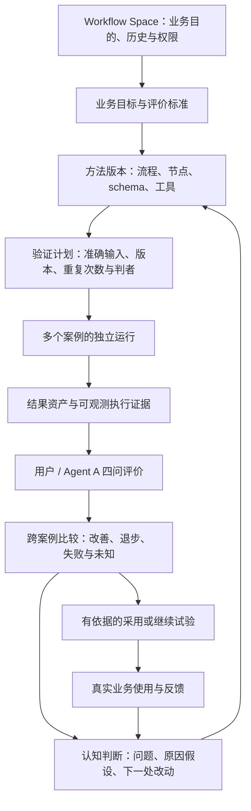
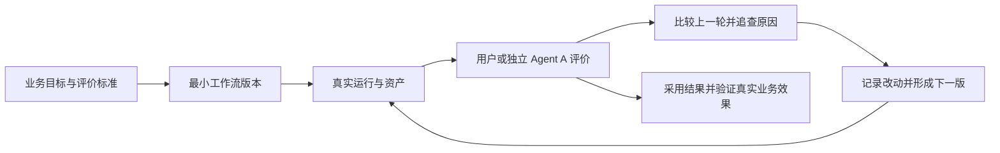

# Agent Workflow 的目标与需求

Agent Workflow 要支持把一项真实业务做成可执行、可评价、可持续改进的工作流。第一版可以很简单，但应由工作流实际完成业务；之后每一轮都有产物、评价、执行证据和改动依据，逐步得到能反复交付的流程。这套能力用于 FDE 客户业务，内容创作是当前的验证业务。

2026-10-04 确认的产品范围包括执行、PostgreSQL 资产管理 harness、一般 Agent SDK 接入、工作流迭代和通用工作台。业务项目提供流程、工具、评价标准与展示扩展，直接使用共享能力。2026-10-06 用户要求由认知 session 维护完整目标、判断进展与验收，独立执行 session 负责实现并回报。

**产品定位：以 Workflow Space 为单位，用 workflow 完成业务，并持续改进做事方法。** 它要同时支持日常业务、资产使用与方法开发。方法、案例、运行、资产和评价属于同一个工作环境；用户和负责迭代的 Agent 依据同一份事实做判断。内容创作是第一个业务实例，通用底座不能按“文章成果后台”固定导航和对象含义。

2026-10-06 用户指出整体前端不满足需求，并明确要求以 Archify 完整流程图作为注意力中心。此前已验收的是局部工程路径，**整体工作台产品尚未验收通过**。当前实现状态只在[建设路线](harness-roadmap.md)维护；本文定义目标与边界，具体屏幕和交互以[Space 工作台产品定义](workbench-presentation.md)为准，日期化实施记录只说明当时交付了什么。

## 产品的使用中心

一个 Space 长期服务一个业务目的。2026-10-07 用户进一步指出：成熟方法的日常使用，应先按真实案例看到输入、产物及其关系；开发方法时，才以完整方法及其演进为中心。**这两个任务都要直接进入，不能把“先选方法、再选 Case、再选 run”设成所有人的必经路径。** 本节与工作台定义修正的是目标信息架构，不表示当前前端已经实现。

日常用户从“案例与产物”进入（CONTENT 可显示为“选题与产物”），先知道做了什么、当前可读成果是什么、是否可用及下一步。点入案例后默认突出要求与输入、主要产物、当前处理状态；中间成果和形成关系在同一案例画布按需展开。“工作流开发”直接进入准确方法的完整流程，检查节点职责、执行器、模型、Prompt、工具、输入输出及变更依据。资产工作台则服务跨案例查找与复用。这是同一批事实的三个工作视角。

因此工作流工作台的主工作区是**可交互的完整流程图**，并随任务切换方法、执行、运营观察和版本演进视图。版本和案例是选择观察对象的入口，输入、配置、路由判断、资产正文、评价和执行证据都能在画布内按所选对象展开。与此同时，业务工作台组织具体请求、待办与交付，资产工作台支持跨运行的检索、版本与复用。评价就近发生，方法演进仍在工作流内；只有出现独立的跨案例审阅任务时，才另设审阅队列。这些视角共用同一 Space，不按数据表分成互不连通的后台。

方法定义和运行实例是两个模式：前者描述允许发生什么，后者描述一个准确 run 实际发生什么。定义图上的输出端口是资产类型；运行中的输出是可点击的准确资产版本。没有运行时也能理解方法，没有产物时也能看到真实失败，不能画出不存在的作品。

### 从案例进入，不等于只展示成功作品

“案例”包含真实业务请求及其全部尝试，不是精选成功示例。列表按业务题目组织，说明用了哪版方法、有何产物、当前能否使用和待处理问题；失败尝试的过程稿仍应可读、可评价并留下下一步。最新稿、流程完成稿、已接受稿、已交付稿分别表达，失败状态不覆盖既有成果，最新时间也不自动选定交付作品。

案例画布默认显示关键输入 → 已有成果及当前处理状态，可展开研究、各轮稿件、审阅意见等中间资产。方法图则在未运行时就显示预期输入输出类型、结构、必填条件与生产/消费节点；运行后用真实资产填入这些位置。控制路径、输入依赖、修订和评价关系分别表达，不能把有先后时间的资产自动连成因果链。当前 CONTENT 的选题定位来自输入，并没有一个已实现的独立“自动选题定位”节点。

### 日常业务与方法改进两条闭环

1. **日常完成业务：** 明确要求 → 建立业务案例并选资料 → 选择准确方法与输入 → 显式运行 → 在图上跟进与处理问题 → 审阅、评价并选定交付版本 → 获得反馈。随时可从方法全图理解规则，从资产工作台找回和复用材料；不是每项日常工作都要先设计对照实验。
2. **依据案例改进方法：** 从有问题的稿件、反馈或运行出发 → 反查生产节点、输入与会话 → 记录四问和原因假设 → 形成有前驱与改动说明的新方法 → 固定案例输入做对照 → 比较结果与局限 → 明确决定是否采用，并保留未解决问题。

第一条不能要求用户先学会数据库表名；第二条不能要求用户找回聊天记录才能理解版本为什么变化。CLI 和 tool 服务 Agent 完成相同动作，前端服务人理解和控制这些动作。

资产贯穿这两条闭环：导入的资料、节点的中间产物、人工修订、审阅意见、交付作品以及有复用价值的经验，都应有准确身份、版本与关系。会话历史说明发生过什么，经过整理的知识说明以后可用什么；保存历史不等于每次把全部历史装入 Agent 上下文。首期可继续由 Agent + CLI 修改方法，完整可视化编排器不是日常业务可用的前提。

### 必须分清的对象

| 对象 | 身份与关系 | 人应看到什么 |
| --- | --- | --- |
| Space | 一个长期业务目的，拥有方法、案例、资产、评价与权限 | 业务目标、当前查看范围、采用情况与待处理事项 |
| Workflow version | 不可变的准确方法；同一稳定 workflow 身份可有多个版本 | 可读名称、改动原因、前驱、流程和执行配置；准确 ID 可展开复制 |
| Case | 一项具体业务题目；可由多个方法版本反复处理 | 目标、不同输入快照、各版本上的全部运行和已有结果 |
| Input manifest | 一次运行绑定的准确输入资产版本；Case 约束和执行配置有各自记录 | 本次用了哪些资料；联合约束、有效配置、标准与判者判断对照条件 |
| Run / 节点实例 | 一次方法执行；循环产生多次节点实例，技术重试另记 | 版本、Case、进度、业务轮次、失败与产物；三稿不等于三次运行 |
| Asset version | 准确正文、附件、生产来源及上下游关系 | 业务可读内容、属于哪轮、依据什么、被谁使用和评价 |
| Review / comparison | 判者在明确条件下对准确产物的判断 | 四问、证据、基线、分歧和未知；执行成功不等于改善 |
| Iteration / adoption | 改动依据与验证关系；采用是独立决定 | 为什么改、是否改善、为什么采用或继续试验 |

这些是产品对象，不代表必须为每项新建一张表。已有 Case、版本、run、manifest、节点上下文和资产关系应复用；一个 Case 与多个版本的关系通过真实运行及计划条目形成，不能强制给 Case 只挂一个版本。

本阶段先完成单一 CONTENT 的完整使用。一个 Space 下多个业务阶段 workflow 的协作、B3 与跨 Space 交接保留扩展边界，不在这轮重做。负责独立评价的辅助 workflow 要标明用途，不能以相同层级的技术 ID 列表干扰主业务方法选择。

## 工作流的完整生命周期

产品先解决用户在每个阶段要作的决定，再安排页面。生命周期不是必须走完的向导：已采用的方法可以持续做业务，候选方法同时研发；某个 Case 的问题也可能只需补材料或修稿，无需升级方法。以下定义目标能力，不代表当前每项已有实现。

| 阶段 | 用户要决定什么 | 需要的信息和持久结果 | 何时具备下一步依据 |
| --- | --- | --- | --- |
| 明确业务目的 | 为谁解决什么问题，成功与不可接受是什么，值得自动化哪部分 | 业务样本、现有做法、痛点、适用范围、成功标准、人的裁决边界 | 能用真实案例判定有没有业务价值 |
| 设计第一版方法 | 为什么是这些节点，怎样交接，在哪里停止或返工 | 准确 v1、节点职责与配置、资产合同、设计假设及关键取舍 | 没有 run 也能理解为什么这样设计，并知道能否执行 |
| 跑具体案例 | 用哪个版本与输入，进度如何，异常怎样处理 | Case、输入快照、实际节点配置与历史、阶段资产、失败和人工介入 | 有可审阅结果，或有可定位的失败 |
| 评价与交付 | 哪些阶段产物可用，整体目标满足多少，本次怎么处理 | 准确资产及过程／结果评价、未解问题、接受与交付记录 | 作出有范围的本次决定，保留未知 |
| 诊断与候选研发 | 问题在哪层，最值得改哪里，预期怎样改善 | 高低质量样本、原因假设、变更差异、受影响节点与资产、新候选版本 | 假设可被验证或推翻，基线和验证条件明确 |
| 验证与采用 | 候选适合哪些案例，是否改善，有什么代价，采用还是回退 | 代表性案例集合、全部尝试、成对评价、关键退化与采用依据 | 日常使用的准确版本和适用范围明确 |
| 稳定使用与周期复盘 | 一周等观察期内常态表现如何，继续用还是开启新改进 | 期间所有相关 Case/run、阶段资产、失败、人工负担、评价覆盖与实际反馈；持久复盘结论 | 明确继续使用、限定范围、回退或启动候选，进入下一观察期 |

### 首版也要保存为什么这样设计

版本前驱和修改理由解释不了无前驱的 v1。应保存业务问题与目标、关键设计假设、各阶段的目的、主要取舍及证据，再让节点和版本引用它们。旧记录没有这些理由时显示缺失；认知 Agent 后来的解释属于补充判断，不冒充作者当时的意图。目的或标准变化也留版本，不能拿新目标静默重判旧决定。

### 稳定运营与候选研发并行

“稳定”是基于一定案例范围和观察条件作出的采用判断，不是永久状态，也不是单次运行成功。采用版本继续处理业务；候选发布、实验和新增评价不会自动替换它。当前采用、正在查看、候选、可执行部署分别表达。缺少历史部署时明确无法重跑，不因为保存了版本定义就承诺能持续运行这一版。

观察窗口可按自然时间或一批业务定义，例如“V2 过去七天”。保存时间、时区、版本、案例／适用范围、纳入规则与证据截至时间；使用期间版本或条件改变要分组记录。保留失败、无产物和人工补救，不只总结好看的作品。周中出现需要立刻处理的问题时可以中断、回退或修复，标明窗口边界与理由，不要求等一周才能行动。

周期复盘应能回答：处理了哪些问题与人群，产出多少可用结果，哪些阶段经常拖累结果，什么情况下需要人工，哪些问题反复出现、哪些此前担忧没有出现。单个最高分、平均分或使用一周都不能自动证明方法成熟。没有新问题时，“继续使用且不改动”也是有效结果，不能为了维持 agent loop 强行制造新版本。

### 改进的是方法、作品，还是模型

| 改进层 | 改什么 | 必须保留的界限 |
| --- | --- | --- |
| 本次作品 | 补材料、人工反馈、修订准确资产 | 不代表以后案例的方法已改善；人工补救要可见 |
| 工作流方法 | 节点、交接、上下文、Prompt／skill、工具、路由、评价与停止规则 | 新方法版本、明确假设、独立验证；skill + CLI 可驱动，无需先训练模型 |
| 节点模型 | 选择不同模型，或在可用接口上训练专用模型 | 模型变化属于实验条件；记录训练来源与独立验证，不能与方法改动效果混称 |

模型后训练是可选的后续能力。先保存可追溯的优质示例、精确人工修订与偏好理由、错误和校准案例，区分训练、开发与未见验证集合；自动评分不是训练真值。OpenAI 接口的当前边界与评价原则见[评估指南](evaluating-workflows.md#模型后训练与外部评价服务的边界)。保存 session 或增加 skill 并不修改模型参数，也不能据此称系统已经自动进化。

停用、迁移与接手同样属于生命周期：说明何时不再接受新业务、已有运行如何处置、历史如何读取、替代方法是什么。后来的操作者应从 Space 恢复目的、现行方法、最近复盘、未解问题及下一步，不依赖找到某一段外部聊天。

## 完整目标：让业务方法能靠证据持续成熟

用户的定位已经明确：一个 Space 长期承载一项业务目的；操作者可以是用户，也可以是读取历史与资产、通过 CLI 提出并执行迭代的 Agent。**最终要交付的是一套能理解方法、完成业务、积累证据、比较改动、决定采用并继续改进的工作环境。** 下面是对完整目标的验收设计，不表示这些能力都已实现，也不预设全自动优化。

| 层次 | 用户应能回答的问题 | 完成的证据 |
| --- | --- | --- |
| 业务目的 | 为谁解决什么问题，结果怎样才算有用，哪些决定要人做？ | Space 中有业务目标、交付物和有版本的评价标准；目标变化留痕 |
| 方法定义 | 当前采用哪一版，完整流程怎样，节点用什么配置、读写哪些资产？ | 无运行也能看图；版本、节点、schema、存储合同与执行实现对应 |
| 执行与协作 | 哪个案例在跑，停在哪里，谁根据哪份材料生成了哪份结果？ | 独立 run、准确输入输出、会话与失败证据；重启后可继续查询 |
| 评价与诊断 | 好在哪里、不好在哪里、相比上一轮提升什么、仍不满意什么？ | 人或独立 Agent A 的四问绑定准确结果、基线、标准与判者；可追到证据 |
| 方法迭代 | 为什么改这一处，预期解决什么，在哪些案例上改善或退步？ | 问题观察 → 修改假设 → 新版本 → 固定验证集合 → 成对比较；失败和未知保留 |
| 采用与真实使用 | 目前为什么用这一版，适用什么条件，何时回退？ | 有责任人的采用理由、证据、风险与历史指针；后续真实业务反馈进入下一轮 |

这里有三种不同变化。一次 run 内的改稿服务本次作品；同一方法在不同案例上的验证说明适用范围；改变方法版本才是 workflow 迭代。工作台要分开显示，不能把“三稿”称为“三个 workflow 版本”，也不能把一次成功当作跨案例成熟。

### 当前由谁完成判断

2026-10-06 用户进一步明确：核心是由本认知角色构建 agent loop，每轮完成后做多方面的完整认知，代表用户提出下一轮需求。认知角色负责维护目标、主动体验、辨别根因与优先级、派发实施并复验，不能仅转述执行者的完成摘要。具体循环与职责见[认知驱动的执行循环](cognition-execution-loop.md)。

认知 Agent 读取 Space 的资产、评价、trace 和必要外部 session，区分业务方法、评价标准、输入材料与执行基础设施的问题，提出可证伪的修改假设。执行 session 按明确范围改代码和界面，交回实现、验证、边界和入口。认知 Agent 再实际使用并核对证据；用户保持业务偏好和最终采用的判断权。

外层操作者的完整聊天历史目前没有自动归档到 Space。近期应先保存有用的认知结论及其证据引用、修改假设、委派范围和验收结果；不能仅留在某个 chat，也不需要无差别复制整台机器的所有会话。假设、观察和已验证结论分别记录。独立评价 Agent A 与执行 session 是不同职责；实现者测试通过不等于独立评价通过。

### 什么叫完成，什么叫成熟

- **工具闭环完成：** 新操作者从 Space 就能恢复业务目的、当前方法、这轮问题和下一步；通过 CLI 或工作台完成一次有明确基线的迭代，关键关系不依赖另找聊天或猜本地路径。
- **业务方法有效：** 在约定的代表性案例上，结果满足业务标准；人工介入、失败、时间与成本分别可见。阈值由具体业务约定，本轮不代填一个好看的通过率。
- **可迁移到 FDE：** 第二项业务只需提供自己的方法、schema、工具、标准与阅读器，能够复用这套执行和迭代机制。它是后续验收，当前 CONTENT 一例不足以证明。

业务方法效果仍需有四问、有修改假设、有复验的真实迭代证明；前端改造可以先用已有真实运行、稿件和失败记录验收，不依赖新增模型调用。当前产品整改、实验阻断和实施进度见[建设路线](harness-roadmap.md)，历史 MiMo 实验见[认知记录](cognition-execution-loop.md#10-第-5-轮真实-mimo-方法对照)。

## 为什么需要这套底座

起点是用通用 Agent 在会话里直接做内容。随着制作、审阅和返工增多，单次交付逐渐暴露出几个问题。下表区分实际观察、明确要求和对它们的设计回应；不能据此认定某一种技术能解决全部内容质量问题。

| 经历过的问题或明确提出的要求 | 为什么会阻碍业务改进 | 共享底座要提供什么 |
| --- | --- | --- |
| 一些历史产物由外部主 Agent 补做；用户随后明确要求由 workflow 内的 Agent 真正生产 | 成品可能完成了，但没有验证这套流程下次能否独立完成 | 真实运行、生产者与介入记录；失败时保留失败，修改流程再运行 |
| 过去有审阅和反馈，但没有稳定记录每轮好坏、相对提升和仍不满意之处 | 改了很多版本，仍难以判断哪个变化有效 | 逐轮四问、明确比较对象、改动依据、采用与回退记录 |
| 资产分散在本地目录，用户明确指出路径不精确会带来歧义 | 人和 Agent 要先找文件，再判断它是哪一版、能不能给下游用 | PostgreSQL 主存储、稳定资产身份、版本与来源关系、按权限读写 |
| 调优中出现过默认工程文档注入内容角色、工具在实际沙箱不可用、CLI 与模型能力不匹配 | 业务方法、工具故障与运行环境混在一起，难以判断该改哪一层 | 可配置 SDK 执行器、节点提示词和工具范围、实际运行配置与调用记录 |
| 用户反复追问下游是否拿到了上游原始材料和关键判断 | 中间摘要可能丢失业务目标，后续角色无法恢复必要依据 | 显式输入关系、精确资产版本、按角色装配上下文 |
| 流程内审阅通过后，用户仍对真实内容不满意 | 执行完成和代理接受不足以证明业务目标达成 | 独立评价、标准版本、真人与 Agent A 判断记录、正反例校准 |
| 工作台、平台和 workflow 多次成为改进焦点，但用户始终希望看到各阶段真实成果与进度 | 若先增加页面和状态，业务质量问题仍可能被隐藏 | 在完整流程上查看进展、产物和判断；从资产或问题也能反查准确节点与执行证据 |
| 用户确认这些共性能力应由 agent-workflow 提供，creation 直接调用 | 若每个业务分别实现资产、执行与迭代管理，FDE 项目难以复用同一套改进方法 | 模块化的共享底座与清楚的业务扩展边界 |

运行环境问题及已有修复见 [调优案例](tuning-loop.md) 和 [当前状态](harness-roadmap.md)。以上痛点能够解释产品需求，不证明“加数据库或换 SDK 后作品必然变好”；效果仍需真实业务验证。

## 一个业务如何逐渐成为可靠的 workflow

先约定业务要交付什么、怎样判断好坏，再做最小可执行版本。第一轮就让结果、输入与执行归属明确，不要求第一轮就拥有复杂阶段或可视化编辑器。

某次产物不合格，可能需要补材料、修改稿件，也可能需要修改整个流程。系统必须区分这两种返工：本轮修订解决这份产物，工作流升级解决以后还会重复发生的问题。能否迁移到其他案例，需要另外验证。

## 必须支持的十项能力

1. **真实业务执行。** 从第一版开始承载实际生产，记录 Agent、程序步骤和人工介入。Workflow Space 对应一个持久业务目的，聚合该业务的多个 workflow 版本、运行、资产、配置、评价和迭代；资产控制台按 Space 展示，并可按 workflow 版本与 run 筛选。稳定 `workflowId` 仍是代码与执行层身份。阶段可调整，不把某个业务的阶段数量写死在底座里。
2. **工作流迭代。** 保留版本、修改原因和实际变更，能把一次评价连接到下一次改动及其验证。
3. **稳定的 Workflow Space。** 每个 Space 对应一个业务目的，长期组织该业务的 workflow 版本、案例、运行、资产、配置、评价和迭代。工作流版本、运行次数与产物版本分别记录；资产控制台以 Space 为聚合范围，并提供 workflow 版本与 run 筛选。`workflowId` 保持为底层稳定执行身份，不作为用户界面额外的业务分组层。
4. **逐轮评价和比较。** 回答好在哪里、不好在哪里、比上一轮提升什么、还不满意什么。评价绑定具体版本和基线；没有基线时明确记录首轮。
5. **人和 Agent 都能评价。** 保留判者、标准、可见材料、证据与分歧；支持校准。评价权限与采用权限分别表达，不默认 Agent 打分就能自动采用。
6. **统一的执行历史。** 将 workflow trace、Agent 可获取的消息与工具记录、操作历史连接起来，能从结果追到其输入和生产过程。标明记录缺失，不承诺读取模型全部内部思考。
7. **PostgreSQL 资产管理 harness 与共享存储层。** 将业务资产与版本、Agent 配置及实际执行快照、运行历史、可获取的会话／trace／操作记录及关联关系纳入统一主存储；可靠装配输入、接收输出并保存来源。harness、CLI 和 Agent tool 共用权限与版本接口。不能只入库本机路径而把正文与历史继续留作目录中的唯一副本。
8. **一般 Agent SDK 与多种执行器。** 按节点选择执行方式，控制提示词、模型、工具、上下文和限制。Codex 是可选执行器，确定性任务也能组成流程；具体一般 SDK 尚待选定。
9. **准确的信息交接。** 上下游依赖具体资产版本；需要原始资料的角色可以获得资料。长期保存全部必要历史，与本次 Agent 能看到哪些上下文，是两个不同问题。
10. **通用工作台。** 展示设计目的、阶段、进度、实际资产、评价、版本差异及执行证据。业务提供专用阅读器与操作扩展，不重新实现整套工作台。

这十项属于共享产品。业务标准的内容仍由业务决定：底座保存和执行评价规则，不能替创作项目定义什么是好稿件，也不能替研究项目改写其事实结论。

## 资产管理与可控执行如何互相配合

资产管理 harness 是 Agent 与业务状态之间的管理层。运行前，它解析正确版本的输入并按角色交付；运行中，它连接执行记录与工具操作；运行后，它校验输出、保留资产版本并交给下一步或评价者。这样一次判断才有明确对象，一次改动才有可比较的依据。

PostgreSQL 解决持久状态与关系管理，SDK 接入解决节点配置和执行接入。它们相互配合，但数据库不会自动控制工具权限，SDK 也不会自动提供跨工作流的资产、评价与业务历史。具体职责见 [架构与边界](architecture.md)。

用户进一步明确：存储能力应支持 Agent 的 prompt、模型、工具等配置和执行历史，并优先服务节点执行器。harness 为节点装配这些能力，CLI、tool 或程序接口让不同执行器使用同一存储服务；资产管理台是另一管理入口。配置版本、实际生效快照与可变工作状态分别处理。完整设计见 [存储层与 SDK 执行闭环](postgres-sdk-plan.md)。

## 当前阶段的取舍

- **已确认：** PostgreSQL 主存储、一般 SDK 接入、通用迭代与工作台由共享项目提供，creation 接入。
- **已确认：** 当前暂不建设临时 VM 管理。一台常驻云服务器可以作为初始部署方式；执行完成不自动删除资产、记录或仍需保留的工作环境。
- **方案建议：** PostgreSQL 管正文、配置与关系，托管私有对象存储保存大媒体与工程包；两个后端由同一资产身份和提交协议管理。具体 provider、区域及保留策略待选择，尚未开通；不退回本机路径方案。
- **尚需设计：** 具体一般 SDK、执行器分配、Agent A 自动采用范围，以及代码定义和界面编辑各自覆盖多少能力。

这些未决事项不影响共享能力归属。文档先写清稳定需求；包名、数据库表和 API 在接口设计阶段确定，不将示意字段冒充现有导出接口。

## 怎样算逐渐做成了

先用一个真实业务证明：从同一工作流空间发起运行，获得真实产物；用户或 Agent A 对精确版本写四问；能查看基线差异并追到执行证据；改流程后形成新版本，再运行并记录采用或回退。进程或入口变化后仍能读取历史，资产无需靠猜测本机路径寻找。

同时分别报告工程可靠性、产物质量、评价者质量、人工投入和成本。单个案例成功只证明该案例；成熟度需要在其他代表性案例与真实使用中继续验证。建设依赖与验收见 [路线](harness-roadmap.md)。
