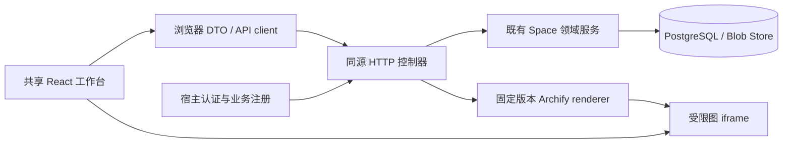

# Space 前端架构方案

状态：2026-10-06 的技术方案，尚未实现新的生产前端。产品职责与用户任务以[产品](product.md)和[通用工作台与展示契约](workbench-presentation.md)为准；当前已实现能力以[建设路线](harness-roadmap.md)为准；实施顺序见[前端实施计划](space-frontend-implementation-plan.md)。

## 从业务生命周期确定边界

Space 是一个长期业务目的的工作空间。用户先定义目的、标准与方法，再用准确版本完成 Case，阅读阶段资产与结果、评价与交付，在一段运营窗口后回看问题、形成有依据的改动、验证并采用下一版。默认一级入口是工作流、业务、资产；评价就近发生，审阅队列按任务开放，演进位于工作流中。它们共享对象与上下文，不各自建设数据系统。

工作流工作台包含方法定义、单次执行、运营观察、版本演进四视图，中心是完整 Archify 流程图，节点、输入输出、分支、实际实例和资产原地展开。业务工作台负责从要求和材料到运行协作、结果、审阅、交付反馈。资产工作台提供跨 Case 检索、版本阅读、来源关系、复用和对照。工作流中的演进视图串起问题、假设、版本变化、验证和采用；资产和节点上的评价连接同一记录。待办、运行提示、Space 目标标准与配置由同一个外壳承载。

当前已有 Case 创建、排队运行等底层动作，旧控制台的“建立首次结果基线”等实验用语和材料粘贴方式没有构成完整日常业务路径。现有事实和动作要复用，产品路径需要重新组织。只读贯通是第一批工程交付，不是完整产品验收。

## 现状与复用

| 部分 | 已观察的实现 | 新前端使用方式 |
| --- | --- | --- |
| Space 服务 | PostgreSQL 版本、Case、manifest、run、context、资产、session、review、comparison、plan、adoption | 保留为事实源与授权边界 |
| 流程与关系 | ProcessContract、ProcessView 实例投影、生产来源、准确输入输出与资产邻域查询 | 服务端生成页面读模型，不靠浏览器猜节点来源 |
| 展示扩展 | WorkflowPresentation、BusinessPresentationAdapter、schema 版本绑定的 AssetReader | 复用业务名称、结果角色与可序列化阅读内容 |
| 现有 Space 控制台 | Node HTTP 服务端生成页面；独立页面与表单、部分 iframe 交互 | 作为迁移期运维入口；不能称为已建成的统一 React 应用 |
| 进程内 inspect | 已有 summary、run、process、asset、context、session、validation 等查询 | 可作为 HTTP 控制器的内部来源；它不是浏览器接口 |
| creation React/Vite | 已有独立 workbench 应用和 `/api/workbench` | 不直接当作 Space API；新的 creation host 保持薄层 |
| Archify | 已固定上游版本及 renderer；全图、聚焦、路径、搜索、导出 | 复用渲染能力，通过受限 bridge 联动应用详情 |

历史版本未保存流程或节点定义时明确缺失。不能用当前同名角色的 Prompt、模型、工具补回历史版本；准确 run 的实际 context 可独立显示，注明属于本次执行证据。回溯流程合同也不能改名为发布时合同。

## 技术栈决定

采用 React 19、TypeScript 5.9、Vite 7、React Router 7，沿用根 pnpm workspace、Node 24 和已锁定版本。2026-10-06 本仓库锁文件分别为 React 19.3.0、TypeScript 5.9.3、Vite 7.3.6、React Router 7.18.4。新增 TanStack Query 5 管理服务端查询、缓存和失效；本轮未安装依赖。布局使用 CSS variables 和 CSS Modules，先复用无障碍基础组件与现有图标。

选择理由是本产品为需要授权的交互工作区，主要需求是稳定路由、异步读模型、图与阅读联动，不依赖公开搜索收录。[React 官方](https://react.dev/learn/build-a-react-app-from-scratch)将 Vite 列为可用构建工具，并提醒独立应用需处理路由及数据获取；[React Router](https://reactrouter.com/7.18.4/start/declarative/url-values)提供路径与查询参数；[TanStack Query](https://tanstack.com/query/latest/docs/framework/react/overview)覆盖获取、缓存、同步等服务端状态管理。框架主版本按本仓库锁定，不为跟随 latest 同时升级其他工作台。

路由负责对象选择，Query 负责服务端状态，局部 React state 负责标签、阅读展开、未提交表单。首期不加另一套全局状态库、微前端或完整 SSR 框架。表单先按已注册业务 schema 做有界字段和服务端校验，不先建设任意低代码表单平台。

## 包与依赖方向

建议新增两个共享包，避免先拆出大量空包。

| 包／项目 | 职责 | 禁止的依赖 |
| --- | --- | --- |
| 既有 `@signal-room/workflow-spaces` | 领域服务、存储、授权、投影、既有控制台、Archify renderer | 不导入 React 应用或 creation |
| 新 `@signal-room/workflow-space-api` | `./contracts` 浏览器安全 DTO 与校验；`./server` HTTP 控制器、分页与授权读模型适配 | contracts 不导入 pg、Node、credentials、业务源码 |
| 新 `@signal-room/workflow-workbench-ui` | Space 外壳、三类工作台与评价／演进视图、路由、图 bridge、阅读与比较组件、API client | 不导入 pool、service、SDK runner 或服务器模块 |
| creation host | 同源路由和静态资源、宿主认证、CONTENT 表单／动作／阅读语义注册 | 不复制 vendor 源码，不自建第二套资产数据库 |

UI 包以 Vite library 方式输出 ESM/CSS，React 作为 peer，由 creation 的浏览器入口打包；路由 API base 与部署 base 由 host 注入。库构建原则参考[Vite library mode](https://vite.dev/guide/build#library-mode)，具体配置使用已锁定 Vite 7 的 API。服务端与浏览器出口分离，并做浏览器依赖图检查；以只有 contracts 和 UI 的最小消费者验证共享性。

UI 内按职责分目录：`shell/`、`workflow/`、`business/`、`assets/`、`evaluation/`、`shared/graph/`、`shared/reader/`、`api/`。各视图通过同一个 selection/context 和 DTO 互相导航，禁止分别保存派生 run→version 映射。研究、分析工作台保留原 UI 与技术栈，按需接入共享包，不在本次强制迁移。

## 路由与对象上下文

建议在 `/workbench/spaces/:spaceId` 下设置 `workflow/versions/:versionId`、`business/cases/:caseId/runs/:runId`、`assets/:assetVersionId`、`evaluation` 等路径。可选 `entrypoint`、`view`、`node`、`occurrence`、`round`、`asset` 与筛选条件进入 URL。单 entrypoint 时隐藏选择器，多入口仍保持准确身份。

从 run 进入必须同步其准确版本，版本切换清除不属于新版本的运行覆盖。轮次身份以 occurrenceId 为准，round 只是标签，重试 attempt 不计新业务轮次。阅读来源或返回图保持所选 Case/run/节点、镜头和阅读位置。一次刻意选择使用浏览器历史，后台刷新使用 replace 或不改 URL；非法组合由 API 明确拒绝。

Space 的当前采用方法由业务声明的 workflow／entrypoint／adoption slot 定位。方法采用和资产采用分开；不能在任意 adoption head 中猜“当前版本”。默认查看顺序为用户最后明确查看的合法版本、该作用域采用版本、最新登记版本，最后一种注明尚未采用。查看、登记、可执行、采用四个状态同时可辨认。

## HTTP 合同（拟议）

同源前缀 `/api/workflow-spaces/v1/spaces/:spaceId`。下表是待实现端点，不是现有可调用 API。所有列表先分页，所有正文按需读取。

| 端点后缀 | 返回页面所需的有界内容 |
| --- | --- |
| `/summary` | 目的、业务名称、方法作用域／采用指针、权限能力、待办运行提示与计数 |
| `/versions` | 名称／别名来源、改动、前驱、登记时间、部署可用性、Case/run/计划覆盖摘要 |
| `/versions/:id`、`/versions/:id/graph` | 冻结方法、来源与完整图；大 Prompt 按节点 detail 单独获取 |
| `/versions/:id/cases` | 每个 Case 的全部尝试及状态、阶段产物数、结果与评价摘要 |
| `/cases`、`/cases/:id`、`/cases/:id/runs` | 完整目标约束、输入版本、协作状态、运行历史，不以最新失败遮住旧结果 |
| `/runs/:id`、`/runs/:id/process` | 准确版本／输入／配置身份、执行和队列状态、原因、实例、routes、覆盖范围 |
| `/runs/:id/occurrences/:occurrenceId` | 准确输入输出、上下文及 attempt／session 摘要，声明配置与实际证据分开 |
| `/assets`、`/assets/:id/reading`、`/assets/:id/relations` | 跨 Case/版本/阶段/时间检索，可读正文、生产／消费／评价关系与分页 |
| `/evaluation/evolution`、`/validation-plans/:id` | 明确 predecessor、改动原因、已有问题／计划／配对尝试／评价与采用 |
| `/runs/:id/events`、`/sessions/:id/events` | 有界事件页、完整性与游标；不一次传整份 trace |
| `/operations-windows/:id`（后续） | 显式时间／采用版本／阶段／Case 筛选范围与冻结复盘集合，不自动声称“一周质量” |

成功列表返回 `{items,nextCursor,snapshotAt}`，详情返回明确版本与身份。列表固定排序为明确业务字段加唯一 ID 作为并列键，采用 keyset 游标；游标绑定筛选、排序、Space、主体作用域和服务端选定的读取上界，并校验失效。`snapshotAt` 首期仅是响应采集时间，不承诺跨页数据库快照：并发新增可能需刷新才能出现，状态可更新；不可静默用 offset 导致重漏。需要可复现的复盘集合时另外冻结准确对象 ID／版本集合，不将分页目录当冻结证据。错误返回 `{error:{code,message,requestId,details}}`，区分权限、关系不符、历史缺失、部署不可用、冲突、服务失败。后续由代码校验 schema，而不是只写 TypeScript 接口。是否隐藏无权对象的存在由宿主策略统一决定。

不把 `overview()` 的所有 payload、Prompt、session 一次序列化给浏览器。摘要先加载，图和阅读器并行加载，节点细节、会话和大正文按需加载。服务端汇总正确关系与统计，浏览器只做展示筛选，不用时间最近、同名或数组序号推断关系。

## 阅读与图 bridge

首期复用 AssetReader 输出的 `{title,sections:[{title,text,pointer?,sourceRefs?}]}`。以 text 渲染正文，按业务结构将正文、画面、关系、评价、执行记录组织成可切换阅读。来源摘要紧凑，准确 ID 与 hash 折叠到证据；支持扩大阅读和返回原图。没有媒体时说明已保存的是画面文字意图，不生成假播放器。未知 schema 使用明确标识的结构化回退，不套用现行阅读器重解释历史。

后续扩展受限段落／表格／媒体块和有授权的短期媒体请求；业务 reader 不能提供任意可执行 HTML。附件使用 Blob 身份与验证过的位置引用，不能把本机路径变成持久资产身份。

流程图和版本演进图分别渲染。前者节点是业务流程角色，后者节点是方法版本；版本图只画显式 predecessor，计划与运行在展开层关联。节点类型颜色沿用 SDK／Codex／程序／判断／人工／未知，运行状态使用边框与文字；颜色不替代状态文本。

iframe 保留 `sandbox="allow-scripts allow-downloads"`，不加 `allow-same-origin`。图由授权服务渲染冻结合同；parent 只接受当前 frame 的 `event.source`、允许的消息类型和当前图内 ID，不用 opaque origin 的 `*` 作为授权。消息先只表达 select/focus，业务读写仍通过 HTTP。应用统一详情时抑制内层语义护照，保留选中与关系高亮，避免两套浮层。适配写在 renderer／host 层，不直接修改固定 third-party 缓存。

选择节点不重载 iframe；通过有界选择／视图 bridge 恢复高亮与镜头，补防回声循环测试。打开阅读层时图保持稳定，窄屏详情覆盖且可恢复；桌面需支持合适宽度与回全图，而不是把完整图裁成不能读的角落。

## 更新、权限与动作

第一批运行更新使用当前可见活跃 run 的短轮询（初始约 3 秒，可调）和条件请求，终态停止；分页事件继续按准确 run/session 增量读取。现有进程内游标语义不能直接承诺为永不过期的 Space 全局游标，需定义过期/reset、去重和重读。SSE 放在后续：只有稳定事件游标和重连合同具备后接入。

Query 缓存按已认证主体／会话分区，再包含 Space/entrypoint/准确版本/run/occurrence/asset；主体切换或登出销毁原 QueryClient 和正文／Prompt／session 缓存，不能仅按对象 ID 命中前一用户内容；后台更新不覆盖评价草稿、不丢滚动位置。权限变更清理相关缓存，切换 Space 隔离缓存。局部错误保留已读正文，重试有界。

每个 HTTP 请求从宿主认证解析 principal，再校验 Space 成员、对象归属和动作能力。浏览器不接收 pool、service、节点 capability、连接字符串或提供者凭证。已有 localhost 运维 host 不等于部署后的多用户认证服务。

现有 SpaceCase 是不可变创建记录（id/title/objective/constraints），同 ID 更换内容会冲突。准备中保存和修正要求需要新增有状态的业务草稿／Case 修订合同、权限与迁移；冻结后 manifest 关联准确 Case 修订。批次 B 在该合同落地前只提供现有创建能力，不把不可变 Case 包装成可编辑状态。

写动作另设显式 POST：创建 Case／冻结输入、导入或生成新资产版本、排队运行、取消、流程协作、四问评价、接受资产、采用方法等。每次重新检查权限、状态、准确版本／manifest／标准／judge，带 idempotency key 和预期前值；同源 cookie 部署需 CSRF 防护。服务返回持久回执，按钮可见不等于授权通过。

manifest 只冻结其 Case/assets 范围；对照条件由 Case 约束、manifest、run effectiveConfig、标准和 judge 联合描述。一个 manifest hash 不代表冻结了全部实验条件。新运行、恢复、返工、改变输入是不同动作，UI 使用现有支持的服务语义；任意历史执行包自动恢复仍未具备。

接受、导出和交付分别记录：接受是准确资产的业务决定，导出是转换／文件产物，交付需要独立对象／回执。现有交付领域合同没有满足产品需要时先补存储及权限，不能用下载成功代替交付；外部平台没有回执时注明人工登记。近期不自动发布到外部。

## 生命周期与认知协作

首版没有 predecessor 仍需业务契约和设计理由：目标、标准、阶段、节点职责、预期产物与停止条件及选择依据。稳定采用版运营与候选研发并行，浏览器按明确方法作用域分别筛选，不能把最新候选当默认生产方法。

运营观察的实际路径是“V2 最近 7 天 → 研究节点 → 各 Case 研究资产 → 按明确维度查看好／差／未评价 → 并看资产 → 回准确 run”。版本演进边展开“问题 → 假设 → 改动节点 → 验证得失 → 采用与运营反馈”；没有证据时保持未知。一周是观察窗，不代表成熟，也不要求强行升级。

初建 Space 保存业务目的、标准与方法设计理由；每个 Case 保存要求、材料和反馈。稳定运营视图从明确采用方法作用域、时间窗口和关键阶段资产集合出发，区分执行可靠性、稿件质量和人类接受／交付反馈。每个比例带分母与覆盖说明，不用未评价当低分，也不把所有版本运行混成稳定版一周结果。

复盘冻结对象集合及条件快照，并串起既有 review／validation issue／iteration／version predecessor／comparison／adoption。字段已经存在的用服务关联，缺少复盘窗口、交付或设计理由语义的显式补合同。认知 Agent 经项目 skill／CLI 调用同一授权服务，变更进入新方法版本并保留依据。它与浏览器工作台共享记录，不靠另外的聊天记忆替代事实源；本轮没有实现自动知识汇总或模型后训练。

验收与分批完成规则见[实施计划](space-frontend-implementation-plan.md)。
