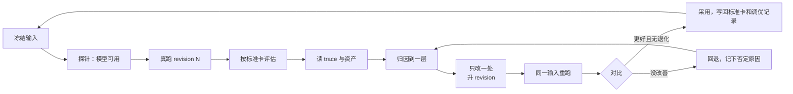

# 调优循环：workflow 是调出来的

**结论先说：** 把一项业务交给 workflow，先做一个最简单、能真跑的第一版，然后一轮一轮调。每一轮做同样几件事：在同一份冻结输入上真跑，按业务标准评估，读 trace 和资产找到出问题的那一层，只改这一处并升版本，再用同一输入重跑对比。每一轮还要定下三件事：看哪些 trace 和资产，关键流程怎么划分、在工作台里怎么显示，哪些资产给用户看。

第一版需要在真实业务中检验；下面案例里的若干原因，是查看 trace 后才定位的。产物评价与执行证据要结合阅读，不能只看其中一面。

这份手册是[设计](./designing-workflows.md) → [评估](./evaluating-workflows.md) → [优化](./optimizing-workflows.md)三份指南的实操版：那三份讲原则，这里讲一轮具体怎么做、用哪些工具。

通用产品与机制由 agent-workflow 提供，业务定义具体标准，见[产品](product.md)和[架构](architecture.md)。下文三阶段、文件与命令行是历史案例的实际做法，不能据此要求新业务继续把资产唯一保存在本机目录。

## 当前谁驱动下一轮

当前的调优者是人或受托 Agent：先读历史产物、session、上下文与评价，判断主要失败和改善假设，修改流程代码、提示词或标准，再通过 CLI 明确启动下一轮并比较结果。共享底座负责冻结输入、关联版本和基线、保存可观察证据；它**不是会自己找原因、改方法、决定采用的自动调优器**。业务 workflow 内的修稿循环也不同于方法版本升级：前者继续完成当前作品，后者要形成新的定义版本和 run。

通用操作者查询由共享 `inspectSpace` 提供，按权限查看 Space 摘要、run、准确资产版本、节点上下文和可观察 session；业务 CLI 负责其特定案例、输入、评价与返工命令。以 creation 当前 `content:space` 为例，从 Creator Lab 根目录运行的 `inspect --run`、`asset --asset`、`context --context`、`session --session` 和 `compare` 用于读证据；`run`、`revise`、`experiment` 才调用模型。操作者查询权限不等于 workflow 节点可读取整个 Space。

creation 的 `revise` 把准确旧稿和显式反馈冻结为新输入，用于修这份作品；`experiment` 则从基线运行取回冻结的原始机会与材料，去掉旧稿反馈，以**当前方法**重新运行，并记录基线、版本和改善假设。两种命令不能混为“重跑”。首轮 CONTENT Space 输入必须显式设 `webResearch: false` 并提供材料；此入口当前拒绝联网研究。方法文件修改后需要重启宿主再运行，避免已加载代码和所记录版本不一致。完整命令及业务验收边界见 Creator Lab 的 `workbenches/creation/docs/README.md`。

评价者身份要如实记录。creation 当前 `review` 命令以认证主体写入 human 评价，不可用它把 Agent A 的意见写成创作者意见；内部审阅通过也不代表人已接受。接受需要创作者明确决定与理由，并通过相应业务关口。是否采用某个流程版本，需要比较真实作品与条件差异，不能由一次运行成功自动推出。

当前自动采集覆盖接入 Space runtime 的执行节点；负责调优的外部 Codex 会话仍由 Codex 保存。实验记录可关联假设、输入、方法快照和基线，但宿主探索历史尚未自动全量归档到 Space，不能把两者混为完整覆盖。

## Skill 与 CLI 怎样支持认知 Agent

skill 负责方法：从业务目的出发，恢复证据，提出可反驳假设，控制改动与验证范围，再做独立复盘。CLI／tool 负责准确查询与持久动作；harness 负责按合同收集执行与资产事实。三者不应要求 Agent 记住本地目录布局，或把同一条评价写到几个互不一致的地方。下表是需补齐的操作者合同；已有命令可复用，缺少的查询和回执不能写成已存在的 CLI 参数。

| 操作者任务 | 最少提供什么 |
| --- | --- |
| 恢复方向 | Space 目的、适用范围、标准、当前采用版本、首版设计理由、最近复盘和未解问题 |
| 界定本轮 | 准确方法、时间窗口／案例集合、纳入规则、版本与运行条件、实际记录覆盖 |
| 查阅证据 | 先取摘要与计数，再按 ID 展开 Case／manifest、节点实际输入与配置、产物正文和关系、session／工具事件、错误与人工介入 |
| 比较判断 | 准确四问、判者与标准、基线、配对条件、关键反例、费用耗时和真实业务反馈的可用记录 |
| 留下改动依据 | 事实观察及引用、原因假设、改动层和受影响节点、可证伪预期、前驱与新版本 |
| 复验与回报 | 冻结验证范围、所有尝试含失败、配对结论、退化与未知、认知复核；作品接受与方法采用分别记录 |

最小证据包是有边界、可继续展开的索引和摘要，不是一次倾倒整个 Space。缺证据、权限不足、服务读取失败、确实无记录各自返回可辨状态。认知结论连回其证据，版本演进的边能展开“问题 → 假设 → 差异 → 复验 → 决定”；下一任 Agent 可以复查，不能只在当前 chat 里留下口头结论。

稳定运行一段时间后的复盘先决定是否值得开启实验。日常工作可继续用已采用版本，候选研发另外进行；没有发现需要改进的证据时，可以记录继续使用。不能为了让循环一直转而强行增加节点或新版本。阶段评价与运营窗口的量尺见[评估指南](evaluating-workflows.md)，生命周期见[产品定义](product.md#工作流的完整生命周期)。

## 让历史自动进入调优循环

新的共享服务应让 Codex、一般 SDK 和程序节点默认进入同一记录协议：执行前保存身份、输入与配置，执行中采集可观察消息和工具操作，执行后提交产物及来源。记录由 harness / adapter 完成，不要求业务逐个补日志或让 Agent 自己记得保存。实现要求见[完整方案中的 Codex 默认行为](postgres-sdk-plan.md#51-codex-接入的默认行为)；当前文件型 runner 尚未满足这套合同。

每轮应能从共享空间直接打开一个证据包：精确产物、冻结输入、实际配置、各次 attempt、可观察事件、失败与记录缺口。四问指向这个包中的具体资产和事件；下一版改动引用相应评价，比较时显示输入、模型、工具与配置有哪些变化。这样人工和 Agent A 可以使用同一份证据，不必重新找会话、猜版本或拼目录。

这个空间已明确为围绕一个业务目的长期存在的 Workflow Space，资产控制台按它组织；一轮执行或一版流程只是其中的一个视角。要保存哪些创作资产、如何版本交接，以及 session 与知识怎样留给后续节点，见 [Workflow Space 存储设计](workflow-spaces.md)。

失败与取消也是迭代样本。业务执行成功、trace 完整、结构校验通过、用户满意是独立结论；缺少证据时可以评价产物，但必须保留无法归因的范围，不能用推测补齐过程。只有已同步到共享池的历史可以作为长期比较依据；本地缓冲和原生恢复文件有各自的保留状态。

## 每轮必须留下的判断

评价者可以是用户，也可以是独立 Agent A。对本轮实际资产记录：好在哪里、不好在哪里、比上一轮提升了什么、还有哪些不满意。说明被评版本、上一轮或其他基线、评价标准、判者身份、证据和不能判断的范围；首轮无基线就明确写无基线。

四问连接到下一次改动：发现的问题 → 主要原因假设 → 修改哪一版流程 → 哪些条件保持相同或发生变化 → 重跑结果 → 采用或回退。旧有 review 不等于已经形成这条可比较的记录。没有必要为每轮强加一个总分；流程内 Reviewer 的 accept 也不能代替独立业务评价。

## 一个真实案例的规模

一个内容创作项目把“从选题到成片”拆成三个阶段 workflow：选题决策、脚本、视频制作。三个阶段在同一个题目上反复调，各自经历了 7～9 个版本：

| 问题 | 怎么发现的 | 在哪一层 |
| --- | --- | --- |
| 写作角色把“区分事实与推断、写明限制”写进了脚本 | 读 Agent 会话的首条注入：仓库和用户级 `AGENTS.md` 共约 1.8 万字被注入给内容角色 | 运行环境 |
| 修订轮“改完了”，但稿子一字没变 | trace 里第二轮根本没有写作调用；两轮用了同一个 phase key，第二轮直接拿回第一轮结果 | 流程结构 / harness |
| 审稿人一直不收敛 | 逐轮对比审稿意见：每轮都挑新的“可以更好”，没有一条必须修 | 标准 |
| 成品检查员报告了不存在的问题 | trace 显示它打开的是上一轮留在目录里的旧截图（观察者自己的产物） | 输入面 |
| 设计师 15 分钟超时 | trace 显示它按提示运行自检脚本，脚本在无网络沙箱里挂住，它又去找浏览器工具 | 工具提示 |
| 下游阶段丢了上游最重要的判断 | 画出每个角色的输入清单：交接靠会话里手工拼，受众问题和编辑意见都没传下去 | 交接 |
| 模型被账号拒绝，宿主 Agent 自己把内容写完了 | 失败信息是“账号不支持该模型”：SDK 自带的 CLI 较旧，换成较新的 CLI 即可；拒绝发生在 run 中途，于是宿主接手。trace 记录的 CLI 版本也不是实际运行的那个 | 运行环境 |

这些故障说明设计需要经过实际运行检验；其中已知类型也可以提前检查，不能把所有故障都视为不可预见。

## 起点：最简单的第一版

| 做法 | 为什么 |
| --- | --- |
| 一个阶段只做**一个决定**，产出**一份主资产**，配**一张标准卡** | 评估和归因都需要一个明确的“这一阶段到底要交什么” |
| 每个角色只防**一种失败**（例如：证据角色防“主张没有出处”，冷读者防“外行看不懂”） | 角色多了而说不清各自防什么，出错时无从归因 |
| 阶段设置明确的评价与采用边界，允许人或独立 Agent A 提供意见 | 记录判者、标准和授权；业务关口按具体政策执行，逐步校准审阅者 |
| 使用共享工作台的最小可用视图，先看产物、评价和历史 | 早期案例用过命令行与静态页；目标是在共享项目提供这些能力，避免每个业务自建平台 |
| 内容全部由 workflow 里的 Agent 产出，宿主 Agent 只负责编排和审阅 | 宿主一旦亲手补内容，就测不出 workflow 本身的能力 |

## 一轮调优怎么做



### 1. 冻结输入

同一个题目、同一份输入快照反复用。目标是将精确资产版本和实际内容随 run 保存在共享存储；下文历史案例的 `input.json` 是旧实现方式。重跑时保持同一输入并核验内容。测“盲跑能力”时，另建去掉人工审阅意见的输入快照，看 workflow 自己能不能做到；这是条件变化，要与原始样本分别标记。

### 2. 开跑前探针，再真跑

```ts
const probe = await probeCodexModel({ model, runnerOptions });
if (!probe.ok) throw new Error(probe.error); // 不要让宿主 Agent 接手
```

每次改动都提升 workflow revision，新 revision 用新 run。run 的 metadata 里记下题目、阶段和上游输入版本，方便之后按条件列出。

### 3. 按标准卡评估

评估者是业务负责人或其代理，按这个阶段的标准卡逐条判：通过、偏弱、不通过，并写一句理由。判决和意见记进决定记录，接受时把意见写回标准卡的“审阅记录”。**不要用测试通过数、run 状态或 Agent 的自评代替这一步。**

### 4. 读 trace 与资产

先看资产，再看 trace：资产告诉你“哪里不对”，trace 告诉你“为什么”。

新存储模式按 run / step / attempt 查询证据和基于持久记录生成的摘要，展开时能定位到原始可见事件。下面的目录读取 API 仍是当前代码可用的方式，保留作为迁移参照，不作为目标工作台的永久依赖。

```ts
const attempt = summarizeCodexAttempt(attemptDir, { ignoreErrors: /unrecognized configuration setting/ });
const session = codexSessionFile(attempt.threadId!, { startedAt });
```

| 想知道 | 看哪里 |
| --- | --- |
| 这个角色到底收到了什么 | `prompt.txt`、`input.json`；完整会话的**首条用户消息**（环境注入都在这里） |
| 它做了什么、卡在哪 | `summarizeCodexAttempt` 的 `commands`（含失败退出码）、`searches`、`filesChanged`、`errors` |
| 花了多少 | 每个 attempt 的耗时、token（输入/缓存/输出）、prompt 与输出字符数 |
| 同一步是否真的重新执行了 | 这一轮的 attempt 是否存在；步骤是 replay 还是新执行 |
| 用的是不是想用的环境 | `runtime.json` 里的 CLI 版本、可执行文件、合并后的 Codex 配置 |

找完整会话一律用 thread id（`codexSessionFile`），不要按“最新修改的会话文件”找。

### 5. 归因到一层

| 层 | 典型信号 | 改法 |
| --- | --- | --- |
| 输入 / 交接 | 下游不知道上游已经确定的事；同一问题每阶段重新发现 | 用有版本的交接档案，按角色切片；画出每个角色的输入清单核对 |
| 角色 prompt | 角色做了不属于它的事，或漏了它该防的失败 | 改这个角色的任务说明；一次只改一个角色 |
| 标准 / 审阅者 | 审阅太松（放过明显问题）或太严（永不收敛） | 分出“必须修”和“可以更好”；用正反两类案例校准审阅者 |
| 流程结构 | 修订没生效、步骤被跳过、循环不停 | 检查 step key 与 replay；加上最后一轮的核查与停止条件 |
| 运行环境 | 内容里出现工程腔；工具挂住；模型被拒 | 按角色设置 `codexConfig`、沙箱、搜索、可执行文件；工具提示先在 Agent 沙箱里实跑 |
| 评估方式本身 | 分数变好但用户仍不满意 | 回到业务负责人，修标准卡，而不是继续提高原分数 |

### 6. 只改一处，升 revision，同一输入重跑

一次改动对应一个可以被推翻的假设：“改 X，Y 会变好；如果 Y 没变，假设错”。重跑用同一份冻结输入，初稿对初稿、终稿对终稿地比。改善了且原来做得好的没有退化，才采用。

### 7. 写回

- 标准卡：人工关口的意见、校准中发现的新判据。
- 调优记录：每个版本改了什么、依据哪条证据、结果如何、否定过哪些改法。
- 回归案例：把有代表性的失败留作之后的校准或回归输入。

## 每一轮要定下的三件事

### 看哪些 trace 和资产

每个角色都要能回答“它收到了什么、做了什么、交出了什么”。收到的 = prompt 与输入切片；做的 = 命令、搜索、改动、错误；交出的 = 发布的资产。任何一项看不到，就先补记录，再谈调优。

### 关键流程怎么划分、工作台怎么显示

目标工作流工作台以 **Archify 完整画布**承载方法、执行、运营观察和演进视图；阶段或节点说明它要做的决定、相关主资产、判决、进度和版本。当前只读图已有局部能力，统一应用及完整运营观察仍待实现。历史阶段列表可作辅助视图，不能继续规定所有工作台必须“一阶段一行”。旧读模型的宿主适配器可提供下列语义，新 Space 使用共享流程、展示与资产关系合同，详见[工作台定义](workbench-presentation.md)：

| 决定 | 读模型适配器 |
| --- | --- |
| 阶段叫什么、为什么存在 | `title`、`purpose` |
| 这个阶段给读者看还是只进审计层 | `phaseAudience`：`"reader"` / `"audit"` |
| 哪份资产是这个阶段的交付物 | `isDeliverable` |
| 资产在哪里读 | `readerUrl` |

划分要根据实际工作校验：用户既要理解“决定 → 主资产 → 判决”，也会查配置、进度和证据。画布按需展开这些信息；在运营观察中，点节点还应能看一段时间内的阶段资产集合，不能只显示最近一次产物。

### 哪些资产给用户看

| 给用户看（读者层） | 只在审计层 | 永不直接暴露 |
| --- | --- | --- |
| 每阶段的主资产（结论先行） | 审阅者逐条意见、校准结果 | 凭据、密钥、会话令牌、未授权私有数据 |
| 标准卡判决与一句理由 | 中间草稿、每轮修订差异；授权范围内的 Prompt、实际配置与会话事件 | 非必要本机路径、未获授权的下载／签名地址 |
| 与上一版相比改了什么 | trace 摘要（耗时、token、失败命令） | |
| 交给下一阶段的档案 | | |

这里的分层是阅读顺序和权限边界，不是禁止业务负责人查看节点 Prompt 或历史。用户明确需要从节点读取配置与可观测会话，授权范围内应可展开；长期存储哪些记录与当前用户／Agent 可见哪些内容分开处理。

## 审阅者也要调

审阅角色的错误有两种：太松（放过该拦的）和太严（拦下该过的）。只用坏案例只能测出“太松”。校准集要同时有：

- 正例：已被业务负责人接受的产物，审阅者应该放行；
- 反例：已知有问题的产物（真实失败或有意改坏的），审阅者应该拦下并指出对的那一条。

记录“放行/拦下”的一致率和漏报数。审阅者的 prompt 或标准改了，就在同一校准集上重跑。

## 宿主 Agent 的边界

主持调优的 Agent（或人）负责：准备冻结输入、运行、评估、读 trace、归因、改 workflow。它**不**负责替 workflow 写内容。某一阶段跑不出来时，正确的动作是修 workflow 再重跑；亲手补一份产物会让这一轮失去意义，而且会把“workflow 不行”藏起来。

观察者自己的产物（截图、拼图、笔记）放在 run 目录之外的专用位置，不要留在被审流程会读取的目录里。

## 调优记录模板

```markdown
## <阶段> <revision>
- 依据：<run id / trace 位置 / 人工意见>
- 观察：<资产里哪里不对>
- 归因：<哪一层，trace 里的哪条证据>
- 改动：<只改了什么>
- 结果：<同一输入重跑的对比；采用/回退>
- 否定过：<试过但无效的改法及原因>
```

## 相关

- 运行环境、模型探针、读 trace 的 API：[Codex 与 Skills](./codex-and-skills.md)
- step key 规则：[编写工作流](./writing-workflows.md#一次执行内-key-不能重复)
- 工作台读模型：[前端读模型集成](./frontend-integration.md)
- 还没解决的 harness 问题：[Harness 路线](./harness-roadmap.md)
