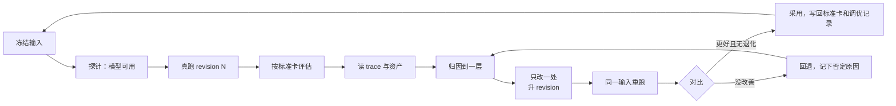

# 调优循环：workflow 是调出来的

**结论先说：** 把一项业务交给 workflow，先做一个最简单、能真跑的第一版，然后一轮一轮调。每一轮做同样几件事：在同一份冻结输入上真跑，按业务标准评估，读 trace 和资产找到出问题的那一层，只改这一处并升版本，再用同一输入重跑对比。每一轮还要定下三件事：看哪些 trace 和资产，关键流程怎么划分、在工作台里怎么显示，哪些资产给用户看。

第一版一定会错，而且错法事先猜不到。下面这个案例里的大部分问题，都只有在 trace 里才看得见。

这份手册是[设计](./designing-workflows.md) → [评估](./evaluating-workflows.md) → [优化](./optimizing-workflows.md)三份指南的实操版：那三份讲原则，这里讲一轮具体怎么做、用哪些工具。

## 一个真实案例的规模

一个内容创作项目把“从选题到成片”拆成三个阶段 workflow：选题决策、脚本、视频制作。三个阶段在同一个题目上反复调，各自经历了 7～9 个版本：

| 问题 | 怎么发现的 | 在哪一层 |
| --- | --- | --- |
| 写作角色把“区分事实与推断、写明限制”写进了脚本 | 读 Agent 会话的首条注入：仓库和用户级 `AGENTS.md` 共约 1.8 万字被注入给内容角色 | 运行环境 |
| 修订轮“改完了”，但稿子一字没变 | trace 里第二轮根本没有写作调用；两轮用了同一个 phase key，第二轮直接拿回第一轮结果 | 流程结构 / harness |
| 审稿人一直不收敛 | 逐轮对比审稿意见：每轮都挑新的“可以更好”，没有一条必须修 | 标准 |
| 成品检查员报告了不存在的问题 | trace 显示它打开的是上一轮留在目录里的旧截图（观察者自己的产物） | 输入面 |
| 设计师 15 分钟超时 | trace 显示它按提示运行自检脚本，脚本在无网络沙箱里挂住，它又去找浏览器工具 | 工具提示 |
| 下游阶段丢了上游最重要的判断 | 画出每个角色的输入清单：交接靠会话里手工拼，受众问题和编辑意见都没传下去 | 交接 |
| 模型被账号拒绝，宿主 Agent 自己把内容写完了 | 失败信息是“账号不支持该模型”：SDK 自带的 CLI 较旧，换成较新的 CLI 即可；拒绝发生在 run 中途，于是宿主接手。trace 记录的 CLI 版本也不是实际运行的那个 | 运行环境 |

没有一条是在设计阶段能想到的。这就是“调出来”的意思。

## 起点：最简单的第一版

| 做法 | 为什么 |
| --- | --- |
| 一个阶段只做**一个决定**，产出**一份主资产**，配**一张标准卡** | 评估和归因都需要一个明确的“这一阶段到底要交什么” |
| 每个角色只防**一种失败**（例如：证据角色防“主张没有出处”，冷读者防“外行看不懂”） | 角色多了而说不清各自防什么，出错时无从归因 |
| 阶段以**人工关口**结束：接受、要改或作废，意见写回标准卡 | 人的判断是最初唯一可靠的评估；写回让下一轮的审阅角色学到它 |
| 先用命令行 + 生成的静态页看结果，不先做平台 | 平台会把调优精力吸走；看清楚要显示什么，是调优得出的结论，不是前提 |
| 内容全部由 workflow 里的 Agent 产出，宿主 Agent 只负责编排和审阅 | 宿主一旦亲手补内容，就测不出 workflow 本身的能力 |

## 一轮调优怎么做



### 1. 冻结输入

同一个题目、同一份输入文件反复用。输入随 run 一起保存（例如 run 目录下的 `input.json`），重跑时逐字相同。测“盲跑能力”时，去掉这份输入里人工审阅留下的意见，看 workflow 自己能不能做到。

### 2. 开跑前探针，再真跑

```ts
const probe = await probeCodexModel({ model, runnerOptions });
if (!probe.ok) throw new Error(probe.error); // 不要让宿主 Agent 接手
```

每次改动都提升 workflow revision，新 revision 用新 run。run 的 metadata 里记下题目、阶段和上游输入版本，方便之后按条件列出。

### 3. 按标准卡评估

评估者是业务负责人或其代理，按这个阶段的标准卡逐条判：通过、偏弱、不通过，并写一句理由。判决和意见记进决定记录，接受时把意见写回标准卡的“审阅记录”。**不要用测试通过数、run 状态或 Agent 的自评代替这一步。**

### 4. 读 trace 与资产

先看资产，再看 trace：资产告诉你“哪里不对”，trace 告诉你“为什么”。

```ts
const attempt = summarizeCodexAttempt(attemptDir, { ignoreErrors: /unrecognized configuration setting/ });
const session = codexSessionFile(attempt.threadId!, { startedAt });
```

| 想知道 | 看哪里 |
| --- | --- |
| 这个角色到底收到了什么 | `prompt.txt`、`input.json`；完整会话的**首条用户消息**（环境注入都在这里） |
| 它做了什么、卡在哪 | `summarizeCodexAttempt` 的 `commands`（含失败退出码）、`searches`、`filesChanged`、`errors` |
| 花了多少 | 每个 attempt 的耗时、token（输入/缓存/输出）、prompt 与输出字符数 |
| 同一步是否真的重新执行了 | 这一轮的 attempt 是否存在；步骤是 replay 还是新执行 |
| 用的是不是想用的环境 | `runtime.json` 里的 CLI 版本、可执行文件、合并后的 Codex 配置 |

找完整会话一律用 thread id（`codexSessionFile`），不要按“最新修改的会话文件”找。

### 5. 归因到一层

| 层 | 典型信号 | 改法 |
| --- | --- | --- |
| 输入 / 交接 | 下游不知道上游已经确定的事；同一问题每阶段重新发现 | 用有版本的交接档案，按角色切片；画出每个角色的输入清单核对 |
| 角色 prompt | 角色做了不属于它的事，或漏了它该防的失败 | 改这个角色的任务说明；一次只改一个角色 |
| 标准 / 审阅者 | 审阅太松（放过明显问题）或太严（永不收敛） | 分出“必须修”和“可以更好”；用正反两类案例校准审阅者 |
| 流程结构 | 修订没生效、步骤被跳过、循环不停 | 检查 step key 与 replay；加上最后一轮的核查与停止条件 |
| 运行环境 | 内容里出现工程腔；工具挂住；模型被拒 | 按角色设置 `codexConfig`、沙箱、搜索、可执行文件；工具提示先在 Agent 沙箱里实跑 |
| 评估方式本身 | 分数变好但用户仍不满意 | 回到业务负责人，修标准卡，而不是继续提高原分数 |

### 6. 只改一处，升 revision，同一输入重跑

一次改动对应一个可以被推翻的假设：“改 X，Y 会变好；如果 Y 没变，假设错”。重跑用同一份冻结输入，初稿对初稿、终稿对终稿地比。改善了且原来做得好的没有退化，才采用。

### 7. 写回

- 标准卡：人工关口的意见、校准中发现的新判据。
- 调优记录：每个版本改了什么、依据哪条证据、结果如何、否定过哪些改法。
- 回归案例：把有代表性的失败留作之后的校准或回归输入。

## 每一轮要定下的三件事

### 看哪些 trace 和资产

每个角色都要能回答“它收到了什么、做了什么、交出了什么”。收到的 = prompt 与输入切片；做的 = 命令、搜索、改动、错误；交出的 = 发布的资产。任何一项看不到，就先补记录，再谈调优。

### 关键流程怎么划分、工作台怎么显示

工作台按**阶段**一行一行排，不按 Agent 调用排。每个阶段一行，写清楚：这一阶段要做的决定、当前采用的主资产、标准卡判决、进度（每个角色做到哪）、历史版本。读模型的宿主适配器就是用来定这些的：

| 决定 | 读模型适配器 |
| --- | --- |
| 阶段叫什么、为什么存在 | `title`、`purpose` |
| 这个阶段给读者看还是只进审计层 | `phaseAudience`：`"reader"` / `"audit"` |
| 哪份资产是这个阶段的交付物 | `isDeliverable` |
| 资产在哪里读 | `readerUrl` |

划分是调优的结论：一开始可能每个 Agent 一行，调几轮后会发现用户只关心“决定 → 主资产 → 判决”，审阅细节放进可展开的审计层。

### 哪些资产给用户看

| 给用户看（读者层） | 只在审计层 | 永不直接暴露 |
| --- | --- | --- |
| 每阶段的主资产（结论先行） | 审阅者逐条意见、校准结果 | 原始 prompt、事件 JSONL、会话文件 |
| 标准卡判决与一句理由 | 中间草稿、每轮修订差异 | 本机路径、凭据、签名 URL |
| 与上一版相比改了什么 | trace 摘要（耗时、token、失败命令） | |
| 交给下一阶段的档案 | | |

## 审阅者也要调

审阅角色的错误有两种：太松（放过该拦的）和太严（拦下该过的）。只用坏案例只能测出“太松”。校准集要同时有：

- 正例：已被业务负责人接受的产物，审阅者应该放行；
- 反例：已知有问题的产物（真实失败或有意改坏的），审阅者应该拦下并指出对的那一条。

记录“放行/拦下”的一致率和漏报数。审阅者的 prompt 或标准改了，就在同一校准集上重跑。

## 宿主 Agent 的边界

主持调优的 Agent（或人）负责：准备冻结输入、运行、评估、读 trace、归因、改 workflow。它**不**负责替 workflow 写内容。某一阶段跑不出来时，正确的动作是修 workflow 再重跑；亲手补一份产物会让这一轮失去意义，而且会把“workflow 不行”藏起来。

观察者自己的产物（截图、拼图、笔记）放在 run 目录之外的专用位置，不要留在被审流程会读取的目录里。

## 调优记录模板

```markdown
## <阶段> <revision>
- 依据：<run id / trace 位置 / 人工意见>
- 观察：<资产里哪里不对>
- 归因：<哪一层，trace 里的哪条证据>
- 改动：<只改了什么>
- 结果：<同一输入重跑的对比；采用/回退>
- 否定过：<试过但无效的改法及原因>
```

## 相关

- 运行环境、模型探针、读 trace 的 API：[Codex 与 Skills](./codex-and-skills.md)
- step key 规则：[编写工作流](./writing-workflows.md#一次执行内-key-不能重复)
- 工作台读模型：[前端读模型集成](./frontend-integration.md)
- 还没解决的 harness 问题：[Harness 路线](./harness-roadmap.md)
