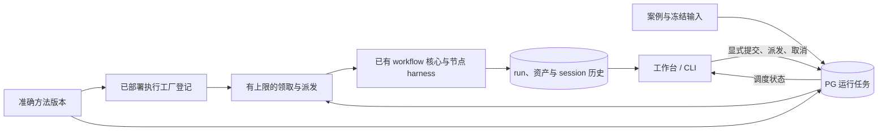

# 准确版本执行与多个选题管理（2026-10-06）

用户已确认推进[方法工作台路线](workflow-process-assets.md)的第 3 步。本轮目标是：选择一个已发布且有对应执行代码的版本，提交多个独立选题，能明确查看排队、执行、取消和中断状态。验证集合与跨版本质量比较属于第 4 步。

## 实施计划

- [x] 共享准确执行器登记：以方法版本与入口查找已部署 factory，校验冻结定义；不按相同 revision 猜测兼容，也不回退到当前代码。
- [x] PostgreSQL 持久任务：入队与原生 run／Space 绑定／命令回执原子保存；多宿主领取受同一并发上限约束。
- [x] 独立取消与中断：每个 run 有自己的取消信号；未知外部执行不自动重跑，取消请求不冒充已停止。
- [x] CONTENT 接入冻结部署配置；UI 和 CLI 明确选择方法版本，提供任务列表、取消与显式派发排队任务。
- [x] 隔离数据库验证两个版本、多个选题、并发上限、重启、取消和资产／session 隔离；真实浏览器验收，保留历史业务数据。

## 设计约束

执行器登记是本轮最小版本加载方式。一个发布版本可以长期保留，但只有宿主仍部署其准确代码与配置时才能运行。同一代码的旧模型配置可以显式保留；源码已经改变的历史版本必须保留相应工厂实现，不能仅凭数据库里的 prompt、文件摘要或版本号恢复执行。通用执行包归档与部署平台不在本轮范围。

任务状态表示调度事实，原生 run 状态表示业务执行事实。任务结束时业务仍可能需要用户评价，不能把调度完成显示成内容被接受。队列不复制资产或 session 正文，只引用已有准确版本、输入 manifest 和 run。

启动工作台、刷新页面和读取状态不启动模型。显式提交运行会启动派发；重启后未执行的排队任务可由用户显式继续派发。已领取任务失去心跳后标记中断待核对，不重新领取。外部模型或工具副作用不声称 exactly-once。

## 验证与结果

共享 PostgreSQL／Spaces／合同测试 **119 项通过**。覆盖准确版本登记、不可用与篡改定义拒绝、跨宿主并发上限、命令去重、独立取消、心跳过期及关闭管理器后保留排队任务。CONTENT 全套测试 **159 项通过**，包括两个冻结部署并行、重启只读不派发、命令去重，以及历史输入由所选版本解析器重建。Creation 类型检查通过。文档站构建 **56 页**通过，内部链接检查通过。

真实浏览器在隔离 Space 提交三个选题，取得以下结果：

| 选题 | 准确部署 | 调度与结果 | 执行调用 |
| --- | --- | --- | --- |
| A | V1 · `fixture-v1` | 先运行；B 取消后仍继续；最终 `completed` / `needs_review` | 5 个 Agent 调用均用 V1 |
| B | V2 · `fixture-v2` | 独立取消；先显示等待停止，确认后显示 `canceled` | 仅研究节点，保留其执行记录 |
| C | V2 · `fixture-v2` | 两个名额占满时排队；B 确认停止后开始；最终 `completed` / `needs_review` | 5 个 Agent 调用均用 V2 |

两个完整 run 各保存 10 份节点上下文与 session（包含资产提交记录），取消的 run 保存 1 份。检查确认：没有跨 run 共用 session，没有串用其他 run 产物，导入输入均属于自己的冻结 manifest；人工评价与采用记录均为 0。手机 390px 宽验收时文档宽度也是 390px，任务卡、长版本 ID 和操作按钮均可阅读。

实际 CONTENT 服务已重启到新实现。18 张既有业务表的记录数量与文档摘要在本轮前后完全一致；旧运行继续在案例与历史页读取，新任务表没有倒填虚假的历史排队记录。实际 Space 尚无新执行任务。候选预览及方法图可读；本轮没有发布实际 Space 的候选版本、运行真实创作模型或替用户评价／采用。

入口：[运行任务](http://127.0.0.1:4393/workbench/runs)、[当前候选方法](http://127.0.0.1:4393/workbench/workflows/preview)。自动验收用的隔离服务已关闭。

## 当前边界

- 以准确版本和入口登记可信的已部署工厂。已验证同一代码的两个冻结模型配置同时执行；通用历史代码归档、自动下载与动态加载没有实现。
- 并发限制的是 run 数量。一个 run 内仍可能并行调用多个 Agent。上限第一次领取时按 Space 持久保存；其他宿主配置不同会被拒绝，在线改上限尚无管理入口。
- 心跳过期的任务保留占位并等待核对，避免旧工作仍在运行时重复派发。当前没有人工对账后重试未知执行的完整界面。
- 关闭宿主会取消它已领取的工作，未领取任务保持排队；重启后由显式派发继续。CLI 退出前也先结算本宿主任务，再关闭数据库连接。
- 验证集合、跨案例评价、跨版本质量比较与采用理由属于下一步；本次测试通过只说明执行机制工作，不证明内容质量提高。
