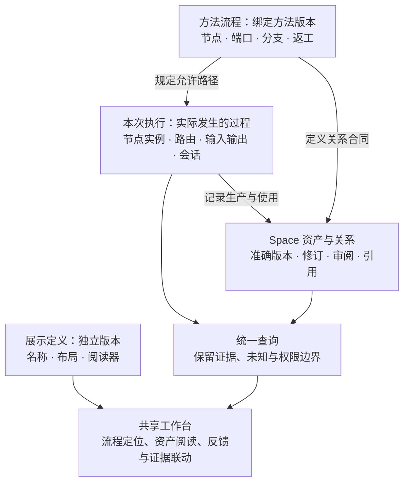
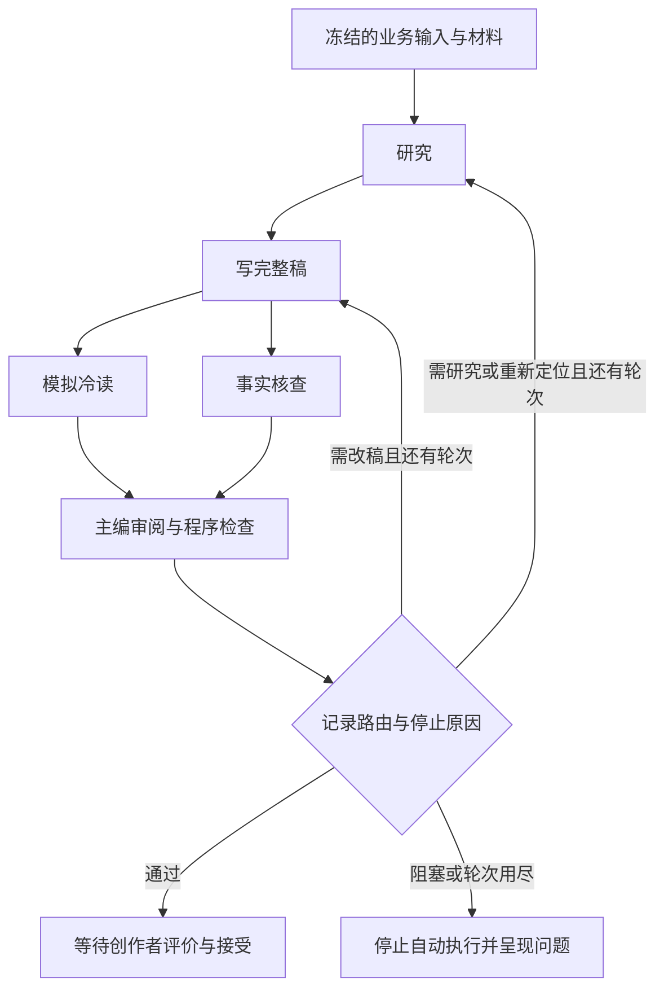
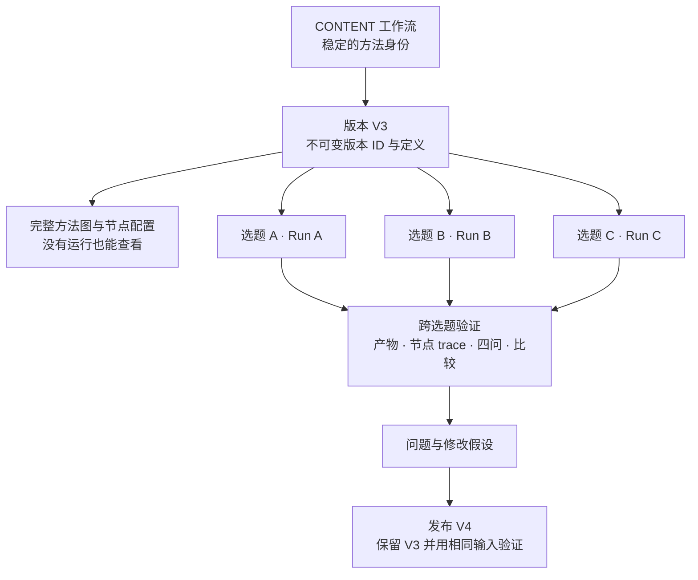
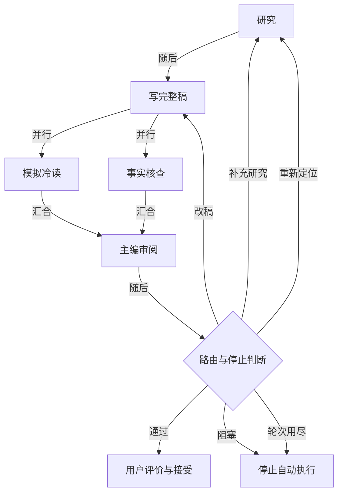

# 流程、执行与资产：工作台的下一层模型

2026-10-05，主会话持续维护这份产品设计。先后实际浏览了 CONTENT 的案例结果、过程、研究来源、比较和执行证据，并核对共享实现。首轮交付事实保留在[实现记录](workbench-implementation-2026-10-05.md)；本文区分现有能力、独立审查与后续建议。

**文档职责：流程、运行实例与资产关系的模型合同，以及日期化设计依据。** 当前产品交互由[工作台产品定义](workbench-presentation.md)维护，当前实现状态只看[建设状态](harness-roadmap.md)。此前“第 4 步未交付”的状态已过期：验证集合与比较已有工程实现，完整图中心工作台仍未通过产品验收。方法、执行及验证的历史证据分别见[方法图记录](workbench-method-implementation-2026-10-05.md)、[执行管理记录](workbench-execution-implementation-2026-10-06.md)、[验证交付记录](workbench-validation-implementation-2026-10-06.md)。

这次要构建的对象是**可理解、可运行、可跨选题评价的 workflow 版本**。最新方案从[第 7 节](#7-把-workflow-版本作为工作台的一等对象)开始；前六节保留流程与资产模型及前轮设计依据。

**通用工作台应把 workflow 的流程、一次运行的实际路径、资产的生产与使用关系连在一起。** 上一版设计主要回答了“资产如何阅读”，只给流程留下阶段名称和分组，遗漏了节点、分支、返工与资产流转的通用语义。这是设计缺口，不能单归因于前端实现者。

## 1. 首轮实用审查：当时哪里看不懂

已做好的部分值得保留：统一的 Space 导航；研究、稿件与三类审阅的阅读器；准确终态稿与审阅对应；三稿没有冒充三次方法实验；研究复用没有冒充重新研究；没有把内部审阅当成人类接受；视图改版独立于 workflow 方法版本。

| 优先级 | 亲自使用或代码核对的发现 | 对用户判断的影响 | 应在哪层解决 |
| --- | --- | --- | --- |
| P0 | “过程与修订”是研究、第一稿、第二稿、最终稿的纵向卡片组；每组意见按主编、核查、冷读排列 | 无法看出冷读与核查并行、主编随后决策，以及为何回到写作或研究 | 流程语义与运行投影，再由 UI 展示 |
| P0 | `stages` 只有 ID、名称、说明；业务适配器返回的 `process` 是资产分组数组 | 新 workflow 仍要自己写如何理解整个过程的逻辑，通用框架只统一了外观 | 定义节点、端口、控制边与运行实例合同 |
| P0 | 存储已有精确版本依赖，但许多业务含义在 CONTENT 适配器和正文中解释 | 一条依赖无法区分“修订上一稿”“评价这份稿”“依据这份研究” | 关系类型合同与统一关系查询 |
| P1 | 研究资产的“谁使用了它”出现三张同名稿件、三张同名核查、三张同名主编卡 | 点击前不知道是哪一轮、为什么关联 | 关系卡显示轮次、节点、用途和准确对象 |
| P1 | 来源可打开正确材料包，包内没有条目锚点；回退页出现 `id`、`text`、`title` | 证据路径正确，却需要在长材料包中重新寻找原文 | 精确片段定位及材料包阅读器 |
| P1 | 两稿比较页出现 `/script/segments` 等字段路径，段落对象序列化为 JSON；两份稿件身份在较后位置 | “哪些地方改了”仍需用户自己解析数据；顺序比较不能解释段落移动 | 比较视图、身份摘要和业务字段标签 |
| P1 | 案例和研究详情正文很长；过程首屏的大块目标与状态占据主要空间 | 看得到所有内容，但不容易同时看到当前阻碍、关联产物和处理入口 | 紧凑摘要、按需展开与联动阅读区 |
| P1 | 概览用“未接受任何结果”筛选待处理案例；研究、稿件、审阅都可显示通用“候选”状态 | 未接受不一定需要现在处理；运行状态、产物角色与业务判决容易混淆 | 待办读模型与分开的状态维度 |
| P1 | 执行证据保留故障与恢复事件，但入口仍有重复角色名、会话 ID 和很长的事件名列表 | 能追查原始事实，却难以立刻定位哪轮哪步失败、怎样恢复、影响了什么产物 | 执行证据挂回节点实例，显示故障与恢复摘要 |

MiMo 的当前事实是一次运行、三份稿件、复用同一研究、自动修订未收敛、没有创作者接受。本次没有提交评价、接受结果、启动模型或改变该案例数据。观察针对当前小规模案例，不证明大量案例下的性能或所有业务适配器都存在相同缺陷。

代码依据：[展示合同](../packages/spaces/presentation.ts)、[业务读模型](../packages/spaces/workbench-model.ts)、[页面渲染](../packages/spaces/workbench-render.ts)、[资产详情](../packages/spaces/console.ts)、[CONTENT 执行](https://github.com/cyl19970726/creator-lab/blob/main/workbenches/creation/src/stages/content.ts)、[CONTENT 适配器](https://github.com/cyl19970726/creator-lab/blob/main/workbenches/creation/src/spaces/presentation.ts)。

## 2. 通用模型：同一件业务的三个层面

三层各自负责不同事实，通过稳定身份连接；用户不需要在三个互不相连的控制台中找线索。



### 方法层：Process Contract

由 workflow 定义包提供，随准确方法版本保存；记录自己的 revision／hash，并由 run 在开始时冻结 `workflowVersionId + entrypoint + processHash`，通过方法版本追到准确代码。后续展示重绑不能替换历史运行所用的流程。需要表达：

- 稳定节点身份、用途和节点类型，如 Agent、程序、判断、人工关口；phase 只做分组，不自动变成独立 workflow。
- 输入输出端口：引用已冻结的存储槽位、资产类型、必需性和数量约束。**复用现有存储合同，不另写一份可能冲突的 schema。**
- 控制关系：先后、并行分叉与汇合、条件出口、返工和循环；业务结果槽位可有一个或多个产物，不让所有业务被迫只有一个最终文件。
- 端口间的数据映射与语义角色：例如主编的 `draft` 输入是被评对象，`research` 是支持材料。控制边和资产关系分别定义。

当前 core 的 workflow 是 TypeScript `execute()`，包含普通条件和循环，**不能从函数自动可靠恢复所有可能路径**。第一步可在定义旁注册受校验的流程标注，与执行使用同一组节点／端口 ID；运行观测返回实际路径和覆盖情况。以后再逐步把标注收敛到可复用的构建辅助函数，不把展示 JSON 变成第二套执行引擎。

声明只表达已覆盖的范围。发布时校验节点、端口唯一性、边端点、结果槽及循环退出／预算约束；运行时核对实际进入、选边和完成记录。声明未覆盖的实际步骤仍显示，并标明“未映射”；未发生的分支只能显示为定义中的可能路径。没有观测不能直接等同于“没有执行”。纯排序和时间邻近不证明因果关系。

### 运行层：Node Occurrence

一个定义节点可以发生多次。例如“写稿”是一个节点，“本次运行第二轮写稿”是一个实例；它内部因网络错误发生的重试是 attempt，不是第三轮写稿。

实例至少连接：`runId`、`definitionNodeId`、实际 `stepId`、父阶段、业务轮次／分支、执行尝试、输入输出绑定、状态和决策记录。输入输出继续指向准确 `assetVersionId`；未产生输出时也保留失败或阻塞实例。

已有 step、phase、parallel、decide、context 和收据应作为事实来源。新模型首先是它们的投影，只补稳定映射及尚未记录的业务轮次／路由信息，不再复制一套执行状态。声明图允许循环；一次运行展开为不同实例后，实际依赖可按因果顺序阅读。

旧运行仅从确切记录恢复：明确记录、适配器可验证的推导、无法确定，三者分别标识。新视图不能回写一个旧运行从未保存过的“当时流程定义”。历史说明性图可单独绑定并标明后来整理，不能改变旧方法 hash。

### 资产层：Semantic Links

资产正文回答“内容是什么”；关系回答“它与其他东西是什么关系”。例如研究被三轮复用，应该只有一份准确研究版本，多条使用关系；第三稿修订第二稿，即使它们分别是两个逻辑资产的 version 1，也应该形成业务修订链。

关系不是画图的附属配置。存储服务、节点 harness、CLI／tool、工作台和负责迭代的 Agent 应读取同一份含义与证据。

## 3. link 要加，但已有关系不应重造

当前已经保存资产 `dependencies`、生产来源、节点输入输出、run 的冻结输入、review 的目标和 adoption。缺少的是通用的关系解释，以及这些原语没有覆盖的业务联系。先统一查询，再有选择地补存储。

| 关系 | 事实来源或新增需求 | 举例 |
| --- | --- | --- |
| produced-by / consumed-by | 从已有 source、context、step、输入输出投影 | 第二轮写稿消费研究 R 和第一稿 D1，产出 D2 |
| depends-on | 继续读取现有准确版本依赖 | 主编产物依赖稿件、研究、冷读与核查 |
| revision-of | 新增或由明确输入槽可验证地解释；不能按时间猜 | D2 修订 D1；不要求二者属于同一个 assetId |
| assesses | 已有 review 目标直接投影；业务审阅资产由合同中的目标槽解释 | 冷读 C2 评价 D2，而非该 run 的“最新稿” |
| cites / incorporates | 需要可校验的片段联系；并非全部存在于 dependencies | 某段稿件引用材料包中的某条资料；某方案包含另一份产物 |
| accepted-as | 从既有 adoption 记录投影 | 创作者把准确稿件指定为本案例接受结果 |

不要把所有联系压成一个 `related-to` 文本字段，也不要把这些关系全部塞进 `dependencies` 冒充生成依赖。特别是某条材料可能通过冻结 context 输入传入，却不在原生 artifact 的依赖数组中。引用可以指向包内片段；“声明引用了”也不证明引用真的支持那句话。

### 关系类型合同与实例

业务可以登记自己的关系类型，共享层保留通用关系的稳定语义。合同独立命名和版本化，由 workflow 方法／存储合同引用准确版本。首版限制为经过校验的声明，复杂业务校验器由宿主预先部署。

| 合同要说明什么 | 服务如何使用 |
| --- | --- |
| 名称、方向、两端允许的 schema 与片段形式 | 防止把任意两个资产随意连线；反向显示只是同一事实的视图 |
| 端口与关系含义的映射 | 从实际输入输出形成有意义的使用、审阅和修订关系 |
| 数量、Space／case 范围、是否允许循环 | 例如单前驱修订链要拒绝多前驱；允许合并修订的业务应另行声明 |
| 谁能声明、何时必须存在、来源与纠错规则 | 区分节点发布、确定性派生和人工补充；不能越过现有授权 |

每条关系连接准确版本，必要时带该不可变正文内的 JSON Pointer 或已定义片段标识；业务 ID 需在**当时冻结的父资产**中解析。不要连接浮动的 `latest`、标题或外部可变 URL 来代替历史证据。

示意而非现有 API：

```yaml
relationType: creation.revision-of@1
from: { assetVersionId: D2 }
to: { assetVersionId: D1 }
evidence:
  kind: recorded-port-binding
  nodeOccurrenceId: author-round-2
  inputSlot: previous-draft
  outputSlot: draft
```

`D2`、`D1` 是说明用别名；实际入库必须是存在的准确版本 ID。`cites` 还可有 `from.pointer` 与 `to.pointer`；旧材料包没有稳定条目 ID 时，可用准确父版本内的索引定位，不把该索引当成跨版本身份。

生产时必需的关系与资产／步骤收据原子提交，重试使用同一幂等身份；缺少必要关系不能声称发布成功。人工事后补充的关系单独追加，记录声明者与时间；修正追加撤销／替代记录，原事实保留。历史推导标明解析器版本与原证据，不伪装为生产时已记录。

**PostgreSQL 仍适合当前方案。** 采用有外键和索引的关系记录、合同定义及现有表的查询投影即可，当前没有引入图数据库的必要证据。具体表和接口留给下一轮实施；查询按 case／run／资产邻域分页，避免每打开一页加载整个 Space。未知类型降级显示准确端点与原类型，不擅自推断含义。跨 Space 分享仍不在本轮范围。

## 4. CONTENT 应该怎样被看懂

下图是根据 CONTENT 定义整理的业务路径概览。工作台现在直接读取通用流程声明生成可点击的方法图，并提供等价文字路径。技术校验失败等细节在节点中展开；主编判定和程序检查共同决定出口。



方法图说的是可能路径。MiMo 的实际执行应显示：

```text
同一次 CONTENT 运行；研究 R 只生成一次

                 研究 R ──────────┬──────────────┬──────────────┐
                                 ↓              ↓              ↓
                             第 1 稿 D1 ───→ 第 2 稿 D2 ───→ 第 3 稿 D3
                             冷读 C1 ∥ 核查 F1  冷读 C2 ∥ 核查 F2  冷读 C3 ∥ 核查 F3
                                 ↓              ↓              ↓
                             主编 E1          主编 E2          主编 E3
                             反馈供下一轮使用  反馈供下一轮使用  轮次用尽，未收敛

选择 D2：
  修订自 D1 · 沿用研究 R · 根据 E1 的反馈
  C2 与 F2 分别审阅 D2 · E2 综合判断 · D3 后续修订了 D2
```

这里展示关系子集以便阅读；核查、主编对研究的依赖仍可展开。冷读和核查是并行节点，不按页面卡片排序伪装成先后执行。精确 route 值和每次改动原因应从对应 decide、主编意见和 guardFailures 读取；自动修订后“不满意之处是否解决”需要关联评价，不能仅靠作者自述。

这一页同时回答：研究有没有重做、哪条意见对应哪一稿、意见导致哪次返工、停在哪里、用户还没判断什么。B3 不进入这次实现；先证明单一 CONTENT 能完整使用这套模型。

## 5. 页面应该长什么样

共享的是交互骨架，workflow 定义的是流程结构和资产含义。首版采用可阅读的流程图与列表，不做自由拖拽流程编辑器，也不把整个 Space 的所有连线铺满屏幕。

```text
内容创作 / MiMo                     本次运行：1     方法：已发布版本
三稿 · 未收敛 · 尚未接受            当前阻碍：主编要求仍未全部满足

[本次执行] [方法全貌]     [查看结果] [比较两稿] [评价]
研究 ✓ → 写稿 ↔ 并行审阅 → 主编 → 停止：轮次用尽
            选择：第 2 轮

┌ 本轮节点与产物 ──────┬ 所选稿件 / 研究 / 意见 ──────┬ 关系与处理 ────────┐
│ 写稿：D2             │ 直接读业务内容               │ 来自：D1、R、E1    │
│ 冷读 C2 ∥ 核查 F2    │ 切换内容不丢失当前轮次       │ 对应：C2、F2、E2   │
│ 主编 E2              │ 来源点击打开准确片段         │ 对比 D1 / 查看 D3  │
│ 路由及返工原因       │                              │ 评价准确版本       │
└─────────────────────┴──────────────────────────────┴────────────────────┘
```

交互规则：

1. **先看结果与阻碍，再展开过程。** 顶部只保留简短目标和当前状态；完整业务目标、配置和原始事件折叠。运行状态、质量判决、人类接受三者分开。
2. **方法图与本次执行联动。** 未走分支在方法视图中弱化；本次视图只把已知实际实例当作已执行。点节点选择它的输入、输出、意见、会话；点资产反向定位生产节点和使用者。
3. **按轮次展开返工。** 显示第几轮、沿用了什么、为什么再做；节点失败后的重试嵌在该节点中。研究复用显示引用，不复制成三次生产。
4. **连线有含义，关系卡可区分。** 例如“第二轮主编意见 · 评价第二稿”，而非三张同名卡；控制关系与资产联系可切换，默认仅显示当前选择的邻域。
5. **比较直接服务判断。** 顶部固定两份对象与条件，业务字段中文标签，口播与画面分开比较；无稳定段落身份时诚实显示顺序对照。审阅意见、作者回应、独立复核分开，不自动宣布已解决。
6. **手机不压缩成三栏。** 保留紧凑流程摘要，节点／资产列表与阅读页切换，回退恢复选中轮次和位置。拓扑图有等价列表，不能只有缩放画布可用。

workflow 的展示定义引用稳定节点、端口、关系类型与结果角色，提供名称、分组、阅读器、摘要和比较布局。默认布局就能看懂新 workflow；领域 reader 只处理特殊正文。多个结果、缺失输出、等待人工、失败重试和历史未知都有通用表现，不再要求每个业务把流程翻译成 CONTENT 式的稿件分组数组。

**还有一个需要单独演进的缺口：反馈落实。** 四问和审阅正文已经能保存，但“这条问题后来是否解决”不能仅靠两份正文比较得出。后续可让新的审阅 schema 给问题稳定 ID，绑定被评资产或片段；新稿记录作者声称回应了哪些问题，独立复核再记录已解决／未解决／无法判断及证据。三者关系可被共享查询读取。旧审阅没有问题 ID 时保留原文与准确评价对象，首版不自动补造逐条解决状态，也不要求本次先建设完整问题管理系统。

## 6. 版本边界与实施顺序

改变节点、数据路由、条件、循环或必需关系，会改变执行／存储语义，应发布新方法或合同版本。改名称、布局、折叠和颜色只发布展示版本。历史关系解释的修正保留新旧解释与依据，不改旧生产事实；旧数据不能只为看图方便而补写未经观测的步骤。

第二轮约定的纵向切片如下；代码交付与满足全部产品验收分别判断：

1. **固定合同。** 在 agent-workflow 定义节点／端口／控制关系、实例映射、语义关系类型和联合查询的边界；盘点哪些事实复用现有表，哪些缺失。采用已部署的 CONTENT 路径核对，避免只用纯线性示例。
2. **做只读投影。** 从当前 MiMo 的 step、context、依赖、决策和终态收据形成实际图；无法确定的部分明示未知。首版新关系限定修订、审阅、引用，保留未来扩展合同。
3. **做一个联动页面。** 流程摘要、轮次、所选资产、关系与评价一体；同时修来源片段和比较阅读。先使用旧数据验收，不为展示重跑模型。
4. **再验证新发布。** 在隔离测试数据上验证新合同登记、节点产物和关系的原子写入；用合成的分支／并行／重试及多结果业务验证通用性。旧节点没有新合同仍可回退，不能静默改变 replay 指纹。

完成标准不是“有一个能画线的组件”，而是用户和迭代 Agent 都能基于同一查询回答：

- 这个方法可能怎么走？这次实际走了哪条路，为什么停止？哪些部分没有记录？
- 第二稿用了什么、受哪条反馈影响、谁审阅了它、第三稿是否回应了意见？哪些是作者自述，哪些经过复核？
- 三轮是否共用研究，资料引用能否定位到当时的准确条目？
- 网络重试有没有被当成业务改稿？主编通过有没有被当作用户接受？
- 换一个带并行分支和多个结果的 workflow，是否只需声明其结构与 reader，而不用修改共享页面？
- 无效关系、错误版本／片段、越权端点、重复提交和定义漂移是否有明确处理，旧运行是否保持不变？

多 workflow 编排、B3、VM、自动调优及生产部署继续沿用原范围。下文讨论同一个 CONTENT 版本处理多个选题，不等于恢复多 workflow 编排范围。

## 7. 把 workflow 版本作为工作台的一等对象

过去主要从“案例 → 本次运行 → 产物”设计页面。现在需要另一个平等入口：“工作流 → 方法版本 → 多个案例的运行与评价”。前者用于完成一项业务，后者用于判断并改进完成业务的方法。两个入口读取同一批记录。



### 身份沿用现有记录

| 身份 | 含义与规则 | 现状 |
| --- | --- | --- |
| `spaceId` | 业务目的及其持久资产、权限与历史归属 | 已有 |
| `workflowId` | 稳定的可执行方法身份，例如 `creation.content`；在 Space 内归组 | 已在 entrypoint 中存在，未形成主入口 |
| `workflowVersionId` | 一份不可变的已发布定义，配合 `entrypoint` 指定具体方法 | 已有，不能再造一套 UI 专用版本 ID |
| `revision`／显示名 | 便于交流的 V3、content-v2；不代替准确身份或内容 hash | 已有，但目前页面主要只显示这个名称 |
| `runId` | 该版本处理某案例的一次执行；绑定准确输入 manifest 和实际配置 | 已有，可按版本归组 |
| 节点实例／attempt／session | 运行中某次业务节点经过、技术尝试和会话；不充当方法版本 | 已有或第二轮新增 |

现有一个 `WorkflowVersion` 可以包含多个 entrypoint，因此准确页面和执行目标是 **Space + 版本 ID + entrypoint**；页面显示该入口对应的 workflow 身份。当前只实现 CONTENT，不必为未来组合方案迁移现有 ID。图布局、缩放和颜色继续属于独立展示版本，不改变方法身份。

版本列表区分“正在查看”“当前采用”“最新发布”和“可执行”。发布 V4 不自动采用 V4，也不改变已经排队运行所用的 V3。沿用既有 `predecessorId`、变更理由和 adoption 保存版本关系；CONTENT 当前发布路径没有填写 predecessor，应补齐显式父版本，不能按创建时间推测。

### 用户先在哪里看到完整图

Space 保留概览、案例和资产入口，增加明确的“工作流”入口。概览同时显示 CONTENT 的用途、当前采用版本和“查看完整流程”。用户不需要先创建案例或产生一次运行才能认识方法。

版本页的默认内容是完整方法图：

```text
内容创作 Space / CONTENT / V3                 [复制准确 ID]
目标：把选题与材料形成可审阅的完整稿件
当前查看 V3 · 当前采用 V2 · V3 可执行

[流程与节点] [选题与运行] [验证与评价] [版本变化]

完整方法图：研究 → 写稿 → 冷读 ∥ 核查 → 主编 → 判断
                      ↑                       │
                      └──────── 返工 ─────────┘

点节点：目的、prompt、模型、工具、输入输出、评价责任
点输出：资产类型、schema、下游用途、阅读方式

[选择选题试跑] [用一组选题验证]       发布、运行、采用分别操作
```

节点检查面板默认显示简明职责；配置和原始定义按需展开。方法页显示冻结的节点定义，运行页显示当次实际生效配置，二者差异有记录。版本标题可读，完整 ID 可复制；技术 hash 放证据区。图有直接可见的全貌和等价列表，不用一份长文字清单替代桌面的图。

## 8. 从定义生成图，而不是分别维护三张图

发布前读取结构化定义就能生成方法预览；不调用 Agent，也不执行 workflow 的 `execute()` 来“探测”路径。发布后从冻结定义生成同一图。开始运行后，用真实实例和事件叠加实际路径；选择资产后，再显示它的准确关系邻域。

| 视图 | 数据依据 | 用户看到的对象 |
| --- | --- | --- |
| 方法图 | 冻结的节点、控制边、端口和数据绑定 | Agent／程序／判断／人工关口，以及预期产物类型 |
| 执行图 | 方法图 + 准确节点实例、路由、attempt 和终态 | 该选题实际经过的步骤、业务轮次、停止与恢复 |
| 资产图 | 准确版本关系查询 | 这份研究、第二稿、对应审阅、引用片段与后续修订 |

当前共享方法页已从 `ProcessContract.nodes/edges` 生成控制流程图；执行过程和资产关系仍使用各自的读模型与联动阅读，不宣称三类交互图都已完成。控制边和数据边分层显示：默认看流程，点节点才展开资产流转，避免所有引用线覆盖全图。节点状态显示和 CLI 查询使用同一份经过验证的读模型。

### 可行性核对：从当前定义直接生成预览

下面的图由当前 `buildContentProcess` 的 nodes／edges 和展示名称自动转换，包含 8 个节点、12 条定义边。生成时只读取方法构建函数，没有执行 CONTENT、创建 run 或调用模型。这证明现有定义可以支持“先看图、再运行”；工作台已实现相同定义的交互图入口。这是当前候选定义的预览，不是给旧 MiMo 运行补造的当时流程。



### 资产自动连线还缺什么

节点的输入输出 schema 不足以唯一确定生产者。比如本轮稿件和上一稿同属 Draft，多个分支也可能产出同一种类型。现有 `relationMappings` 表达某次产出的语义关系，不能完整代替方法层的跨节点数据绑定。

本轮在现有流程合同中增加可选 `runInputs` 与 `dataBindings`，引用现有端口与存储槽位。下面是现有 API 的局部示例（`runInputs` 需另声明准确 schema 引用）：

```yaml
dataBindings:
  - id: research-to-author
    from: { node: researcher, port: research }
    to: { node: author, port: research }
    selection: latest-successful-in-this-run
  - id: prior-draft
    from: { node: author, port: draft }
    to: { node: author, port: priorDraft }
    selection: previous-business-round
    when: later-rounds
  - id: fixed-materials
    from: { runInput: materials }
    to: { node: factChecker, port: materials }
    selection: frozen-input
```

`selection` 是受限语义，不允许任意脚本；包括当前业务轮次、上一业务轮次、当前运行最近成功产物和冻结输入。`when` 可区分首次与后续业务轮次的互斥来源。发布校验节点／端口、准确 schema、来源选择和条件重叠；声明参与流程 hash。它不执行取数，也不授权隐式换输入。实际资产仍以 context 收据为准，CONTENT 现有执行适配器核对准确输入；通用声明与运行观测的自动差异检查尚未实现。以后可让 authoring helper 同时产生绑定声明和执行参数，减少两处维护。

人工反馈、循环沿用和外部输入都有显式来源。无法声明的动态部分显示“运行时决定”，图的完整性范围写清楚；不能因为没有边就断言节点没有其他输入。旧定义继续回退，新增声明不回写历史方法。

### 构建与发布的最小流程

1. **构建候选。** 收集业务代码、Agent 配置与 prompt、工具定义、资产 schema、存储和流程合同，产生一个候选包及预览图。候选未发布时明确标草稿。
2. **校验并发布。** 检查节点／端口引用和绑定，保存不可变定义、内容 hash、准确执行包引用、父版本和修改原因；方法图此时就能访问。
3. **指定版本运行。** 启动参数固定版本、入口、案例和输入；执行器核对加载包与已发布身份一致。之后发布新版本不影响已提交的运行。
4. **记录和解释。** 节点、产物、路由、失败与恢复进入现有存储；共享投影生成执行视图及资产邻域。评价和采用保持独立记录。

“有旧版本 ID”不等于“还能执行旧代码”。当前 methodSnapshot 保存文件摘要，不能仅靠摘要恢复已改变的执行环境。需要一个最小的准确版本加载机制：开始可使用已部署的版本到执行 factory 的登记，随后保留受管理的不可变执行包和必要依赖标识。旧版本缺少对应执行包时允许阅读历史，启动明确不可用；不能把旧 ID 交给当前代码冒充旧版。此事不要求引入临时 VM。

## 9. 同一版本跑多个选题：先冻结验证集合

版本页的“选题与运行”先汇总使用该版本的全部历史 run；“验证与评价”再保存一次**有明确目的的选题集合**。两者不同：所有历史运行可能包含不同输入、实验配置和临时调试，不能自动混成一次公平实验。

最小验证计划保存：准确版本／入口、每个案例的冻结输入、重复运行次数、评价标准与判者配置、允许的运行配置差异和并发上限。每个计划项绑定自己的 run 和评价，记录未启动、执行中、失败、待评价、已评价、排除及原因。取消一个选题不会丢掉整个集合。

现有 `IterationDraft` 已有 `caseIds/runIds/reviewIds/hypothesis`，可以承载事后迭代证据；但它要求已有 review 和 run，不能独立表示运行前计划。实施时可补一个小的验证计划及条目表，关联现有 run／review／iteration，不另造运行、资产或评价历史。具体字段在接口设计时再定。

比较 V3 和 V4 时，以相同案例及准确输入成对展示，并显示实际模型、工具、联网条件和判者差异。所有计划项都保留，缺跑与失败不能从分母消失；重复运行先在各案例内说明，不能把多次尝试混成更多独立案例。

```text
验证：V3 → V4 · 固定 3 个选题 · 同一套评价标准

选题       V3 结果与评价       V4 结果与评价       改善／退步／仍未知
MiMo       对应 run、四问     对应 run、四问       点开节点与证据
选题 B     对应 run、四问     执行失败             保留失败，不作质量结论
选题 C     对应 run、四问     等待用户评价         明确尚未评完

共性问题：哪些案例出现、哪种输入条件下出现、涉及哪个节点
修改假设：准备改变什么，预期改善什么
采用决定：由谁依据哪些结果采用或继续试验
```

这使多个 trace 有了比较单位：先按方法节点和问题类别看跨案例摘要，再进入某个 run 的对应节点与原始 session。四问可由人或独立 Agent 作答，保留标准版本、判者与准确对象。技术可靠性、内容质量和用户接受分别汇总；平均分不能代替具体证据。

**真正并行由持久任务管理。** CONTENT 已改用共享 PostgreSQL 队列，每个任务绑定准确版本、manifest、上下文与幂等身份；默认每个 Space 同时执行两个 run。跨宿主领取共用持久上限，单个任务可以取消。已领取但失去心跳的任务保留为中断待核对，不自动重跑；刷新页面和启动宿主不派发模型。初始交付采用显式登记的已部署执行工厂：历史版本只有对应实现仍部署时才可运行，不能仅凭同一个 revision 或数据库 prompt 恢复旧代码。验收证据与边界见[执行管理实施记录](workbench-execution-implementation-2026-10-06.md)。

## 10. 下一步构建顺序与可见成果

本节保留当时四步拆分及各批工程交付依据，不作为现行产品建设顺序。第 4 步后来已完成工程接入，见[验证交付记录](workbench-validation-implementation-2026-10-06.md)；2026-10-06 的整体产品反馈仍未解决，现行顺序只在[建设状态](harness-roadmap.md)维护。任意历史执行包归档与加载未包含在这些最小交付中。

| 顺序 | 完整交付 | 用户如何判断完成 |
| --- | --- | --- |
| 1 · 已完成 | 修正恢复状态与停止路径的共享投影 | 第三轮已产稿，同时能看到失败与恢复；选择返工和预算停止分别保留，UI 与 CLI 一致 |
| 2 · 已完成 | 工作流／版本入口、独立发布预览、自动方法图 | 没有案例、没有 run 也能找到 CONTENT 完整图；可点节点看职责、配置、资产端口；已有历史版本也可阅读 |
| 3 · 已交付（已部署工厂） | 准确版本启动与多个运行的执行管理 | 每个任务绑定所选版本；仍部署准确工厂的版本可运行；多个选题独立排队、并行与取消。验证计划项属于第 4 步 |
| 4 · 已有工程实现，产品整合待验收 | 验证集合、跨案例评价与版本比较 | 已有冻结计划和准确配对；还需把版本、Case、产物与比较接入连贯的图中心工作台，真实内容效果未证明 |

所有共享身份、查询、图投影、验证计划和执行管理放在 `agent-workflow`；CONTENT 提供其节点、业务资产、方法路径、配置、评价标准与专用阅读器。先用一个真实 CONTENT 方法和隔离合成案例验证通用性，不把多选题验证扩大为多 workflow 调度平台。

这里最关键的验收是：**首次进入能理解方法；每次运行知道用了哪个版本；跨选题能判断该方法的稳定问题；下一版本的改变有依据可查。**
