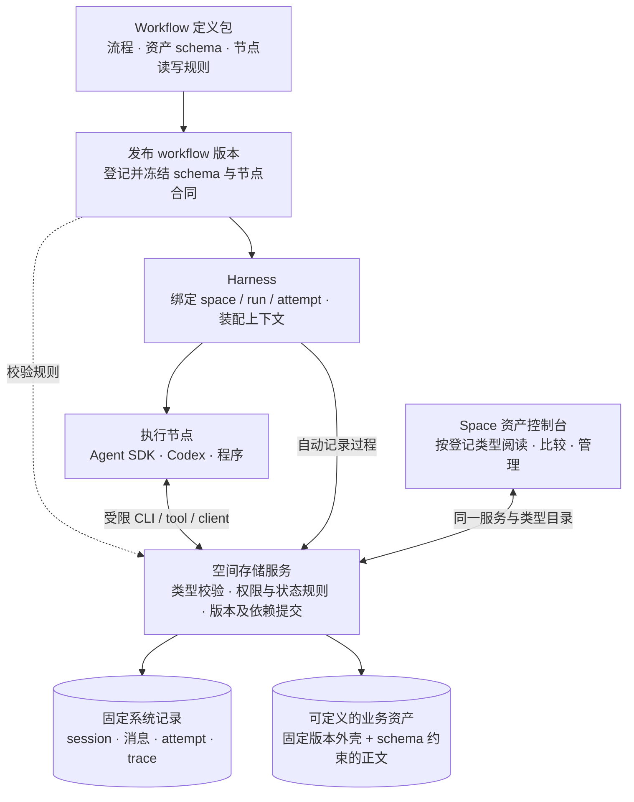
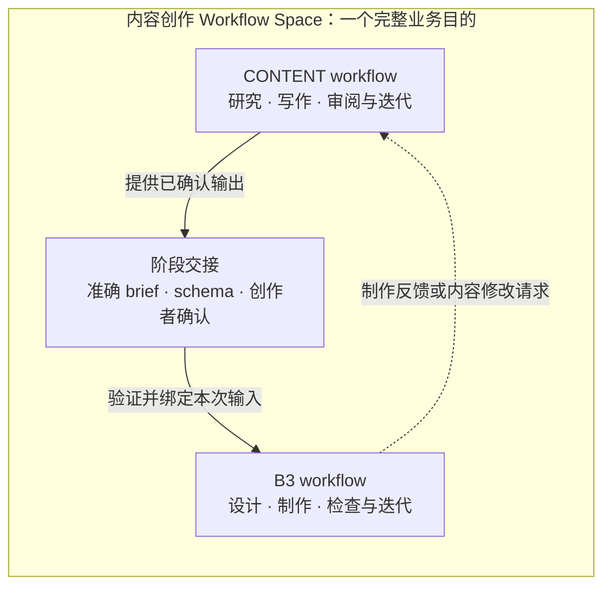
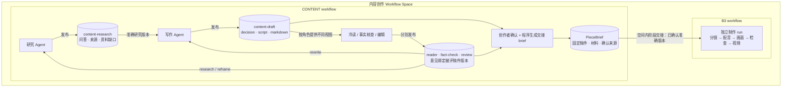

# Workflow Space：围绕业务目的组织执行与迭代

**2026-10-04 用户明确：一个 workflow space 对应一个完整业务目的，空间内可以定义几个不同阶段的 workflow，并保留它们的版本与迭代；资产控制台针对整个 space 设置。** 内容创作采用一个 space，CONTENT 和 B3 是其中两个阶段 workflow。本文主要是业务设计：Schema Registry、PostgreSQL Space 领域服务、节点限定客户端、core 桥接与可注入业务阅读器的只读控制台已有确定性测试；合成材料的 SIWC 生产和独立审阅探针也已持久化。准确 API 与证据边界见 [Space 存储接入指南](space-storage.md)。creation 业务接入、生产大媒体和部署尚未全部验收；下文的整体阶段方案和全部能力不可直接视为现成 API。

空间的中心问题是：“这项业务目前怎样完成，哪些版本试过，效果如何，下一轮为什么这样改？”数据库、SDK、文件目录和 VM 都是实现手段。换执行器、重启服务或发布下一版 workflow，不应创建一份失去历史关系的新空间。

本文是空间存储的主要设计入口。先看 workflow 如何定义和使用存储，再看内容创作的具体例子；后文补充历史依据、版本、会话知识与实施。对象存储与 SDK 的具体接入细节仍见[基础设施方案](postgres-sdk-plan.md)。资产如何成为人能理解的业务页面，见[通用工作台与展示契约](workbench-presentation.md)；展示版本与数据、方法版本分别管理。

2026-10-05 补充：单一 CONTENT 的真实案例与首轮共享工作台已接入，准确范围见[工作台实现记录](workbench-implementation-2026-10-05.md)。以下跨阶段整体方案继续保留为目标，下一轮仍聚焦 CONTENT。实用审查要求补齐[流程、运行实例与资产语义关系](workflow-process-assets.md)：现有来源、输入输出、依赖、review 和 adoption 是事实基础；新增关系类型合同和精确片段联系，不另造一套与旧记录冲突的关系库，也不由前端按时间猜先后。

## 0. 先看使用关系：固定系统模型，加上 workflow 定义的存储合同

**空间决定数据归属，schema 决定数据结构，workflow 决定节点怎样使用数据，存储服务负责执行这些约束。** 之前只列了要保存哪些对象，没有把“谁定义结构、谁控制读写、谁执行规则”说明白。



图中的整体产品关系仍是目标；已实现的 Space 服务可登记 schema、冻结存储合同并在节点提交时强制校验。core 的 `ctx.publish()` 需通过 [Space runtime 桥接](space-storage.md) 才进入这套合同，不能把旧消费者的直接调用等同于已接入。

| 层次 | 谁定义 | 什么可以变化 | 什么必须固定 |
| --- | --- | --- | --- |
| 系统记录模型 | agent-workflow | 工作流选择允许的会话策略、上下文策略和工具配置；适配器记录声明过的扩展信息 | space / run / attempt / session / message 身份、消息顺序、事件来源、版本与校验收据的核心语义 |
| 业务资产类型 | 业务的 workflow 定义包 | Research、Draft、Brief、FrameSpec 等正文 schema；类型的关系要求、业务检查与展示器 | 统一资产外壳、空间归属、不可变版本、hash、schema 引用和生产来源 |
| 节点存储合同 | 每个 workflow 版本 | 各节点可读的输入类型与状态、可写输出、依赖关系、可执行动作、session / 知识使用策略 | 不能扩大宿主授权；不能伪造生产者、跳过结构校验、覆盖历史或修改系统 trace |

“系统固定”指由共享库统一维护，系统自己也会有 schema 版本和迁移；不表示永远不升级。“可定义”指通过受校验、可登记的声明扩展，首版不为每个 workflow 动态建一套数据库表。

### 一个 workflow 要提交哪些存储定义

发布 workflow 版本时，同时提交可持久保存的 `storageContract`（首版接口已实现；以下还包含目标扩展）：

1. **资产类型和 schema。** 类型命名空间、准确 schema revision、完整正文定义、依赖 schema 和内容摘要；例如 `creation/content-draft@1`。正文 schema 建议采用 JSON Schema，并声明明确 dialect；业务 schema revision 与 JSON Schema dialect 不是同一个版本号。[JSON Schema 官方说明](https://json-schema.org/understanding-json-schema/reference/schema)
2. **节点输入输出绑定。** 哪个输入槽接受哪种 schema、哪些业务状态，哪个输出槽生成哪种类型，必须声明哪些上游依赖；是否允许在同一逻辑资产下追加版本。
3. **操作与状态规则。** 哪个节点能读、提交候选、评价、请求修订或接受交接；哪些状态转换由程序或人执行。结构符合 schema 不等于有权操作，也不等于内容质量通过。
4. **展示与兼容策略。** 类型可注册阅读器、比较器和受控索引字段；缺少专用阅读器时仍能用通用结构化视图读取。跨 schema 版本的消费需要明确兼容声明或转换步骤。

共享层首先校验这份声明本身，再校验每次业务写入。schema 的 `$ref` 解析到登记并冻结的依赖，不在运行时任意取远端“最新版”；这份依赖闭包与 workflow 版本一起保存。JSON Schema 的标识可以用于注册表解析，不必对应实时可下载文件。[官方 schema 组织说明](https://json-schema.org/understanding-json-schema/structuring)

定义来自 workflow 包，发布后登记在 space 的类型目录中，可被空间内多个 workflow 版本复用。登记身份使用类型命名空间、revision 与定义 hash；同名同版本不同内容必须拒绝，不能覆盖。跨空间复用通过显式导入的类型包完成，实例仍保留各自空间归属。运行节点拿到本轮已发布合同，不需要维护 schema，也不能通过登记新类型获得额外权限。

**业务规则、权限和数据库引用校验由存储服务执行，不塞进 JSON Schema 里冒充字段验证。** 自定义业务检查器使用预先部署的版本化实现；schema 登记本身不授权执行任意代码。Agent 可提出新类型草稿，正式发布通过有权限的定义发布操作完成，运行中的节点不能自行改写本轮合同来让错误输出通过。

### Schema 版本与资产版本分别管理

- 每个资产版本保存固定外壳：`spaceId / assetId / assetVersionId / typeId / schemaRevisionId / schemaHash / payloadHash / source / dependencies`。这些身份和来源由服务生成或核验；业务可定义的是 `payload` 和声明过的附件、关系。
- workflow v2 可以继续使用 `Draft@1`，并不要求每次改流程都升资产 schema。反之，稿件正文出现破坏性结构变化时，发布 `Draft@2`；旧资产继续按 `Draft@1` 解释。
- 新节点只接受 `Draft@2` 时，旧稿需要显式转换，产生新版本并记录来源；不能只给旧 JSON 换标签。旧运行恢复时仍使用旧 workflow 合同与 schema。
- 同一 space 可同时存在两个 schema 版本的资产。控制台根据资产自己的 schema 读取，比较时展示转换与字段差异；不会拿当前 workflow 的 schema 强套全部历史。

**Schema Registry、Workflow Storage Contract、节点能力绑定与校验服务** 已有首版实现；接入这些服务的消费者才能获得相应保证。旧消费者已有的 `type` 和 `schemaVersion` 字符串只能标记类型，不能证明存在可解析定义或已经校验。

## 1. 一个空间里有什么

**Workflow Space 管完整业务；阶段 workflow 是可独立执行和迭代的方法；phase 是一次 workflow 内部的执行分组；case 是一次具体业务需求，run 是某阶段处理它的一次执行。** 例如一个账号的内容创作 space，持续承载“从选题到可交付成片”的业务；某一期内容是一个 case，不是一个新 space。

| 层次 | 内容创作中的例子 | 保存与版本规则 |
| --- | --- | --- |
| 业务空间 | 内容创作 space | 统一保存目标、类型目录、资产、会话、评价与历史；不随阶段运行结束而释放 |
| 整体流程方案 | CONTENT → 内容确认 → B3 → 成片验收 | 记录阶段连接、输入输出合同、人工关口，以及采用的阶段 workflow 准确版本；例如 CONTENT@3 + B3@2 |
| 阶段 workflow | `creation.content`、`creation.b3` | 可以分别开跑、改版、比较与复用；共享 space 身份，各自声明节点存储合同 |
| Workflow 内部 phase | CONTENT 的研究 / 写作 / 审阅；B3 的准备 / 设计 / 渲染 | 组织同一 run 的步骤、进度和产物；不是独立空间，也不自动具备人工审批能力 |
| Case 与运行 | 某期内容，CONTENT R1、B3 R2、B3 R3 | 同一案例关联多次阶段运行；R2 与 R3 可以使用同一 brief 比较不同制作方法 |

整体方案的阶段组合清单用于解释“这次业务由哪些版本配合完成”，不是强制增加一个用户要维护的项目层级，也不要求首版就实现父 workflow 调度器。阶段之间可以先由工作台在人工确认后触发。以后也可用父 workflow 的 phase 调用子 workflow，空间归属和资产版本规则保持一致。现有核心的 `workflowId` 是可执行定义身份，不能用自由填写的 `revision` 冒充已发布、可解析的版本。

**阶段版本与整体方案版本分别解释。** 首版可以把多个阶段入口及其准确代码 revision / 存储合同一起冻结在一个方案版本中；修改 B3 时，发布新方案组合，沿用 CONTENT 的原 revision，无需重跑 CONTENT。仅有一个入口字典还不够表达业务流程：还需保存阶段连接、确认关口、输入输出绑定，以及同一 case 中各阶段实际采用的运行与产物。界面不能把最后结束的一个 run 当作整项业务已完成。

**本轮收敛：一个创作 space，多个阶段 workflow。** 先前把 CONTENT / B3 分成两个 space 的讨论不作为当前实施要求。阶段方法能独立迭代，不足以构成拆空间的理由。只有未来确实出现不同的业务目的、所有权或独立对外服务边界，再讨论跨空间协作；首版不引入 SpaceLink 或跨空间交接引擎。

### CONTENT 与 B3：同一空间内如何交接



研究、稿件、brief、制作工程与成片都归属这个 space。资产控制台可以看完整业务链，也可以按阶段、案例、workflow 版本、角色筛选。同一案例中，CONTENT 完成后不用复制到另一份资产库；B3 消费存储服务提供的准确 brief 与授权附件。

| 关系 | 保存内容 | 规则 |
| --- | --- | --- |
| 阶段连接 | 同一 space 中的来源 / 目标 workflow、输出 / 输入槽、兼容 schema 与前置状态 | 声明 CONTENT 的已确认 brief 可以进入 B3；不让每个节点读取全部空间数据 |
| 确认与交接记录 | space / case、来源 run、准确 brief 版本 / hash / schema、确认者和材料清单 | 人确认具体产物，程序登记交接；重复请求保持幂等 |
| InputBinding：一次执行采用的输入 | 确认记录、目标 run / workflow 版本、准确 brief 与附件版本 | B3 开跑后固定，不随当前稿件或默认 schema 漂移 |
| Feedback：反向反馈 | B3 产物与失败证据、输入 brief、对上游的修改请求 | 反馈进入同一案例的下一轮评价和改动；不直接覆写稿件或审批 |

共享的 brief schema 是两个阶段的交接合同。B3 只接受声明兼容的版本；不兼容时拒绝或执行显式转换并保留新旧版本关系。同一空间并不取消节点权限：B3 只能读取本次绑定材料，不能顺带读取写作者私有 session 或修改已确认稿件。

CONTENT 升级或改稿不会自动修改 B3 已经使用的输入。新 brief 形成新交接，用户可以再开一次制作；同一 brief 也可以用于比较多个 B3 workflow 版本。单独重跑 B3 时，前序 CONTENT 的准确运行和确认记录仍然可追溯。

数据交接与执行触发分别设计。当前人工确认由工作台承接；phase 或父子调用本身不等于持久审批。首版重点是把两个阶段的资产、session、评价和案例关联完整保存，而不是先增加跨空间编排复杂度。

## 2. 从既有故障倒推设计

以下是已有调优记录中的问题与明确诉求；技术判断是本次设计的推论。历史并非没有资产、trace 或 review，缺的是稳定的跨轮组织与使用合同。详细例子见[调优案例](tuning-loop.md)。

| 历史问题 / 诉求 | 存储层必须提供的机制 |
| --- | --- |
| workflow 失败后宿主补做了成品，成品存在不代表流程自己完成 | 真实生产来源、外部介入记录；资产状态与 run 成败分开 |
| 第二轮重复 step key，直接复用了首轮文本 | step / attempt / replay 身份和复用原因；改稿是否真的执行可核查 |
| 检查员误读目录中的上一轮截图 | 审阅输入固定精确截图版本；记录实际打开的证据 |
| 按角色交接时遗漏受众问题或编辑意见 | 节点上下文清单包括原始材料、关键判断和反馈；可逐项追溯 |
| 默认工程规范进入内容角色；实际 CLI / 模型与预期不一致 | 声明配置与实际生效配置分别保存；标明不可观测部分 |
| 审阅通过后，用户仍不满意内容价值 | 评价绑定当时目标、标准、对象与判者；机器检查、角色接受、用户满意与采用分别保存 |
| 路径有歧义，希望升级后还能找到每轮原因与资产 | 空间内稳定身份、正文持久化、版本与比较关系；路径只表示物理位置 |

存储提供的是发现、解释和改进问题的基础。它不能单独消除模型能力限制、保证创作质量，或证明 Agent 的评价已经校准。

## 3. 按真实创作流程确定保存清单

当前创作流程是 CONTENT 内研究、写作和复核反复协作，完整内容由创作者确认后形成 brief，再进入 B3 制作与创作者验收。目标设计中，两部分是同一个创作 space 内的阶段 workflow，由版本化交接连接。旧 B1 / B2 拆分属于历史。下表按现有消费者的实际产物梳理；业务类型与阅读器由 creation 注册。

### 用现有 CONTENT → brief → B3 看具体关系

下图节点与资产来自当前创作实现；统一空间存储、schema 登记和节点客户端已有共享代码，creation 的实际接入正在进行。为便于阅读，图中把冷读、事实核查和编辑合为一组；实际是三个角色，冷读与事实核查并行。



研究、稿件、内容审阅、brief、B3 制作资产和制作过程都属于同一个创作 space，分别关联各自 workflow、run、阶段和角色。当前 Space runtime bridge 已记录受管 Agent 的 session、消息、可见工具事件及 attempt；完整执行器覆盖仍是目标。业务资产正文 schema 由 creation 的 workflow 包定义。`rewrite` 直接回写作，`research / reframe` 先回研究。

### 现有业务 schema 长什么样

当前业务合同在 creation 的 `src/stages/content.ts`、`brief.ts` 和 `b3.ts`，并已有向共享 Schema Registry 登记的定义。以下列代表字段，完整约束以源码为准；共享库不写死 creation 字段。

| 业务资产 | 正文的代表字段 | 本例的校验要求 |
| --- | --- | --- |
| `content-research` | `questions[{question, answer, materialRefs, gap}]`、`notes[{id, url, publisher, date, keyPoints, sourceKind}]`、`remainingGaps` | 问答、来源结构有效；资料 ID 不冲突；`materialRefs` 与允许使用的资料对应 |
| `content-draft` | `decision{coreQuestion, oneLineAnswer, audience, beats, ...}`、`script{title, coverText, estimatedSeconds, segments, sourcesUsed, ...}`、程序生成的 `markdown` | 正文包含完整内容决定和脚本；segment 有 `time / voiceover / onScreenText / visual`；不是任意一段 Markdown |
| `content-reader` | `retell`、`lostAt`、`boredAt`、`keepWatchingAt3s`、`keepWatchingAt30s` | 冷读意见关联本次看到的稿件版本，不能以作者意图替代观众理解 |
| `content-fact-check` | `issues[{segment, claim, problem, evidence, fix}]`、`summary` | 问题分类为 wrong / overclaim / unsupported；证据对应本次材料 |
| `content-review` | `verdict`、`route`、`criteria`、`questionCoverage`、`mustChange`、程序补充的 `guardFailures` | 结构、程序检查与业务判断分别记录；`route` 控制返工，不自动代表用户采用 |
| `PieceBrief` | `schemaVersion: brief-v1`、`topicId`、`version`、`sources`、`decision`、`materials`、`script`、`notesForB3` | 从创作者接受的准确稿件形成；来源包含 run / revision / reviewer / acceptedAt |
| `b3-frame-specs` | `report`、`build{ok, output}`、`specs[{file, content}]` | 同时保存设计师报告、程序检查和实际 spec 正文；模型说“构建成功”不能代替程序检查 |
| `b3-voice-manifest` | `voice`、`lines[{index, seconds}]` | 当前只记录声音模式与时长；目标存储合同还要登记真实音频附件及 hash，不能声称这些字节已经入库 |

表中结构与发布内容来自现有实现；资料引用、空间访问、状态及附件的统一服务校验属于本方案新增要求，不能由表格反推当前系统已强制执行全部规则。

### 同一资产，不同节点拥有不同控制

先看两个 workflow 的差别。它们属于同一个 space，但各有自己的存储合同，使用同一套系统模型与存储服务：

| Workflow 执行入口 | 消费的资产 | 可产生的资产 | 本例的业务控制 |
| --- | --- | --- | --- |
| CONTENT | 原始材料、指定历史研究 / 稿件 / 反馈 | 研究、稿件、冷读、核查、编辑意见 | 可以多轮返工；稿件只能作为候选，确认由创作者操作完成 |
| B3 | 创作者确认后的准确 brief、模板 / 参考及制作中间资产 | 脚本文件、声音、frame specs、合成、检查与视频 | 消费固定 brief；不修改已接受稿件或原 brief；程序构建、检查与创作者验收分别记录 |

所以 workflow 的差别不仅是资产 JSON 字段不同，也包括允许操作哪些类型、接受什么状态的输入、能调用什么动作。即使两个 workflow 复用同一 schema，它们的读写规则也可以不同。

下面把现有角色收到的材料和实际发布路径，翻译成拟登记的节点存储合同。它描述 creation 目标强制边界；旧流程中的 prompt / 输入装配不等于已通过新 Space 服务执行。

| 节点 | 允许读取 | 允许提交 | 不能顺带获得的能力 |
| --- | --- | --- | --- |
| 研究 | 原始需求与材料、指定的旧研究 / 稿件 / 反馈 | 新研究资产版本 | 改已确认 brief；擅自采用成片 |
| 写作 | 需求、材料、研究、指定旧稿与编辑意见 | 新稿件候选版本 | 覆写旧稿；替创作者确认 |
| 冷读 | 稿件的观众视图：受众画像、标题、封面、可见 segments | 冷读意见 | 读取作者 decision、研究背景、评分标准或其他角色的私有 session |
| 事实核查 | 准确稿件及其研究材料 | 核查意见 | 修改被核查的稿件 |
| 编辑 | 稿件、研究、冷读、事实核查与标准 | 编辑意见及返工建议 | 将自己的 pass 当成人工确认 |
| 创作者确认操作 | 被选稿件和审阅证据 | 接受记录；程序据此发布 brief | 把任意未确认稿件冒充已接受输入 |
| B3 设计节点 | 已确认 brief、声音时间轴、允许的模板和参考版本 | frame specs 与设计报告 | 修改 brief；伪造程序构建结果或用户验收 |
| B3 程序 / 检查节点 | 各自声明的制作输入或准确检查图片 | 音频、合成、截图、检查报告、视频等各自输出 | 自动删除此前版本；把检查 pass 当作创作者已接受 |

冷读是这个设计的关键检验：存储服务必须提供受限的 `viewerView`，记录源稿件版本、视图定义版本及实际交付内容；不能一面在 prompt 中说“只看正文”，一面仍给它读取完整 Draft 的工具权限。后续的依赖和审阅仍指回原始稿件版本，但不因此暴露被隐藏字段。

### 一份可登记的 workflow 存储声明

下面是**设计示意，不是当前可调用 API**。`@1` 是本例拟登记的业务 schema revision，不是现有代码已创建的注册项。

```yaml
workflowVersion: creation-content-v1
assetSchemas:
  research: creation/content-research@1
  draft: creation/content-draft@1
  reader: creation/content-reader@1
  factCheck: creation/content-fact-check@1
  review: creation/content-review@1
  brief: creation/piece-brief@1
nodes:
  author:
    inputs: { research: research, priorDraft: draft, feedback: review }
    optionalInputs: [priorDraft, feedback]
    outputs: { candidate: draft }
    actions: [readBoundInputs, appendOutputVersion]
  coldReader:
    inputs: { manuscript: draft }
    projections: { manuscript: creation/viewer-view@1 }
    outputs: { observation: reader }
    actions: [readBoundInputProjection, appendOutputVersion]
handoffs:
  production:
    schema: brief
    requires: creatorAccepted
    targetWorkflow: creation.b3
    targetInput: brief
```

完整声明还必须含需求、材料、配置与本轮知识 / 反馈绑定，并在发布时解析成不可变 schema、视图、业务检查器和权限规则的准确引用与 hash。示意中的动作是能力声明；宿主仍按实际节点身份与授权取交集，不能把一个动作字符串当成授权凭据。

从这个例子看，**Agent 输出 schema、持久资产 schema 和存储操作合同是三个不同对象**。写作模型返回 `decision + script`，程序补 `markdown` 后才形成稿件资产；编辑模型返回意见，程序补 `guardFailures`；B3 设计师只返回文件列表 / 声明，程序另行读取 spec 正文并执行构建检查。最终发布前，存储服务校验的是完整资产 schema，并保留模型执行者、加工步骤与提交者的实际关系。

假设以后要求每段脚本新增必填 `materialRefs`，就发布新的 Draft schema，并让新 workflow 版本引用它。旧稿仍按旧 schema 阅读；新节点需要新结构时显式转换。若只是修改写作 prompt，则可以产生新的 workflow 版本并继续引用原 Draft schema。session / message 的系统结构在这两种变化下仍由共享层统一维护。

### 完整保存清单

| 要保存什么 | 创作中的实际例子 | 交接和查看需要保留什么 |
| --- | --- | --- |
| 业务目标与案例输入 | 账号、目标读者、这期要回答的问题、原始材料 | space 的长期目的与 case 的单次需求分别保存；输入清单固定材料版本 |
| 研究与证据 | `content-research`、来源、资料缺口与后续补充 | 证据来源与原文 / 快照；后续研究引用了哪轮稿件和反馈 |
| 内容方案与完整稿件 | `content-draft` 的判断、脚本、Markdown | 每轮成稿的确切版本；依赖哪版研究；与上版有何变化 |
| 独立阅读与事实核查 | `content-reader`、`content-fact-check` | 判者实际看到了哪版稿件和资料；不能把对旧稿的意见贴到新稿上 |
| 编辑决定与程序检查 | `content-review`、返工方向、guard 结果 | 判断依据、关联的研究 / 稿件 / 审阅；机器检查与内容评价分别保存 |
| 人工确认与阶段交接 | 接受完整稿件后生成的版本化 brief | 谁确认了哪版内容；brief 的材料、脚本与制作要求；B3 消费的准确版本 |
| 制作稿与分镜 | `b3-script-file`、脚本、storyboard | 文件正文或受管理内容地址、hash、源 brief、sample / full 范围 |
| 声音与时间轴 | 音频片段、`b3-voice-manifest` | 真实音频内容与每段时长、台词、provider / 参数；不能只存音频本机路径 |
| 视觉设计与工程包 | `b3-frame-specs`、设计说明、依赖与构建结果 | spec 正文、参考版本、工具 / 模板版本、可重建工程清单及构建记录 |
| 合成、检查与视觉证据 | `b3-assembly`、检查截图、`b3-inspection` | 实际打开的图像内容及 hash、技术检查、审阅意见；证据与结论相连 |
| 成片与交付 | `b3-video`、预览、最终确认 / 返工 | 视频本体、编码和时长、来源资产、准确成片版本及采用决定 |
| 执行与迭代资料 | 角色配置、session、工具记录、知识、四问与比较 | 按下节规则保存，不能让它们只散落在执行器的私有目录 |

原有 creation SQLite 工作台已核对部分产物的准确引用和 hash，并保存代码与运行快照；但该工作台按 `caseId` 组织，尚未自动迁入长期业务 Space。音视频和详细 trace 仍涉及本地文件。共享 Space 层另有 session／知识存储；迁移需要保留原型已有证据，不能把旧 case 直接改名成 space，或宣称已有全部记录。

## 4. 数据归属与版本关系

空间统一组织数据，但不同记录保留各自语义和访问范围，不能把配置、资产、评价和执行收据都塞成可任意修改的文件。

| 领域对象 | 归属与必要关联 | 规则 |
| --- | --- | --- |
| WorkflowSpace | 业务目的、负责人、访问政策、生命周期 | 稳定 `spaceId`；归档停止新生产但保留历史；不随一次执行结束而删除 |
| Workflow / WorkflowVersion | 所属 space、稳定 workflow 身份、前序版本、流程定义、角色配置、改动依据、代码构建标识 | 空间内可有多个阶段 workflow；分别识别各自版本，已发布或已运行版本不可覆盖 |
| 整体流程组合清单 | 所属 space、阶段连接、人工关口、准确阶段 workflow 版本 | 保存本次业务采用的组合；可作为已发布方案或案例执行快照的一部分，不强制另建调度系统 |
| Case / InputManifest | 所属 space、具体业务问题、目标与约束、准确输入版本清单 | 一个 case 关联多阶段、多次 runs；各次 manifest 冻结实际材料，不在恢复时重新解析“最新资料” |
| Run / Step / Attempt | space、workflowVersion、case、inputManifest，以及实际执行配置 | 每个 run 固定一个版本和一份输入；失败重试是新的 attempt，改 workflow 后是新 run |
| Asset / AssetVersion | 所属 space、逻辑资产身份、不可变内容版本、来源与上游依赖 | 导入资料也能存在，不强制先有 run；生产版本关联具体 attempt；人工修改或外部补做保留真实来源 |
| AgentConfigVersion / EffectiveConfig | space 内角色配置及运行时生效快照 | prompt、模型、工具、方法、限制与上下文策略有准确版本；改默认配置不改旧运行 |
| Session / Message / Trace / ToolCall | session 属于 space，关联角色与参与的 attempts；每条消息、调用与事件记录具体执行来源 | 会话可以跨 attempt 继续或分叉；harness / adapter 自动记录可观察内容，断流和缺失可见 |
| KnowledgeEntry / KnowledgeRevision | space 内可复用的知识、方法笔记和决策依据；可进一步限定案例或角色 | 从哪些资产 / 消息提炼、是原始事实还是推断、适用范围和失效状态都保留；更新产生新版本 |
| Review / Comparison | space、被评 run 与准确资产版本、基线、标准版本、判者和证据 | 保存四问；首轮没有基线则明确说明；人和 Agent A 的意见分别保留 |
| Iteration | space、本轮问题与假设、依据的评价、候选 workflow 版本、验证案例和 runs | 一轮迭代可以有多个案例和多次执行；不把每次重试都算新一轮 |
| Adoption | space、决定者、理由、比较依据、准确目标版本 | 记录采用或回退；既保留决定历史，也维护当前指针；评价不自动等于采用 |

空间、workflow 版本、run、资产版本和迭代轮次分别有 ID。服务端校验这些对象确实属于同一空间或有显式共享关系；不能仅凭前端或 Agent 传入 `spaceId` 决定可见范围。

早期单独的 PG 执行账本 adapter 中，`workspaceId` 只是调用方提供的技术分区键，没有空间目的、版本、成员、采用或迭代语义。后续新增的 [Space 领域服务](space-storage.md)已在该底层分区之上建立独立身份与约束；**只把账本键改名成 `spaceId` 仍然不算实现 Workflow Space。**

## 5. 版本控制与跨阶段协作的操作规则

资产控制采用“稳定资产 ID + 不可变版本 + 明确用途绑定”。例如某案例的“主稿件”有稳定身份，第一轮和第二轮是不同版本；“已确认主稿件”指针指向其中一个版本。输入资料、创作成果和人工导入使用同一版本规则，但保留不同来源。

1. **先登记来源。** 上传 / 导入资料可在任何 run 之前进行，记录来源人与原始内容；不得伪造一个 Agent attempt 才能入库。
2. **冻结交接。** 节点开始前解析输入资产、配置、反馈和知识，生成不可变的上下文清单；下游不靠目录扫描或模糊的 `latest` 选版本。
3. **追加候选。** 节点可提交多个候选结果和附件。正文 / 文件准备好并校验后才可供其他节点读取；候选不覆盖已采用成果。
4. **记录依赖。** 每个输出关联准确上游版本、生产 attempt、工具与参数、workflow 版本；既能向上追来源，也能向下找到受影响产物。
5. **单独确认。** schema 校验、技术检查、Agent 评价与人的接受各自有记录。阶段允许使用哪些状态的产物由业务定义，例如 B3 使用已确认 brief。
6. **明确返工范围。** 上游有新版本时，旧下游成果仍保留原依赖，同时可标记存在待验证的新输入；不自动改写或宣称旧成片已采用新稿。
7. **处理并发与分支。** 两个 Agent 从同一基线产生不同候选都可以保留；更新采用指针时检查预期版本，冲突要显式处理，不用最后写入覆盖他人结果。
8. **保留差异。** 文本支持版本差异；图像、音频和视频提供并排 / 播放与关联证据，不假装二进制内容能像文本一样自动合并。

一个阶段会产出多个角色成果，同一 run 内也可以多轮返工。因此除 workflow 版本外，还需保留 `stage / role / outputSlot / round` 的业务绑定。这些是可扩展字段，不能把 CONTENT、B3 或固定阶段数写死在共享库。业务阶段、内部 phase 和返工轮次不是同一个身份；工作流结构变化时，跨版本比较通过明确的业务输出对应关系完成。

## 6. Agent 的历史和知识怎样持久存在

“Agent 的知识”至少包含以下不同内容，不能合并成一个不断覆盖的 memory 文件：

| 内容 | 保存合同 | 下一轮如何使用 |
| --- | --- | --- |
| 角色定义与配置 | 角色 ID、配置版本、prompt / 方法内容、模型与工具声明 | workflow 版本引用准确配置；实际覆盖项另存执行快照 |
| 实际上下文包 | 最终交付的指令、输入资料、引用版本、选入的反馈 / 知识、裁剪或摘要记录 | 解释本次节点到底看到了什么；不能只保存一段 prompt 模板 |
| Session 与消息 | 空间和角色归属、原生 session ID、消息序号、消息来源 attempt、分叉点 | 同一会话续接保留序列；独立审阅开新会话；是否可原生恢复由执行器能力声明 |
| 模型与工具执行记录 | 请求 / 响应、公开事件、工具输入输出、用量、错误、结束状态与完整性标记 | 从产物反查过程；超大正文可进入受管对象存储，但空间中仍有清单与关联 |
| 恢复检查点 | 可序列化状态、格式版本、SDK / 工具版本及外部操作收据 | 只用于支持的恢复协议；一份历史 transcript 不自动等于可继续执行的检查点 |
| 可复用知识与笔记 | 内容版本、来源资产 / 消息、作者、适用范围、事实 / 推断分类、有效状态 | harness 按角色与任务挑选，冻结本次读到的版本；未经核实的推断不能自动升级成既定事实 |
| 用户与 Agent 的反馈 | 对象版本、标准、四问、依据与分歧 | 进入下一轮指定的反馈包；不能把所有历史意见无差别注入每个角色 |

Session 是一段持续对话，attempt 是一次执行尝试，角色定义是方法配置，三者分别保存。一个 session 可连接多次 attempt；一次 attempt 的工具调用可产生多个资产。采用新 workflow 版本时，是否续用旧 session 必须显式选择并记录；首版内容生产与独立评价默认使用新的会话，从空间读取被选中的历史。

保存的是宿主实际提交、实际收到和执行器公开的内容，不承诺模型隐藏思考或无法观测的原生注入。历史存储保留必要原文；摘要和搜索索引是有来源的派生结果，不能替换唯一原始记录。凭据只保留受保护的引用，不纳入 Agent 可读的资产与知识库。

## 7. 节点怎样使用空间

harness 在执行前取得空间、workflow 版本、run、step、attempt 和输入清单，为节点绑定受限客户端。CLI、tool 和程序接口共享同一套领域操作，而不是分别设计文件读写逻辑。

建议的首版能力合同如下；名称为设计示意，尚不是已有导出 API：

| 能力 | 节点或控制台的操作 | 服务端保证 |
| --- | --- | --- |
| 打开空间概览 | 读取业务目标、允许查看的版本与当前决定 | 由宿主授权绑定空间，不信任模型自选其他空间 |
| 装配运行材料 | 解析 case、输入清单、准确资产与配置版本 | 开跑前冻结；可变别名解析一次；恢复沿用同一清单 |
| 读取资产与相关反馈 | 按版本读取正文、来源、授权的基线与四问 | 校验归属与内容完整性；登记本次实际交付的证据版本 |
| 提交节点成果 | 向指定输出位置追加候选资产版本 | 生产者身份由宿主注入；提交幂等；不覆写上一轮成果 |
| 保存执行过程 | 自动写入会话、工具调用、错误与可见事件 | 无需 Agent 主动“记得保存”；写入失败或缺失不能伪装为完整 |
| 评价与推进迭代 | 评价准确产物；登记问题、改动假设和下一候选版本 | 判者、证据和基线可追溯；采用操作另外校验权限 |

节点产生的新版本归属 space，并关联具体 workflow 版本与运行。一个受管 Agent 不需要知道数据库表名、对象存储 key 或某台机器的绝对路径。Codex 若需要文件，由 harness 把已授权版本物化到工作目录；一般 SDK 通过工具取得同样的版本。

共享历史不是整包复制进下一轮 prompt。下一次执行要明确选择“本次输入 + 本轮相关反馈 + 指定基线”，并保存实际交付清单，才能解释 Agent 为什么这样改。

## 8. 资产控制台是空间的入口

打开控制台先选择 space，看到业务目的、整体流程与各阶段采用的 workflow 版本、待评价的结果，以及最近一轮的改动与验证。主要视图围绕同一空间展开：

- **资产：** 输入资料、中间产物、最终成果及其版本；按案例、workflow 版本、运行和角色筛选。切换 workflow 版本不会切换到另一套资产库。
- **Workflow 版本与迭代：** 看整体阶段组合，以及各阶段流程与配置改了什么、依据哪次反馈、用哪些运行验证。CONTENT 与 B3 可以独立改版，不要求一起升级。
- **运行与过程：** 看本次实际材料、配置、产物、节点记录和可观察 trace；从资产也能反查生产过程。
- **评价与比较：** 并排打开准确产物版本，展示四问、基线、条件变化和采用理由。
- **配置：** 管理角色的 prompt、模型、工具和方法版本；可追到哪些 workflow 版本与运行使用过它们。

“属于同一空间”不等于全部资料自动进入每个 Agent 的上下文。节点只获得本次需要且被授权的材料和工具；审阅者可使用独立的证据包。

各阶段当前采用的 workflow 版本，与某个案例采用的成品版本，是不同指针。例如整体方法组合是 CONTENT@3 + B3@2，某个案例仍可保留 CONTENT@2 生成的最佳稿件，并交给 B3@2 制作。方法组合、准确运行和采用的产物都必须有记录，不能用一个空间全局 `latest` 表达。

## 9. 一次完整迭代如何发生

1. 创建 space，登记业务目的、评价标准和一个案例，导入原始材料。
2. 发布 workflow v1，冻结输入清单 I1，运行 R1；产物 A1 与配置、过程一起归入这个 space。
3. 人或独立 Agent A 对 A1 记录四问。评价绑定 R1、标准和实际看过的证据。
4. 创建迭代记录：“依据这条评价，要检验哪个改动是否有效”；从 v1 形成 v2，保留具体差异。
5. 用同一案例和 I1 跑 R2，产出 A2。若材料、模型或标准也变了，比较显示差异，不能把结果全归因于流程修改。
6. 对比 A1 / A2，记录相对改进和仍不满意之处，再决定采用 v2、继续试验或回退。两版的产物和历史都留在原空间。

上面可以是某个阶段 workflow 的迭代，也可以是整体阶段组合的迭代，记录中必须标明对象。只改 B3 时，可以固定已确认 brief 比较两个制作版本；评估端到端业务效果时，还要记录 CONTENT、B3 的组合与两个创作者关口，不能用局部阶段改进代替整体效果。

只修改一次产物，不必创建新的 workflow 版本；调整以后每次执行会用到的方法、流程、角色或配置，则形成新的 workflow 版本。业务交付与 workflow 迭代有关联，但不能混成同一个版本号。

## 10. 存储实现围绕领域合同展开

PostgreSQL 已保存空间及其版本关系、输入与上下文清单、文本 / JSON 正文、会话消息、知识与评价。当前 `PostgresBlobStore` 在 PG 保存并校验最多 16 MiB 的实际对象字节。大音视频、图像、工程包及过大的原始事件块仍计划使用私有对象存储；PG 保存不可变对象位置、hash、大小、类型和发布状态。具体生产对象服务与完整媒体链路尚未开通。

建议的持久记录组如下。`ws_*` Space 领域表已实现其中若干关系，`aw_*` 执行账本仍单独承担 run/step/attempt；表内的全部目标字段和产品行为不因首版迁移存在就视为完成，详见 [当前实现](space-storage.md)：

| 记录组 | 关键关系与一致性要求 |
| --- | --- |
| spaces / workflow_versions / version_entrypoints | 一个业务目的的空间；容纳多个阶段 workflow 的身份、版本前序与配置 / 代码清单；保存整体采用的准确组合，已发布版本不可覆盖 |
| stage_bindings / handoffs / acceptance_records | 同一空间内的阶段输入输出合同、准确来源版本、人工确认与运行输入绑定；这些是逻辑记录组，可复用现有案例 / 接受记录，不要求首版新增跨空间引擎 |
| asset_types / schema_revisions / schema_dependencies | 固定的类型登记结构，保存 workflow 自定义的正文 schema；按 namespace / revision / hash 解析，禁止同版本覆盖 |
| workflow_storage_contracts / node_storage_bindings / projection_versions | 每版流程的 schema、输入输出、字段视图、权限和业务状态规则；开跑前固定，不能随当前配置漂移 |
| cases / input_manifests / context_manifests | 案例、材料、反馈、知识与生效配置固定到准确版本；清单可校验 |
| assets / asset_versions / dependencies / output_bindings | 固定外壳引用准确 schemaRevision；JSONB 正文按定义校验，媒体使用受管附件；来源、上下游和阶段用途分别记录，受 space 约束 |
| run_bindings / execution_snapshots | 把既有 run / step / attempt 账本绑定到所属空间、方案与阶段 workflow 版本、执行入口、案例和实际上下文 |
| agent_roles / config_versions / sessions / messages / tool_calls / checkpoints | 配置与会话分别版本化；消息有序，过程记录关联实际 attempt，检查点声明恢复能力 |
| knowledge_entries / knowledge_revisions | 空间内知识、可见范围、内容版本、来源及失效关系 |
| reviews / comparisons / iterations / iteration_runs / adoption_events | 从精确产物和评价到改动假设、版本、验证运行与决定形成完整链 |
| blob_manifests / upload_intents / event_chunks | 外部内容的上传、校验与恢复清单；未完成内容不可冒充已发布资产 |

同一空间中的引用需要数据库关系约束与服务检查共同保证，不能只在查询时加过滤条件。空间、资产、会话、评价等端口共用事务协调：节点完成时，已准备的资产版本、依赖、输出绑定、执行状态和完成事件一起提交。外部对象先暂存与校验，再发布 PG 清单；中断后按原提交身份对账。大文件的详细协议沿用[存储与 SDK 方案](postgres-sdk-plan.md)，由本页规定领域归属。

高频事件和会话历史使用明确的游标与分页合同，保留顺序、来源及缺段标记；控制台先读摘要，再下钻正文。不能静默截断后声称“完整历史”。全文 / 向量检索可以随后增加，索引始终指向有权限的原始版本；首版不需要先引入另一套知识数据库。

**保留以空间为管理单位。** 完成 run 不删除资产、session 或知识；归档 space 不删除历史。清理本地缓存前验证持久正文可读；对象清理必须检查资产依赖、基线评价和当前使用关系。备份同时覆盖 PG 与被引用对象，恢复验收必须从空间打开旧产物、会话与比较，不能只检查数据库启动成功。

现有 case 原型的迁移需要显式选择目标 space，导入原始版本、来源和可读取内容。缺失的历史配置或 trace 标为缺失，未知的版本前序保持未知，不根据文件修改时间补造。旧消费者可以继续使用旧适配器，避免两个存储同时成为同一新空间的写入正本。
## 11. 接下来怎样落地

推进顺序改为以空间为起点，而不是继续扩展通用存储后再拼空间：

1. **固定模型与可定义合同。** 先实现 Schema Registry、workflow 版本的 storageContract、节点读写和视图绑定；以 creation 已有业务 schema 为首个登记包。再把 space、workflowVersion、case / inputManifest、空间资产与版本、迭代和评价映射到 PG，并接上已有执行账本。所有通用机制放在 agent-workflow，业务 schema 留在 creation。
2. **空间服务与节点客户端。** 先证明导入、版本发布、开跑、提交、读取历史及评价都经过同一服务；控制台和节点使用同一身份与版本语义。正文、记录和大文件后端的选择服从这个合同。
3. **SDK 执行与空间控制台。** 接入一个受控 SDK 节点和独立 Agent A，让用户在同一 space 完成两版比较；真实模型结果与离线测试分别验收。Codex 原生环境控制不阻塞这条主线。

本轮新增的产品要求是让空间表达完整业务的阶段关系：在已有多入口版本模型上，保存 CONTENT → 人工确认 → B3 → 成片验收的连接与状态依据，并在同一 case 下组织运行和资产。先接通这条真实链，再考虑通用父流程调度；跨空间协作不作为本轮前置条件。

早期 PG 执行账本的原子提交、正文校验和事件序号已被复用；账本本身没有空间的业务目的、版本管理、输入导入、配置历史或迭代关系。账本 artifact 强制带生产 attempt，无法单独表达“用户先把参考资料放进空间”；后续 [Space 领域服务](space-storage.md)已补上领域资产与导入来源，而非只增加筛选字段。

**首个产品验收采用一条真实的跨阶段协作链：**

先验证合同本身：登记 creation 的业务 schema 与节点权限；缺字段或类型错误的资产不能作为有效输出发布；冷读节点能读观众视图但不能读取完整 decision；写作节点不能执行创作者接受操作。发布新 schema 后，旧资产和旧运行仍能按原合同解释与恢复。另用同一共享存储注册一个结构不同的测试资产，证明机制没有把 creation 的字段写死。

1. 在同一个 space 导入材料，研究、写作、审阅节点通过受限客户端读取准确材料并产生各自版本；独立 Agent A 留下评价及自己的会话记录。
2. 创作者确认同一 space 中 CONTENT workflow 产生的准确稿件与 brief；B3 workflow 的 run 绑定该案例与固定 brief 版本，产出一份可读取的制作资产，并保留跨阶段依赖。存储验收不要求先生成整部视频，但不能只登记本机路径。
3. 依据反馈形成 v2，再处理同一案例。新节点能读取授权的旧产物、指定反馈和知识版本；修改 CONTENT 后，原 B3 输入依旧固定在其实际使用的 brief，待更新关系可见。
4. 重启服务并从空工作目录执行读取，材料正文、会话消息、知识来源、实际交付上下文与版本交接仍可恢复查看；不能依靠原目录中碰巧存在的文件通过验收。
5. 一个空间的资产控制台展示完整案例、阶段交接、各阶段 workflow 版本、结果、四问与采用记录，支持按阶段筛选。从产物可追到生产过程及输入，从评价可追到下一轮改动。未经授权的其他空间不能读写这些对象；空间内 B3 节点也不能因接收 brief 获得所有 session 或资产。

这是空间与迭代闭环的验收。PG 集成测试通过只证明底层持久性；SDK 回答一句话只证明一次调用；两者都不能代替上述验收。
